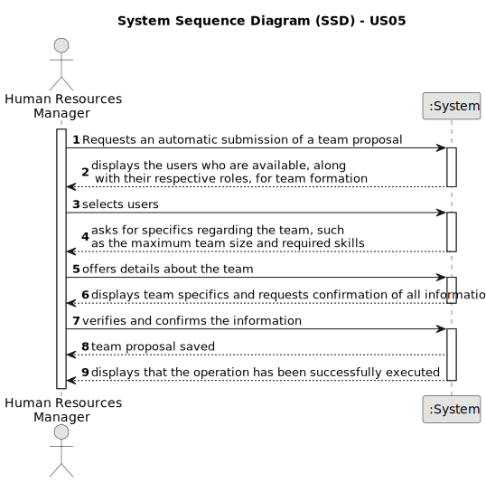

# US05 - Generate a team proposal automatically

## 1. Requirements Engineering

### 1.1. User Story Description

> As a HRM, I want to generate a team proposal automatically.

### 1.2. Customer Specifications and Clarifications

**From the specifications document:**

> Teams are comprised of temporary clusters of staff members assigned to carry out diverse activities across one or multiple green areas.
> When assembling adaptable teams, it's crucial to take into account both the team's size and the range of skills needed to be effectively covered.

**From the client clarifications:**

> *Question:* What information will the customer provide?

> *Answer:* The customer provide the max size of the team and a set of skills.

> *Question:* What should the output of the automation be? (should it just store the team proposal or show it to the customer?)
Will the team proposal be a document about all the instructions of each team member/worker?

> *Answer:* The systems provide team proposals and HRM can accept of refuse the proposals. In the future (not in this
sprint) HRM may decide to edit the team.

> *Question:* How does it generate the team if there are not enough employees?

> *Answer:* The system should provide information why it can't generate a team.

> ** Question:** How does he propose a team, for what purpose? (Is there any predefinition)?

> *Answer:* There is no purpose, at least in this sprint.

> *Question:* What are the input data to automatically generate a team?

> *Answer:* the max size of the team (for instance 4), and the skill needed: 4 tree pruner and 1 light vehicle driver,
meaning that one team member has 2 skills.

### 1.3. Acceptance Criteria

* **AC1:** The HRM must provide the maximum team size and the required skill set.

### 1.4. Found out Dependencies

* In order to facilitate efficient and structured registration of team members, as described in "US03 - Registration of 
a collaborator with a job and essential attributes," it is essential to initially establish and record skills as detailed 
in "US01 - Registration of skills that HRM may assign to a collaborator." The presence of documented skills is crucial for 
later associating them with team members during the registration process. Therefore, ensuring the availability of documented 
skills is vital for optimizing the registration of team members in an organized manner.

### 1.5 Input and Output Data

**Input Data:**

* Typed data:
    * Maximum team size
    * Skill´s needed

**Output Data:**

* Proposals for teams that are subject to subsequent approval or rejection.
* Explanation regarding why a team couldn't be formed due to insufficient employees possessing the necessary skills.
* Confirmation of successful registration or indication of operation failure.

### 1.6. System Sequence Diagram (SSD)

### 1.7 Other Relevant Remarks

* In order to ensure efficient team formation, the system should provide clear and informative notifications if it 
encounters a shortage of employees with the necessary skills. Furthermore, HRM should be given the option to either approve
or reject team proposals presented by the system.