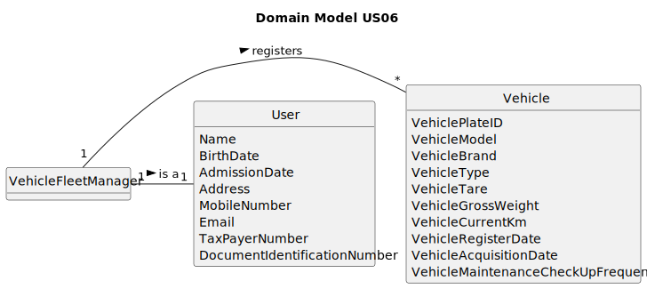

# US06 - Register a vehicle as a Vehicle Fleet Manager

## 2. Analysis

### 2.1. Relevant Domain Model Excerpt 

### 2.2. Other Remarks

The Vehicle Fleet Manager is a User as shown in the Domain Model, and he should be considered part of the "User" in the Global Domain Model. It is represented as Vehicle Manager to make the US's purpose clear.