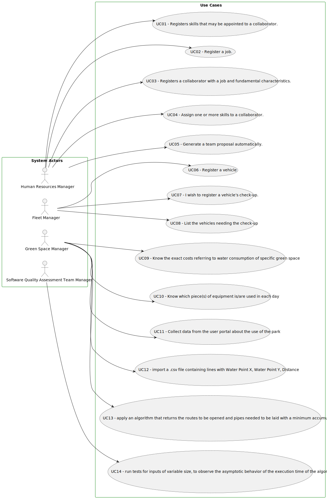

# Use Case Diagram (UCD)

*In the scope of this project, there is a direct relationship of 1 to 1 between Use Cases (UC) and User Stories (US).*

This will be the only document that uses "US/UC"; the rest will be prefixed with "US".

This is the global Use Case Diagram, and it displays the main functions of the main roles in the application:

*For each Use Case/User Story (UC/US), evidence is provided below of the application of the main activities of the software development process (requirements, analysis, design, testing and code).*

# Use Cases / User Stories

| UC/US     | Description                                                                                                                                 |                   
|:----------|:--------------------------------------------------------------------------------------------------------------------------------------------|
| US01/UC01 | [Register a Skill](../../us01/Readme.md)                                                                                                    |
| US02/UC02 | [Register a Job](../../us02/Readme.md)                                                                                                      |
| US03/UC03 | [Register a collaborator with a job and fundamental characteristics.](../../us03/Readme.md)                                                 |
| US04/UC04 | [Assign Skills to a collaborator](../../us04/Readme.md)                                                                                     |
| US05/UC05 | [Generate a team](../../us05/Readme.md)                                                                                                     |
| US06/UC06 | [Register a Vehicle](../../us06/Readme.md)                                                                                                  |
| US07/UC07 | [Register a vehicle´s checkup](../../us07/Readme.md)                                                                                        |
| US08/UC08 | [List vehicles needing checkup](../../us08/Readme.md)                                                                                       |
| US09/UC09 | [Known precise expenses relating to water consumption of specific green space](../../us09/Readme.md)                                        |
| US10/UC10 | [Identify which piece(s) of equipment is/are used in each day.](../../us10/Readme.md)                                                       |
| US11/UC11 | [Collect data from the user portal about park use.](../../us11/Readme.md)                                                                   |
| US12/UC12 | [Import a .csv file with routes](../../us12/Readme.md)                                                                                      |
| US13/UC13 | [Apply an algorithm that returns the routes to be opened and pipes needed to be laid with the least accumulated cost.](../../us13/Readme.md) |
| US14/UC14 | [Run tests for inputs with variable sizes.](../../us14/Readme.md)                                                                               |                                                                                 |