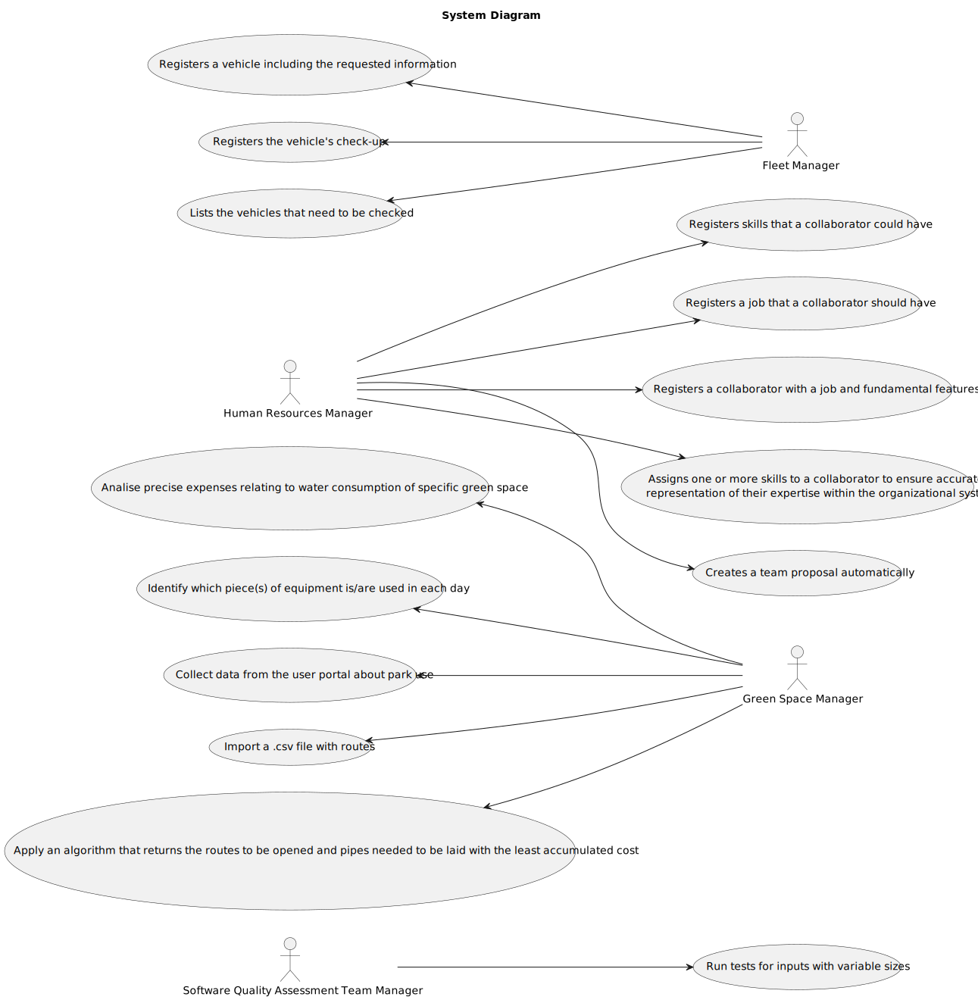

# User Manual

|         | Members         |
|---------|-----------------|
| 1230792 | Mariana Sousa   |
| 1231183 | Marta Domingues |
| 1231375 | Nuno Teixeira   |

## Index ##

 <!-- TOC -->
  
  * [Index](#index-)
  * [Glossary](#glossary-)
  * [Introduction](#introduction)
  * [System Overview](#system-overview)
    * [Objectives of the Application](#objectives-of-the-application)
    * [Structure and Organization](#structure-and-organization)
    * [Main Features](#main-features)
    * [System Diagram](#system-diagram)
  * [System Features](#system-features)
    * [1. Add Skills to Collaborator Profile | Human Resources Manager](#1-add-skills-to-collaborator-profile--human-resources-manager)
    * [2. Assign Job Roles to Collaborators | Human Resources Manager](#2-assign-job-roles-to-collaborators--human-resources-manager)
    * [3. Register a New Collaborator | Human Resources Manager](#3-register-a-new-collaborator--human-resources-manager)
    * [4. Skill Assignment to Collaborators | Human Resources Manager](#4-skill-assignment-to-collaborators--human-resources-manager)
    * [5. Automatic Team Proposal Generation | Human Resources Manager](#5-automatic-team-proposal-generation--human-resources-manager)
    * [6. Vehicle Registration | Fleet Manager](#6-vehicle-registration--fleet-manager)
    * [7. Vehicle Check-Up Registration | Fleet Manager](#7-vehicle-check-up-registration--fleet-manager)
    * [8. List of Vehicles Needing Check-Ups | Fleet Manager](#8-list-of-vehicles-needing-check-ups--fleet-manager-)
    * [9. Known precise expenses relating to water consumption of specific green space | Green Space Manager](#9-known-precise-expenses-relating-to-water-consumption-of-specific-green-space--green-space-manager-)
    * [10. Identify which piece(s) of equipment is/are used in each day | Green Space Manager](#10-identify-which-pieces-of-equipment-isare-used-in-each-day--green-space-manager-)
    * [11. Collect data from the user portal about park use | Green Space Manager](#11-collect-data-from-the-user-portal-about-park-use--green-space-manager-)
    * [12. Import a .csv file with routes](#12-import-a-csv-file-with-routes-)
    * [13. 	Apply an algorithm that returns the routes to be opened and pipes needed to be laid with the least accumulated cost](#13-apply-an-algorithm-that-returns-the-routes-to-be-opened-and-pipes-needed-to-be-laid-with-the-least-accumulated-cost-)
    * [14. Run tests for inputs with variable sizes](#14-run-tests-for-inputs-with-variable-sizes-)
<!-- TOC -->

## Glossary 
[CLICK HERE TO BE REDIRECTED](../../sprintB/global-artifacts/01.requirements-engineering/glossary.md)

## Introduction
This document has been meticulously crafted to provide comprehensive guidance specifically for green space managers and administrators.

The GreenSpace Management System manual is intended to be a comprehensive resource, providing essential information about the software's functionality and operations. From general overviews to specific functionalities, it covers a wide range of topics required for effective green space management.

This is primarily aimed at green space managers and administrators, and its goal is to provide users with the knowledge they need to navigate and use the GreenSpace Management System efficiently. Whether you are in charge of park maintenance, landscaping projects, or recreational facilities, this manual is designed to meet your needs.

This manual, targeted at a wide range of audiences, including those involved in the administration and maintenance of green spaces, provides useful insights and operational instructions. It serves individuals in charge of human resource management, vehicle and equipment fleet management, and collaborators in charge of green spaces and related activities.

In conclusion, this document, which focuses on improving efficiency and optimising green space management practices, is your go-to resource for realising the full potential of the GreenSpace Management System.

## System Overview
The GreenSpace Management System (GSMS) is a comprehensive software solution for managing urban green spaces like parks, gardens, and public areas. At its core, GSMS seeks to simplify and improve the administration and maintenance processes associated with these green spaces, ensuring their sustainability, functionality, and aesthetic appeal.

### Objectives of the Application
The primary goal of GSMS is to centralise and improve the management of urban green spaces. GSMS allows for the efficient coordination of a variety of tasks, including collaborator management, team organisation, vehicle and machinery management, and maintenance scheduling, by providing a single platform. GSMS enables users to effectively oversee and maintain green spaces, thereby contributing to their preservation and enhancement.

### Structure and Organization
GSMS is designed to meet the diverse requirements of green space managers and administrators. The application has a modular design, allowing users to access specific functionalities based on their roles and responsibilities. Key modules in GSMS include:

* **Collaborator Management:** Register and maintain information about collaborators, such as their professions, skills, and assigned tasks. Create team proposals based on the required competencies to optimise workforce allocation.
* **Vehicle Management:** Register and manage the vehicles used in green space management activities. Organise maintenance checks and manage vehicle-related tasks to ensure operational effectiveness.

### Main Features
* **Employee Registration and Management:** Easily register and manage information about collaborators, allowing for the assignment of tasks and skills to optimise team composition.

* **Vehicle Registration and Management:** Make the process of registering and managing vehicles used in green space management more efficient, ensuring proper maintenance and resource utilisation.

* **Team Proposal Generation:** Streamlines the formation of work teams by automatically producing proposals based on required competencies.
This feature evaluates the skills and qualifications of available employees and recommends the best team composition for specific tasks or projects. The application contributes to the efficient and effective completion of projects by optimising workforce allocation.

* **Water Consumption Cost Analysis:** Offers tools for calculating water consumption costs in specific green spaces. This feature collects and analyses water usage data to assist green space managers in identifying high consumption areas and potential inefficiencies.
  Cost analysis helps managers optimise water usage, reduce costs, and promote sustainability.

* **Optimal Route Determination:** Calculates the best routes for pipe installation within green spaces. This feature optimises water distribution by taking into account terrain, distance, and supply requirements. By optimising route planning, the application helps to develop robust irrigation systems that meet the needs of green spaces while minimising resource waste.

* **Equipment Usage Analysis:** The equipment usage analysis feature allows managers to monitor and analyse equipment usage in green spaces. This feature provides valuable insights into equipment efficiency and effectiveness by monitoring variables such as equipment utilisation rates, maintenance schedules, and performance metrics. With this information, managers can make informed decisions about equipment maintenance, replacement, and utilisation strategies.

* **User Portal Data Collection:** Data on park usage can be collected more easily from user portals. This feature helps managers collect data on visitor demographics, usage patterns, and preferences. Understanding how users interact with green spaces can help managers tailor maintenance and management strategies to meet park visitors' needs and expectations.

### System Diagram

## System Features
### **1. Add Skills to Collaborator Profile | Human Resources Manager**

Empower Human Resources Manager to improve collaborator profiles with relevant skills.

Here's a **Step-by-Step** Guidelines:
1.	Access the Human Resources Management system.
2.	Head to the "Skills Management" section.
3.	Initiate skill addition by selecting "Add New Skill."
4.	Enter skill details, including name and proficiency.
5.	Verify entered information for accuracy.
6.	Confirm skill addition by clicking "Save."
7.	Receive confirmation message after successful addition.

### **2. Assign Job Roles to Collaborators | Human Resources Manager**
Allow human resources managers to assign job roles to collaborators efficiently.

**Step-by-Step Guidelines:**

1. Log in to the human resource management system.
2. Head to the "Jobs" section.
3. Use the "Create New Job" feature.
4. Enter job details, including title and description.
5. Assign necessary skills to the job role.
6. Conduct a thorough review of entered information.
7. Save job role details to confirm creation.
8. Receive a confirmation message after successful creation.

### **3. Register a New Collaborator | Human Resources Manager**
Facilitate the registration of new collaborators with appropriate job roles and characteristics.

**Step-by-Step Guidelines:**
1. Access the Human Resources Management system.
2. Head to the "Collaborator Management" section.
3. Select "Add New Collaborator."
4. Enter collaborator details, including personal information and the assigned job.
5. List any relevant characteristics.
6. Check the entered information for accuracy.
7. Confirm registration to finalise.
8. Receive a confirmation message after successfully registering.

### **4. Skill Assignment to Collaborators | Human Resources Manager**
Enable human resource managers to assign specific skills to collaborators effectively.

**Step-by-Step Guidelines:**
1. Log in to the Human Resources Management system.
2. Go to the "Collaborator Management" section.
3. Choose a target collaborator for the skill assignment.
4. Use the "Assign Skills" feature.
5. Select relevant skills from the available options.
6. Verify skill assignments for accuracy.
7. Confirm the skill assignment and finalise.
8. Receive a confirmation message for a successful assignment.

### **5. Automatic Team Proposal Generation | Human Resources Manager**
Streamline team formation by automatically generating team proposals.

**Step-by-Step Guidelines:**
1. Access the human resource management system.
2. Head to the "Team Management" section.
3. Use the "Generate Team Proposal" function.
4. Determine the required skills and maximum team size.
5. Create a team proposal.
6. Review and approve the generated proposal.
7. Receive a confirmation message for successful proposal generation.

### **6. Vehicle Registration | Fleet Manager**
Empower Fleet Managers to register vehicles seamlessly.

**Step-by-Step Guidelines:**
1. Log in to the Fleet Management System.
2. Go to the "Vehicle Management" section.
3. Choose "Register New Vehicle."
4. Enter vehicle information, including VIN, plate, and maintenance frequency.
5. Verify the entered information for accuracy.
6. Save vehicle registration details to confirm.
7. You will receive a confirmation message after successfully registering.

### **7. Vehicle Check-Up Registration | Fleet Manager**

Facilitate the registration of vehicle check-ups for fleet managers.

**Step-by-Step Guidelines:**
1. Log in to the Fleet Management System.
2. Head to the "Vehicle Management" section.
3. Choose the vehicle for check-up registration.
4. Begin check-up registration.
5. Enter the check-up date.
6. Confirm registration to finalise.
7. Receive a confirmation message upon successful registration.

### **8. List of Vehicles Needing Check-Ups | Fleet Manager** ###

Provide fleet managers with a convenient list of vehicles that need to be inspected.

**Step-by-Step Guidelines:**
1. Log in to the Fleet Management System.
2. Head to the "Vehicle Management" section.
3. Select the "Vehicles Needing Check-Up" tab.
4. eview the list of vehicles that require inspection.
5. Utilise filtering and sorting options as needed. 
6. Receive the operation completion message.

### **9. Known precise expenses relating to water consumption of specific green space | Green Space Manager** ###
This feature lets the Green Space Manager request a statistical analysis of water consumption costs.

**Step-by-Step Guidelines:**
1. Launch the GMS system.

2. Go to the section that requests a statistical analysis of water consumption costs.
3. The system will prompt you to enter data about the time period and park identification.
4. Fill in the data.
5. The system will validate the input data and present the analysis results, which will include a bar plot, average costs, and statistical indicators.
### **10. Identify which piece(s) of equipment is/are used in each day | Green Space Manager** ###
This feature allows the Green Space Manager to analyse equipment usage.

**Step-by-Step Guidelines:**
1. Access the GMS system.

2. Go to the section on analysing equipment usage.
3. The system will request that you upload the file "EquipmentUsed.csv".
4. Provide the file path and upload it.
5. The system will process the uploaded file and display the analysis results as a pie chart.
### **11. Collect data from the user portal about park use | Green Space Manager** ###
This feature allows the Green Space Manager to collect data from the user portal about park usage.

**Step-by-Step Guidelines:**
1. Access the GMS system.
2. Go to the section that collects data from the user portal.
3. The system will request that you upload the file "Inquiry.csv".
4. Provide the file path and upload it.
5. The system will process the uploaded file and display the analysis result and conclusions regarding the use of the park.
### **12. Import a .csv file with routes** ###
This feature allows the Green Space Manager to import a.csv file containing information about possible pipe routes between water points, including installation costs.

**Step-by-Step Guidelines:**
1. Access the GMS system.
2. Go to the section titled Pipe Installation Routes.
3. The system will prompt you to upload the cvs file containing the water points and the distances between them.
4. Provide the file path and upload it.
5. The system will process the uploaded file and display a graph that depicts the imported route data.
### **13. 	Apply an algorithm that returns the routes to be opened and pipes needed to be laid with the least accumulated cost** ###
This feature enables the Green Space Manager to use an algorithm to determine the best routes to open and pipes to lay while incurring the lowest total cost, ensuring adequate water supply to all points.

**Step-by-Step Guidelines:**
1. Access the GMS system.
2. Go to the section titled Pipe Installation Routes.
3. The system will prompt you to upload the cvs file containing the water points and the distances between them.
4. Provide the file path and upload it.
5. The system will process the uploaded file and display a graph that depicts the imported route data.
6. The system will process the previously collected routes and create another graph with routes that connect all water points at the lowest cost.

### **14. Run tests for inputs with variable sizes** ###