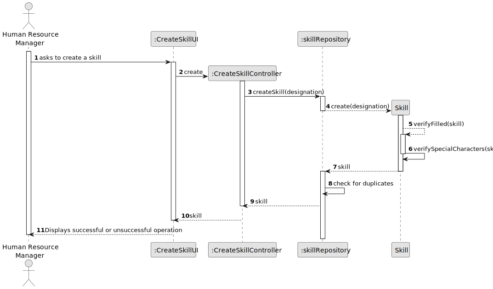
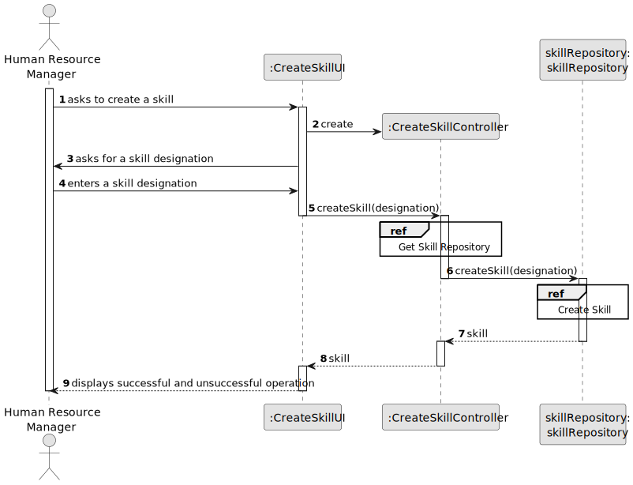
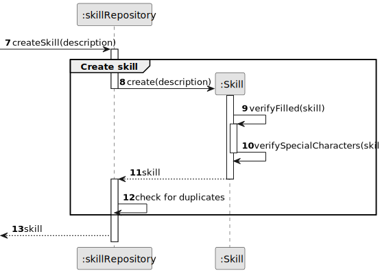
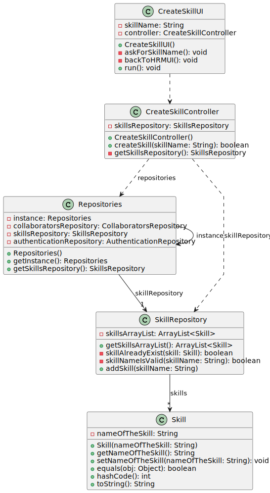

# US01 - Create a Skill

## 3. Design - User Story Realization

### 3.1. Rationale

*Note that SSD - Alternative One is adopted.*

| Interaction ID | Question: Which class is responsible for...   | Answer                | Justification (with patterns)                                                                                 |
|:---------------|:----------------------------------------------|:----------------------|:--------------------------------------------------------------------------------------------------------------|
| Step 1  		     | 	... interacting with the actor?              | CreateSkillUI         | Pure Fabrication: there is no reason to assign this responsibility to any existing class in the Domain Model. |
| 			  		        | 	... coordinating the US?                     | CreateSkillController | Controller                                                                                                    |
| Step 2  		     | 	...saving the inputted data?                 | CreateSkillUI         | Pure Fabrication                                                                                              |
| Step 3  		     | 	... instantiating  the skill?                | skillRepository       | Information Expert, High Cohesion and Low Coupling: there is no class in the Domain Model that follows the rules to be a Creator class.                                                          |
| Step 4  		     | 	... validating all data (global validation)? | skillRepository       | Information Expert: knows all of its skills.                                                                  | 
|                | ... validating all data (local validation)    | Skill                 | Information Expert: the created object has its own data.                                                                                           |
| Step 5  		     | 	... informing operation success?             | CreateSkillUI         | Is responsible for user interactions.                                                                         | 

### Systematization ##

According to the taken rationale, the conceptual classes promoted to software classes are:

* Skill

Other software classes (i.e. Pure Fabrication) identified:

* CreateSkillUI
* CreateSkillController
* SkillRepository
* Repositories

## 3.2. Sequence Diagram (SD)

### Full Diagram

This diagram shows the full sequence of interactions between the classes involved in the realization of this user story.

### Split Diagrams

The following diagram shows the same sequence of interactions between the classes involved in the realization of this user story, but it is split in partial diagrams to better illustrate the interactions between the classes.

It uses Interaction Occurrence (a.k.a. Interaction Use).

*Create Skill*

## 3.3. Class Diagram (CD)

