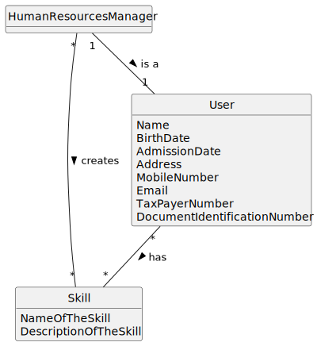

# US04 - Human Resources Manager assigns skills to Users/Collaborators

## 2. Analysis

### 2.1. Relevant Domain Model Excerpt 

### 2.2. Other Remarks

Human Resources Manager must be interpreted as a normal User, as it is in the global artifacts.