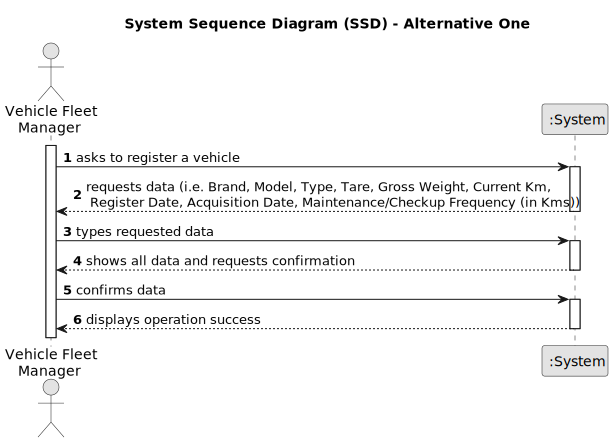

# US06 - Register a vehicle as a Vehicle Fleet Manager

## 1. Requirements Engineering

### 1.1. User Story Description

As a VFM, I wish to register a vehicle including Brand, Model, Type, Tare,
Gross Weight, Current Km, Register Date, Acquisition Date, Maintenance/Checkup Frequency (in Kms).

### 1.2. Customer Specifications and Clarifications 

**From the specifications document:**

>   Each Vehicle is characterized by a Model, a Brand, a Type, a Tare, a Gross Weight, it's current Kms, it's Register Date, it's Aquisition date and it's maintenance check-up frequency.

**From the client clarifications:**

> **Question:** Can a VFM register no vehicles at all?
>
> **Answer:** In theory, if the VFM considers that the Organization doesn't need to have Vehicles, there shouldn't be Vehicles registered.

> **Question:** Is there the need of validating the Brand, Model and other characteristics of the vehicle?
>
> **Answer:** No, there is no need for validation.

> **Question:** For the application to work does the VFM need to fill all the attributes of the vehicle?
>
> **Answer:** Yes, including the Vehicle plate

> **Question:** Should the application identify a registered vehicle by a serial number or other attribute?
>
> **Answer:** Yes, bby Plate ID

> **Question:** Should the application a group the vehicles by their brand, serial number or other attribute?
>
> **Answer:** No, no requirements were set concerning groups of vehicles.

> **Question:** If the VFM inserts the same vehicle by mistake, should it inform ther user of the mistake and give him the option to add another vehicle?
>
> **Answer:** It shouldn't be possible to create duplicates in the first place.

### 1.3. Acceptance Criteria

* **AC1:** All required fields must be filled in.
* **AC2:** When registering a vehicle with an already existing VehiclePlateID, there should be the option to replace the existing one with the new one or to change the plate of any of the duplicates.
* **AC3:** When registering a plate ID, there should only be allowed the plates with the correct alphanumeric format.
* **AC4:** It shouldn't be possible for the VFM to select invalid data for the fields, including negative numbers in the numeric ones, such as check-up frequency.

### 1.4. Found out Dependencies

* There is a dependency on "US07 - Register a vehicle check-up" as there must be at least one vehicle to create a vehicle check-up.

### 1.5 Input and Output Data

**Input Data:**

* Typed data:
    * a vehicle's plate id
    * a vehicle's model
    * a vehicle's brand
    * a vehicle's type
    * a vehicle's tare
    * a vehicle's gross weight
    * a vehicle's current Kms
    * a vehicle's register date
    * a vehicle's acquisition date
    * a vehicle's maintenance check-up frequency

**Output Data:**

* (In)Success of the operation

### 1.6. System Sequence Diagram (SSD)

**_Other alternatives might exist._**

#### Alternative One

### 1.7 Other Relevant Remarks