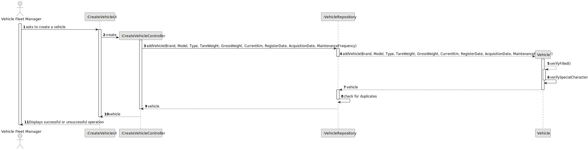
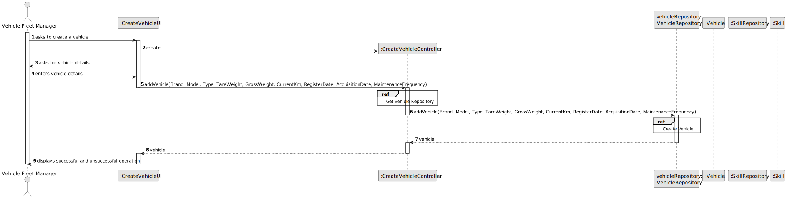
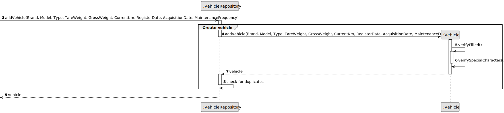
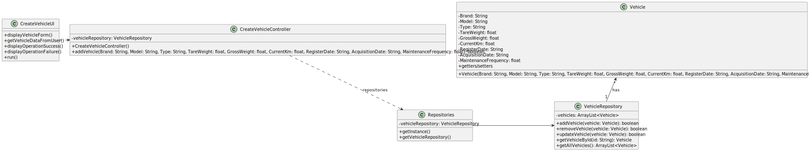

# US006 - Create a Task 

## 3. Design - User Story Realization 

### 3.1. Rationale

_**Note that SSD - Alternative One is adopted.**_

| Interaction ID | Question: Which class is responsible for...   | Answer                  | Justification (with patterns)                                                                                 |
|:---------------|:----------------------------------------------|:------------------------|:--------------------------------------------------------------------------------------------------------------|
| Step 1  		     | 	... interacting with the actor?              | CreateVehicleUI         | Pure Fabrication: there is no reason to assign this responsibility to any existing class in the Domain Model. |
| 			  		        | 	... coordinating the US?                     | CreateVehicleController | Controller                                                                                                    |
| 			  		        | 	... instantiating a new Vehicle?             | VehiclesRepository      | Creator: in the DM VehiclesRepository has stores multilple Vehicles.                                          |
| 			  		        | ... knowing the user using the system?        | UserSession             | IE: cf. A&A component documentation.                                                                          |
| 			  		        | 							                                       | VehiclesRepository      | IE: knows/has its own Vehicles                                                                                |
| Step 2  		     | 							                                       |                         |                                                                                                               |
| Step 3  		     | 	...saving the inputted data?                 | Vehicle                 | IE: object created in step 1 has its own data.                                                                |
| Step 4  		     | 							                                       |                         |                                                                                                               |              
| Step 5  		     | 	... validating all data (local validation)?  | Vehicle                 | IE: owns its data.                                                                                            | 
| 			  		        | 	... saving the created vehicle?              | VehiclesRepository      | IE: owns all its vehicles.                                                                                    | 
| Step 6  		     | 	... informing operation success?             | CreateVehicleUI         | IE: is responsible for user interactions.                                                                     | 

### Systematization ##

According to the taken rationale, the conceptual classes promoted to software classes are: 

* Vehicle
* VehiclesRepository

Other software classes (i.e. Pure Fabrication) identified: 

* CreateVehicleUI  
* CreateVehicleController

## 3.2. Sequence Diagram (SD)

### Full Diagram

This diagram shows the full sequence of interactions between the classes involved in the realization of this user story.

### Split Diagrams

The following diagram shows the same sequence of interactions between the classes involved in the realization of this user story, but it is split in partial diagrams to better illustrate the interactions between the classes.

It uses Interaction Occurrence (a.k.a. Interaction Use).

**Create Vehicle**

## 3.3. Class Diagram (CD)

