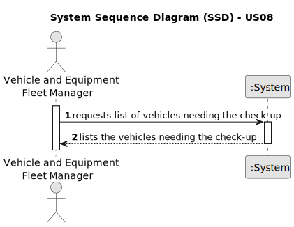

# US08 - List the Vehicles Needing Check-Up

## 1. Requirements Engineering

### 1.1. User Story Description

As an Vehicle and Equipment Fleet Manager, I want to list the vehicles needing the check-up.

### 1.2. Customer Specifications and Clarifications 

**From the specifications document:**
>	The system should allow the Vehicle and Equipment Fleet Manager to list the vehicles needing check-up. 

**From the client clarifications:**

> **Question:** Can the vehicles get placed automatically on a list or the onr listing has to be FM?
>
> **Answer:** The list of vehicles is automatically created but the creation is triggered by the FM.

> **Question:** What information will appear on the final list regarding the vehicle, besides the needing for check-up?
>
> **Answer:** Data that allow to identify the vehicle like Plate, brand and modle, as well as, the data that allowed to select/insert the vehicle in the list, number of kms, frequency of checkup and the last checkup.

### 1.3. Acceptance Criteria

* **AC1:** The system should automatically generate a list of vehicles needing check-up.
* **AC2:** The creation of the list should be triggered by the Fleet Manager.
* **AC3:** Each vehicle entry in the list should include:
  * Plate number
  * Brand
  * Model
  * Number of kilometers
  * Frequency of check-up
  * Date of the last check-up
  * Type
  * Tare
  * Gross Weight 
  * Register Date
  * Acquisition Date
* **AC4:** The list should be updated in real-time to reflect changes in vehicle status.
* **AC5:** The Fleet Manager should be able to view the list of vehicles needing check-up upon request.
* **AC6:** The system should provide appropriate error messages if there are any issues with generating or accessing the list.
### 1.4. Found out Dependencies

* **US06 - Register Vehicle:** Since the system needs to have vehicles registered before listing those needing check-up, then US08 depends on having the functionality to register vehicles (US06).
* **US07 - Register Vehicle's Check-Up:** Since the system needs to track the history of vehicle check-ups, then US08 depends on having the functionality to register and manage check-ups for vehicles (US07).
### 1.5 Input and Output Data

**Input Data:**

* Typed data:
    * none required

**Output Data:**

* (In)Success of the operation
* List of vehicles needing check-up:
  * Plate number
  * Brand
  * Model
  * Number of kilometers
  * Frequency of check-up
  * Date of the last check-up
  * Type
  * Tare
  * Gross Weight
  * Register Date
  * Acquisition Date
### 1.6. System Sequence Diagram (SSD)

### 1.7 Other Relevant Remarks

* The listed vehicles requiring check-up are marked as "pending" until they are processed or addressed by the Fleet Manager.