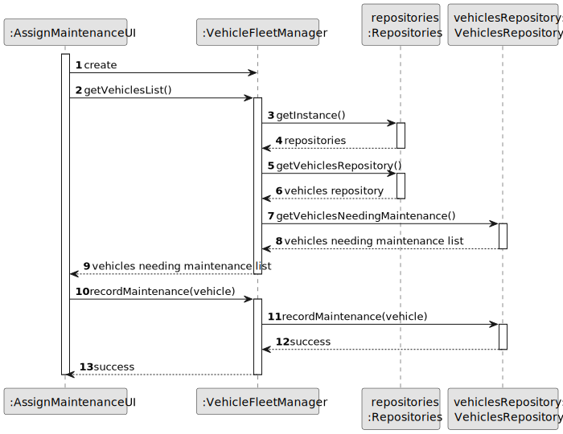
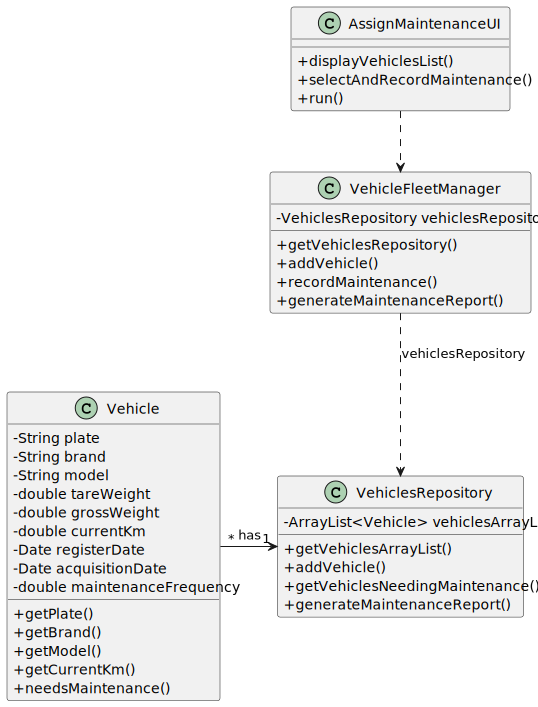

# US08 - Maintenance Report

## 3. Design - User Story Realization 

### 3.1. Rationale

_**Note that SSD - Alternative One is adopted.**_

| Interaction ID | Question: Which class is responsible for... | Answer               | Justification (with patterns)                                                                                 |
|:---------------|:--------------------- |:---------------------|:--------------------------------------------------------------------------------------------------------------|
| Step 1  		     |	... interacting with the actor? | ListMaintenanceUI         | Pure Fabrication: there is no reason to assign this responsibility to any existing class in the Domain Model. |
| 			  		        |	... coordinating the US? | ListMaintenaceController | Controller                                                                                                    |
| 			  		        |							 | VehiclesRepository         | IE: knows/has its own Vehicles                                                                                |
| 			  		        |							 | Vehicle             | IE: knows its own data                                                                                        |
| Step 2  		     |							 |                      |                                                                                                               |
| Step 3  		     |							 |                      |                                                                                                               |              
| Step 4  		     |	... validating all data (local validation)? | Vehicle                 | IE: owns its data.                                                                                            |
| Step 5  		     |	... informing operation success?| ListMaintenanceUI         | IE: is responsible for user interactions.                                                                     | 

### Systematization ##

According to the taken rationale, the conceptual classes promoted to software classes are: 

* Vehicle
* VehiclesRepository
* CheckUp

Other software classes (i.e. Pure Fabrication) identified: 

* ListMaintenanceUI  
* ListMaintenaceController

## 3.2. Sequence Diagram (SD)

### Full Diagram

## 3.3. Class Diagram (CD)

