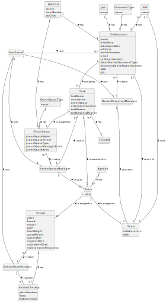

# OO Analysis

The construction process of the domain model is based on the client specifications, especially the nouns (for _concepts_)
and verbs (for _relations_) used.

## Rationale to identify domain conceptual classes
To identify domain conceptual classes, start by making a list of candidate conceptual classes inspired by the list of 
categories suggested in the book "Applying UML and Patterns: An Introduction to Object-Oriented Analysis and Design and 
Iterative Development".

### _Conceptual Class Category List_

**Business Transactions**
* Task assignment: This involves distributing tasks among collaborators or teams within the system.

* Team proposal generation: Entails creating recommendations for team formation by considering the requirements of tasks and the skills of collaborators.

* Vehicle check-up: This describes the practice of inspecting and keeping in good condition vehicles used in the management of green spaces.
---

**Transaction Line Items**

* Diary: A log of planned tasks or activities scheduled to be executed in green spaces, outlining a timeline for the work.
---

**Product/Service related to a Transaction or Transaction Line Item**

* Equipment: Refers to equipments or machinery utilized in various tasks.

* Vehicle: Denotes vehicles employed for transportation or task execution.

* Machine: Signifies machinery utilized across different tasks.

* Automotive Inspection: This appears to be an incomplete entry and requires further clarification or refinement.
---

**Transaction Records**

* Not clearly depicted in the given model.
---  

**Roles of People or Organizations**

* Collaborator: Refers to a staff member responsible for tasks associated with green space management.

* Human Resources Manager: Represents the person responsible for managing human resources.

* Fleet Manager: Refers to an individual in charge of overseeing human resources.

* Green Spaces Manager: Denotes the individual accountable for the overall management of green spaces.

* Vehicle and Equipment Fleet Manager : A person who manages the fleet park, the machines, equipment and vehicles, ensuring their good condition and assigning them to the tasks to be carried out.

* Green Spaces User: Represents someone who uses the green spaces overseen by the organization.
---

**Places**

* GreenSpace: Represents the different green spaces under the organization's management, including gardens and parks.
---

**Noteworthy Events**

* Task: Represents the tasks or activities slated for execution within the domain.

* UserPortal: Issues or malfunctions flagged by users within the User Account Portal.
---

**Physical Objects**

* Equipment: Represents the equipment utilized by collaborators for various tasks.

* Vehicle: Represents the vehicles used for transportation or tasks.

* Machine: Represents the vehicles employed for transportation purposes or for completing tasks.

* PlantMaterial: Represents items pertaining to plants.

* UrbanFurnitures: Represents urban furniture.

* Insfrastructure: Denotes fundamental structures or systems.
---

**Descriptions of Things**

* Skill: Represents the capabilities individuals hold.

* Job: Represents roles or positions within the organization.
---

**Catalogs**

* Catalog of vehicles: This catalog comprises a comprehensive list of all vehicles owned or employed by the organization
for tasks associated with maintaining green spaces. It may encompass specifications such as vehicle type, model, capacity,
present condition, and more.
 

* Catalog of equipment: This catalog comprises a list of equipment utilized by collaborators for various tasks within 
green spaces management. It includes tools, machinery, and other resources necessary for carrying out tasks effectively.

* Catalog of jobs: This catalog contains and comprises a comprehensive list of job roles or positions within the organization.
It includes information and descriptions of each job role, specifying the responsibilities, qualifications, and skills required for each
position.

* Catalog of skills: This catalog contains a list of skills held by collaborators within the organization. It outlines 
the diverse capabilities and competencies of individuals pertinent to task allocation and team formation.

* Catalog of machines: This catalog contains a list of machines used in the management of green spaces. 
It provides information such as machine type, model, specifications, and functionalities.

* Catalog of PlantMaterial: This catalog contains a list of plant materials employed within the green spaces overseen by
the organization. It encompasses a variety of plants, flowers, shrubs, trees, and more, accompanied by their respective
characteristics and maintenance needs.

* Catalog of UrbanFurnitures: This catalog comprises a listing of urban furniture or amenities found within the green 
spaces under the organization's management. It encompasses items like benches, tables, playground equipment, and more, 
along with their specifications and respective locations.

* Catalog of Insfrastructure: This catalog contains a compilation of infrastructure elements found within green spaces 
under the organization's management. It covers foundational structures, systems, and facilities like irrigation systems,
lighting, drainage systems, and more.
---

**Containers**

* Team: Represents teams of individuals collaborating.
---

**Elements of Containers**

* Collaborator: Represents a staff member responsible for tasks associated with green space management.
---

**Organizations**

* Organization: Represents the primary entity overseeing the domain, which in this instance is Musgosublime (MS).
---

**Other External/Collaborating Systems**

* UserPortal: An interface system allowing users to engage with the organization, report issues, and more.
---

**Records of finance, work, contracts, legal matters**

* Work records: Documentation concerning tasks carried out within green spaces, encompassing task fulfillment,
maintenance, and similar activities.

* Maintenance records: Documentation detailing maintenance activities conducted on equipment, vehicles, and 
other related assets.
---

**Financial Instruments**

* Not directly depicted in the given model.
---

**Documents mentioned/used to perform some work/**

* Not directly depicted in the given model.
---

## Rationale to identify associations between conceptual classes

An association is a relationship between instances of objects that indicates a relevant connection and that is worth of remembering, or it is derivable from the List of Common Associations:

- **_A_** is physically or logically part of **_B_**
- **_A_** is physically or logically contained in/on **_B_**
- **_A_** is a description for **_B_**
- **_A_** known/logged/recorded/reported/captured in **_B_**
- **_A_** uses or manages or owns **_B_**
- **_A_** is related with a transaction (item) of **_B_**
- etc.

| Concept (A) 		 |      Association   	       | Concept (B)      |
|----------------|:--------------------------:|-----------------:|
| Agenda            |       has       |                           Task |
| Task              |    can have     |                    Garden Tool |
| Task              |      needs      |                        Vehicle |
| Task              |      needs      |                       Machines |
| Task              |    assign to    |                    Green Space |
| Task              |    assign to    |                           Team |
| Vehicle           |       has       |                          Brand |
| Vehicle           |       has       |                       Check-up |
| Machine           |       has       |                          Brand |
| Brand             |       has       |                          Model |
| Green Space       |       has       |                 User Equipment |
| Green Space       |       has       |                        Address |
| Green Space       |   is divided    |                          Zones |
| Zones             |    can have     |               Lightning System |
| Zones             |    can have     |              Irrigation System |
| Zones             |    can have     |                Drainage System |
| Zones             |    can have     |                Drinking System |
| Lightning system  |      have       |            Lightning Equipment |
| Irrigation system |      have       |           Irrigation Equipment |
| Drainage system   |      have       |             Drainage Equipment |
| Drinking system   |      have       |             Drinking Equipment |
| Green Space       |   is analyzed   |     Water Statistical Analysis |
| Green Space       |       has       |              Electronic Device |
| Electronic Device |   is analyzed   | Equipment Statistical Analysis |
| Green Space       |  is connected   |                         Portal |
| Portal            |   is analyzed   |              Stats User Portal |
| Report Issues     |   is reported   |                         Portal |
| Team              |      needs      |                          Skill |
| Skill             |    assign to    |                   Collaborator |
| Team              |       has       |                   Collaborator |
| Collaborator      |       has       |                            Job |
| Collaborator      |       has       |                       Document |
| Collaborator      |       has       |                        Address |
| Collaborator      |   assigned to   |                           Team |
| GSU               | interacts with  |                    User Portal |
| GSU               | interacts with  |              Electronic Device |

## Domain Model
