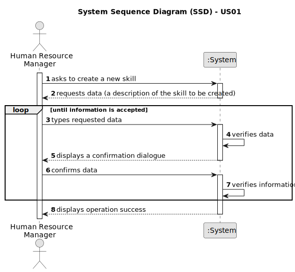

# US01 - Create a Skill

## 1. Requirements Engineering

### 1.1. User Story Description

As a Human Resources Manager (HRM), I aim to register skills that could be assigned to a collaborator.

### 1.2. Customer Specifications and Clarifications 

**From the specifications document:**

>	A skill generated should be saved in a skills list so that it can be allocated to one or more workers later. 

**From the client clarifications:**

> **Question:** Will a list of qualifications be provided?
>
> **Answer:** No. The human resources manager establishes it, and the system stores it for later use with a profile.

> **Question:** What information can be introduced to develop a new skill?
>
> **Answer:** The skill name.

> **Question:** Which information is required to create a new skill?
>
> **Answer:** The skill name.

> **Question:** Which skills are accepted? Should we allow the HRM to introduce anything as a skill?
>
> **Answer:** HRM is ultimately responsible for making these decisions. (No special characters or algarisms should be allowed in the skill name.)

> **Question:** Do I need to add skills by writing them down, or can I simply provide a file containing all of the skills?
>
> **Answer:** Both are acceptable because the business is the same, the crucial difference is in the UX.

> **Question:** Is it necessary for the HRM to see confirmation of the operation's success as well as the skills added, or just the operation itself?
>
> **Answer:** It will depend on whether you choose to insert one or more skils in a batch. Perhaps some adaptation is required.

> **Question:** Is there another possible outcome, such as if the HMR does not enter the requested data, do I need to ask the user to register a different competence?
>
> **Answer:** This US is quite simple, a skill is currently just a name.

> **Question:**  What criteria are required to register a skill?
>
> **Answer:** Pruner, truck driver, and phytopharmaceutical applicator are some examples of skill names.

> **Question:**  When you create a skill that already exists, how should the system react?
>
> **Answer:** By definition, a set cannot contain duplicate values. Checking for duplicates is not a business rule; it is a technological rule.

> **Question:**  Should the system allow HRM to introduce multiple skills in a single interaction before saving all of them?
>
> **Answer:** This is not a requirement.

### 1.3. Acceptance Criteria

* **AC1:** All skill fields must be filled in.
* **AC2:** If you create a skill with the same name as an existing one, the system will display an information window and reject it.

### 1.4. Found out Dependencies

* None for now.

### 1.5 Input and Output Data

**Input Data:**

* Typed data:
    * a designation

* Selected data:
    * none 

**Output Data:**

* (In)Success of the operation

### 1.6. System Sequence Diagram (SSD)

**_Other alternatives might exist._**

#### Alternative One

