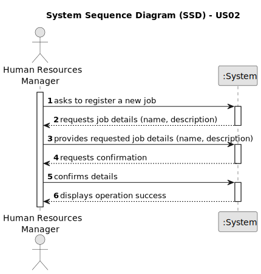
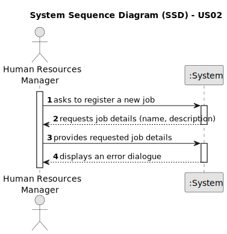

# US02 - Register a Job

## 1. Requirements Engineering

### 1.1. User Story Description

As a Human Resources Manager, I want to register a job that a collaborator need to have.

### 1.2. Customer Specifications and Clarifications 

**From the specifications document:**

>	 The system should allow the Human Resources Manager to register a job that a collaborator needs to have.

**From the client clarifications:**

> **Question:** Can special characters and numbers be entered when registering a job? I assume that a job cannot be empty. Is that right?
>
> **Answer:** No. That's right.

> **Question:** For registering a job into system manager needs to type just "Job title"?
>
> **Answer:** A job is just the job name!

### 1.3. Acceptance Criteria

* **AC1:** All required fields for registering a job must be completed, including the job name and description.
* **AC2:** The job name must be unique within the system.
* **AC3:** The job name must not exceed a certain character limit, e.g., 50 characters.
* **AC4:** The job description should adequately describe the responsibilities and requirements of the job role.
* **AC5:** Upon successful registration, the system should provide a confirmation message to the Human Resources Manager.

### 1.4. Found out Dependencies

* **US03 - Register Collaborator:**  Since registering a job for a collaborator involves assigning specific job roles to individual collaborators, then US02 depends on having collaborators registered in the system.
* **US05 - Generate Team Proposal:** Since generating a team proposal involves considering the job roles of individual collaborators, then US02 depends on US05.
### 1.5 Input and Output Data

**Input Data:**

* Typed data:
    * job name
    * job description

**Output Data:**

* (In)Success of the operation

### 1.6. System Sequence Diagram (SSD)

#### Success

#### Error

### 1.7 Other Relevant Remarks

* Upon creation, the registered job remains in a "pending" state until further action is taken by the system or the Human Resources Manager to finalize its status.