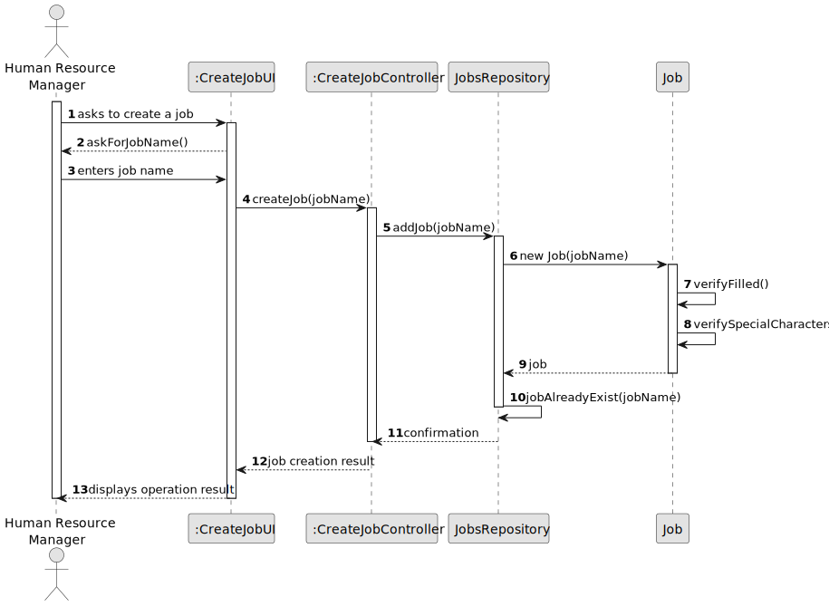
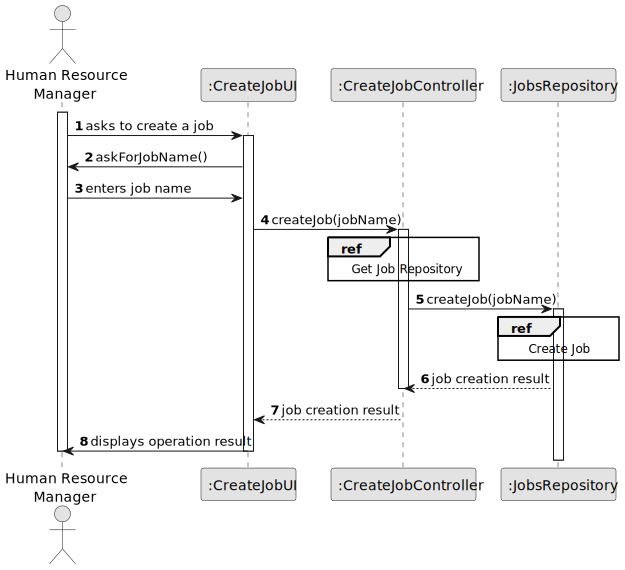
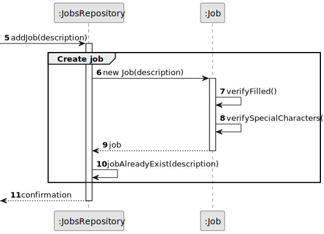
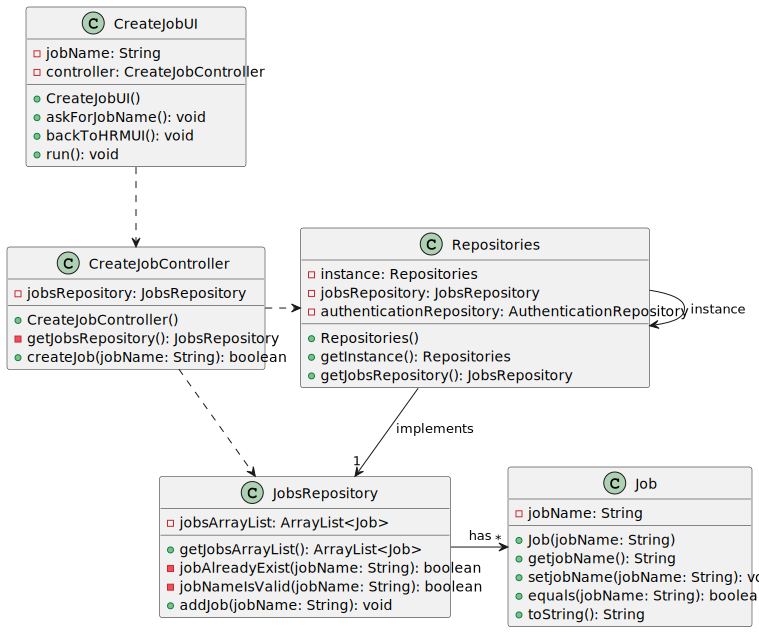

# US02 - Create a Job

## 3. Design - User Story Realization 

3.1. Rationale

| Interaction ID | Question: Which class is responsible for... | Answer | Justification (with patterns)                                                                                     |
|----------------|---------------------------------------------|--------|-------------------------------------------------------------------------------------------------------------------|
| Step 1         | ... interacting with the actor?            | CreateJobUI | Pure Fabrication: There is no reason to assign this responsibility to any existing class in the Domain Model.     |
|                | ... coordinating the US?                   | CreateJobController | Controller                                                                                                        |
|                | ... having all the repositories?           | Repositories | IE: Has all the different repositories.                                                                           |
| Step 2         | ... initiating a new Job?                 | JobsRepository | Creator (Rule 1), Pure Fabrication: In the Domain Model, JobsRepository is responsible for managing job entities. |
| Step 3         | ... validating the input data?            | CreateJobUI | IE: Is responsible for user interaction.                                                                          |
| Step 4         | ... knowing all the jobs?                  | JobsRepository | IE: Knows all its jobs.                                                                                           |
| Step 5         | ... displaying the operation result?       | CreateJobUI | IE: Is responsible for user interaction.                                                                          |
|                | ... saving the created job?               | JobsRepository | IE: Owns its data.                                                                                                |
| Step 6         | ... informing operation success?          | CreateJobUI | IE: Is responsible for user interaction.                                                                          |

### Systematization ##

According to the provided rationale, the conceptual classes promoted to software classes are:
* JobsRepository
* Job

Other software classes (i.e., Pure Fabrication) identified:
* CreateJobUI
* CreateJobController

## 3.2. Sequence Diagram (SD)

### Full Diagram

This diagram shows the full sequence of interactions between the classes involved in the realization of this user story.

### Split Diagrams

The following diagram shows the same sequence of interactions between the classes involved in the realization of this user story, but it is split in partial diagrams to better illustrate the interactions between the classes.

It uses Interaction Occurrence (a.k.a. Interaction Use).

**Create Job Partial**

## 3.3. Class Diagram (CD)

