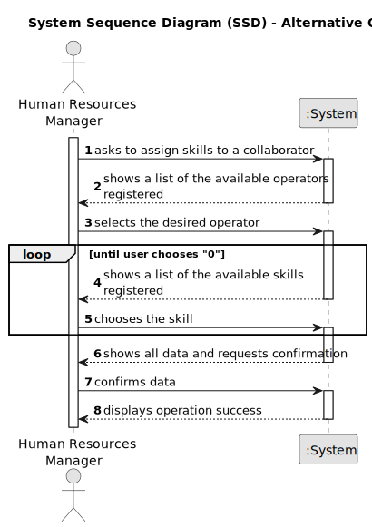

# US04 - Assign skills to collaborators

## 1. Requirements Engineering

### 1.1. User Story Description

As an HRM, I want to assign one or more skills to a collaborator.

### 1.2. Customer Specifications and Clarifications 

**From the specifications document:**

>	Every skill must have a name and a description that allows the Human Resources Manager to clearly distinct each off them so they can assign it to a User/Collaborator

>	A User/Collaborator can have no skills, and a skill can exist without being assigned to any User/Collaborator 

**From the client clarifications:**

> **Question:** Is there a maximum number of skills that can be assigned to a User/Collaborator?
>
> **Answer:** No, a User/Collaborator can have an infinite number of skills.

> **Question:** Is there any criteria that allows or prevents a User/Collaborator to have a specific skill assigned to them?
>
> **Answer:** No, any User/Collaborator can have any skill.

### 1.3. Acceptance Criteria

* **AC1:** All required fields must be filled in.
* **AC2:** The fields like Email, TaxPayerNumber, MobileNumber and others that require a specific format to be valid, should respect that format.
* **AC3:** A skill must have a valid and unique name and a description that enlights the Human Resources Manager about the skill.
* **AC4:** Any User/Collaborator can have any skill assigned and it should be impossible to repeat skills.

### 1.4. Found out Dependencies

* The US04 depends on the US01 and the US03

### 1.5 Input and Output Data

**Input Data:**

* Typed data:
    * a name for the  skill
	
* Selected data:
    * the User/Collaborator who will have the skill asigned to him 

**Output Data:**

* (In)Success of the operation

### 1.6. System Sequence Diagram (SSD)

**_Other alternatives might exist._**

#### Alternative One

### 1.7 Other Relevant Remarks

* Human Resources Manager is a normal User, as it is shown in the global artifacts. It is displayed as Human Resources Manager, so it becomes clear what's the US purpose.