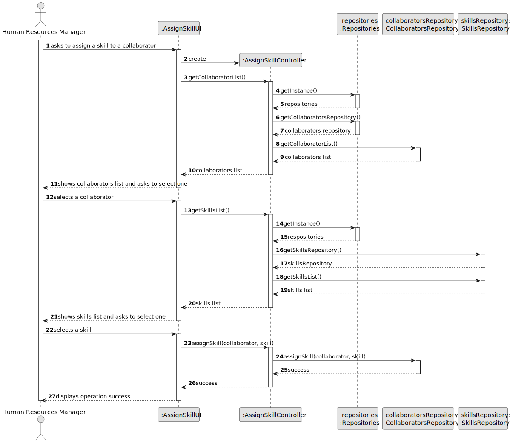
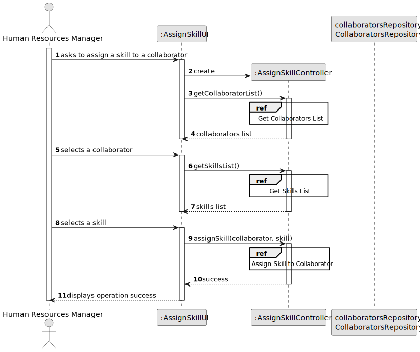
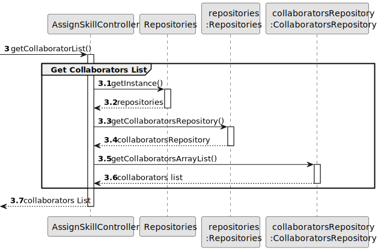
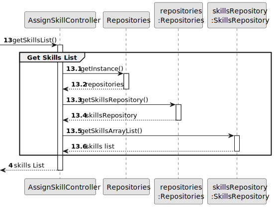
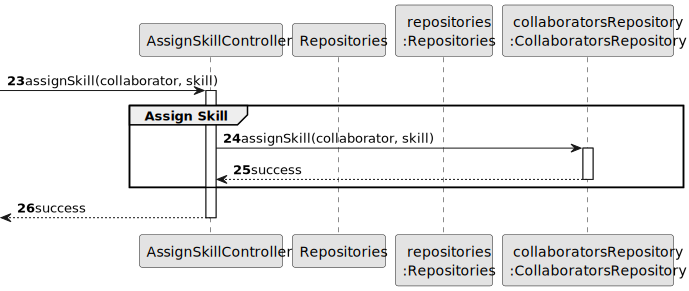
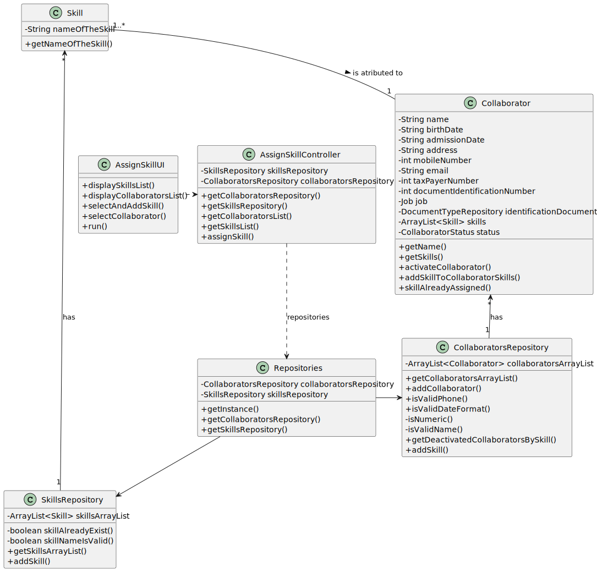

# US006 - Create a Task 

## 3. Design - User Story Realization 

### 3.1. Rationale

_**Note that SSD - Alternative One is adopted.**_

| Interaction ID | Question: Which class is responsible for...  | Answer                          | Justification (with patterns)                                                                                 |
|:---------------|:---------------------------------------------|:--------------------------------|:--------------------------------------------------------------------------------------------------------------|
| Step 1  		     | 	... interacting with the actor?             | AssignSkillUI                   | Pure Fabrication: there is no reason to assign this responsibility to any existing class in the Domain Model. |
| 			  		        | 	... coordinating the US?                    | AssignSkillController | Controller                                                                                                    |
| 			  		        | 	... instantiating a new Skill?              | SkillsRepository                | Creator: in the DM SkillsRepository has stores multilple Skills.                                              |
| 			  		        | ... knowing the user using the system?       | UserSession                     | IE: cf. A&A component documentation.                                                                          |
| 			  		        | 							                                      | CollaboratorsRepository         | IE: knows/has its own Collaborators                                                                           |
| 			  		        | 							                                      | Collaborator                    | IE: knows its own data (e.g. email)                                                                           |
| Step 2  		     | 							                                      |                                 |                                                                                                               |
| Step 3  		     | 	...knowing the skills to show?              | SkillsRepository                | IE: Skills are stored in a skills repository.                                                                 |
| Step 4  		     | 							                                      |                                 |                                                                                                               |              
| Step 5  		     | 	... validating all data (local validation)? | Skill                           | IE: owns its data.                                                                                            | 
| 			  		        | 	... saving the assigned skill?              | Collaborator                    | IE: owns all its skills.                                                                                      | 
| Step 6  		     | 	... informing operation success?            | AssignSkillUI                   | IE: is responsible for user interactions.                                                                     | 

### Systematization ##

According to the taken rationale, the conceptual classes promoted to software classes are: 

* Skill
* Collaborator
* SkillsRepository
* CollaboratorsRepository

Other software classes (i.e. Pure Fabrication) identified: 

* AssignSkillUI  
* AssignSkillController

### Full Diagram

This diagram shows the full sequence of interactions between the classes involved in the realization of this user story.

### Split Diagrams

The following diagram shows the same sequence of interactions between the classes involved in the realization of this user story, but it is split in partial diagrams to better illustrate the interactions between the classes.

It uses Interaction Occurrence (a.k.a. Interaction Use).

**Get Collaborator List Partial SD**

**Get Skill List**

**Assign Skill to Collaborator**

## 3.3. Class Diagram (CD)

