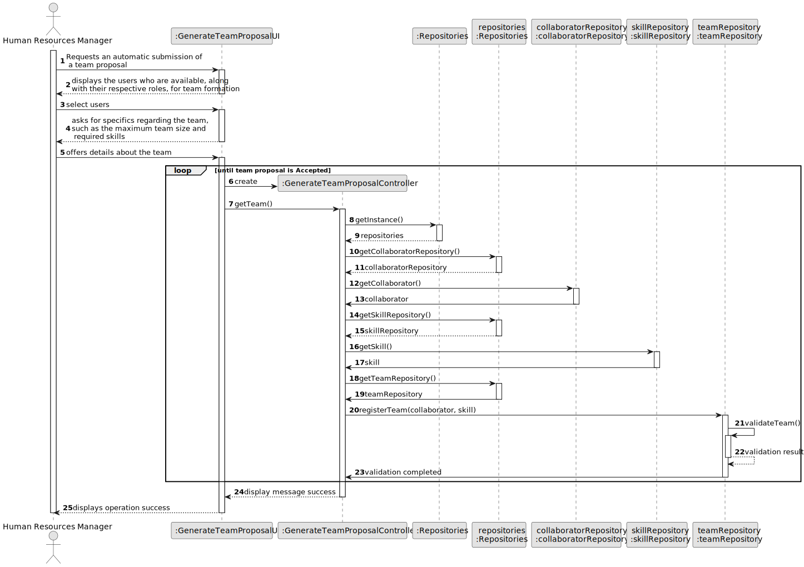
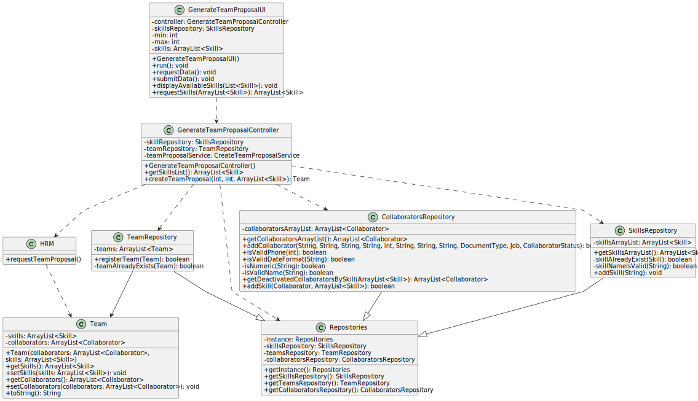

# US05 - As a HRM, I want to generate a team proposal automatically.

## 3. Design - User Story Realization

### 3.1. Rationale
| Interaction ID | Question: Which class is responsible for...              | Answer                         | Justification (with patterns)                                                                                 |
|:---------------|:---------------------------------------------------------|:-------------------------------|:--------------------------------------------------------------------------------------------------------------|
| Step 1         | ... interacting with the actor?                          | GenerateTeamProposalUI         | Pure Fabrication: there is no reason to assign this responsibility to any existing class in the Domain Model. |
|                | ... coordinating the US?                                 | GenerateTeamProposalController | Controller                                                                                                    |
|                | ... having all the repositories?                         | Repositories                   | IE: has all the different repositories.                                                                       |
|                | ... initiating a new Team?                               | TeamRepository                 | Creator (Rule 1), Pure Fabrication: no existing class in Domain Model can initialize a new Team.              |
| Step 2         | ... obtaining the skills list?                           | SkillRepository                | IE: has all of the skills.                                                                                    |
|                | ... knowing which skills were selected?                  | GenerateTeamProposalUI         | IE: is responsible for user interaction.                                                                      |
| Step 3         | ... temporarily keeping the input data?                  | GenerateTeamProposalUI         | IE: is responsible for user interaction.                                                                      |
|                | ... validating the input data?                           | TeamRepository                 | IE: is responsible for user interaction.                                                                      |
| Step 4         | ... knowing all the collaborators?                       | CollaboratorRepository         | IE: knows all its collaborators.                                                                              |
|                | ... knowing if the collaborator is available for a team? | Collaborator                   | IE: knows all its collaborators.                                                                              |
|                | ... knowing which collaborator has the skills?           | Collaborator                   | IE: knows all its skills.                                                                                     |
| Step 5         | ... displaying the team proposal?                        | GenerateTeamProposalUI         | IE: is responsible for user interaction.                                                                      |
|                | ... saving the generated team?                           | TeamRepository                 | IE: owns its data.                                                                                            |
| Step 6         | ... informing operation success?                         | GenerateTeamProposalUI         | IE: is responsible for user interaction.                                                                      |

### Systematization ##

According to the taken rationale, the conceptual classes promoted to software classes are:

* HRM 
* Collaborator
* Team

Other software classes (i.e. Pure Fabrication) identified:

* GenerateTeamProposalUI
* GenerateTeamProposalController

## 3.2. Sequence Diagram (SD)

### Full Diagram

This diagram shows the full sequence of interactions between the classes involved in the realization of this user story.

## 3.3. Class Diagram (CD)

