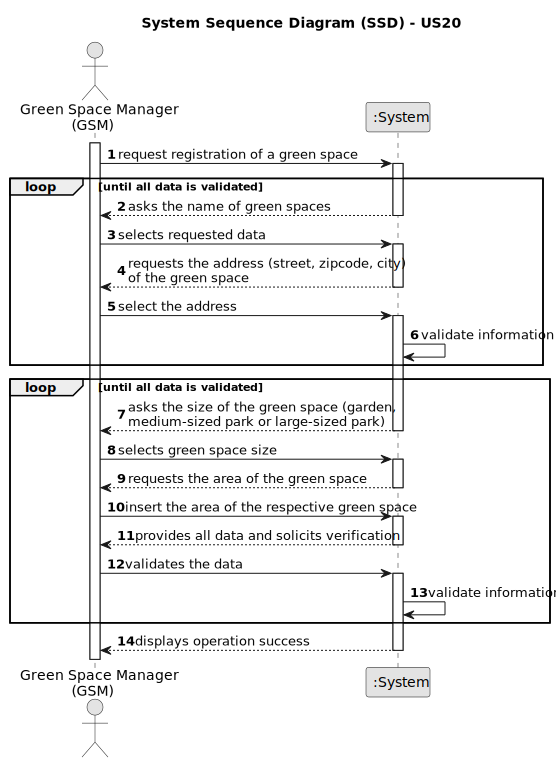

# US20- Register a green space

## 1. Requirements Engineering

### 1.1. User Story Description

As a Green Space Manager (GSM), I want to register a green space
and its respective area.

### 1.2. Customer Specifications and Clarifications

**From the specifications document:**
> The Green Space Manager choose the name of the green space

> The GSM choose the address of the green space.

>The GSM choose the size of the green space.

>The GSM enter the area of the respective green space.

>The GSM confirms the data.

**From the client clarifications:**

> **Question:** In which unit should the area be measured in?
>
> **Answer:** In hectares.

> **Question:** Can the GSM register multiple green spaces at once?
>
> **Answer:** That's a matter of UX/UI, each dev team can decide about it.

> **Question:** To register a green space, what is the criteria needed to classify it as a medium-sized park or a large-sized park?
>
> **Answer:** It's a GSM responsibility to decide the classification.

> **Question:** Can two green spaces have the same name?
>
> **Answer:** No.

> **Question:** Which attributes a Green Space have?
>
> **Answer:** Type (size of the green space), area, name and address.

### 1.3. Acceptance Criteria

* **AC1:** The system must request the name of the green space.
* **AC2:** The system must request the address of the green space.
* **AC3:**  The system must request the size of the green space.
* **AC4:** The system must request the area of the green space.
* **AC5:** The system must validate each piece of information provided.
* **AC6:** The system must compile and display all provided data for the user Green Space Manager verification.
* **AC7:** The system must allow the Green Space Manager to validate the compiled data.
* **AC8:**  The system must perform internal validation checks on all data.
* **AC9:** The system must indicate successful operation upon validation.

### 1.4. Found out Dependencies

* There are no dependencies 

### 1.5 Input and Output Data

**Input Data:**

* Typed data:
  * greenSpaceName
  * greenSpaceAddress
  * greenSpaceArea

* Selected data:
  * greenSpaceSize (garden, mediumPark, largePark)

**Output Data:**

* (In)Success of the operation

### 1.6. System Sequence Diagram (SSD)

### 1.7 Other Relevant Remarks

* Edge Cases and Error Handling (Consider how the system should handle invalid or incomplete data. Detail how the system should handle duplicate green space names or addresses to prevent duplicate entries).
* User Interface Considerations (Ensure that the user interface is intuitive and guides the GSM through each step of the registration process with clear instructions and requests. Include progress indicators or feedback messages to inform the GSM of the current step and any errors in real-time).
* Validation Logic (Specify the validation criteria for each data field as address format, size options, area constraints).
* Data Storage and Security (Outline how the collected data will be securely stored and protected to comply with privacy regulations and best practices. Mention if there are any specific database requirements or constraints related to storing green space information).
* Scalability and Performance (Consider the potential number of green spaces that may be registered and ensure the system is designed to handle large volumes of data efficiently. Include performance benchmarks or requirements if applicable).