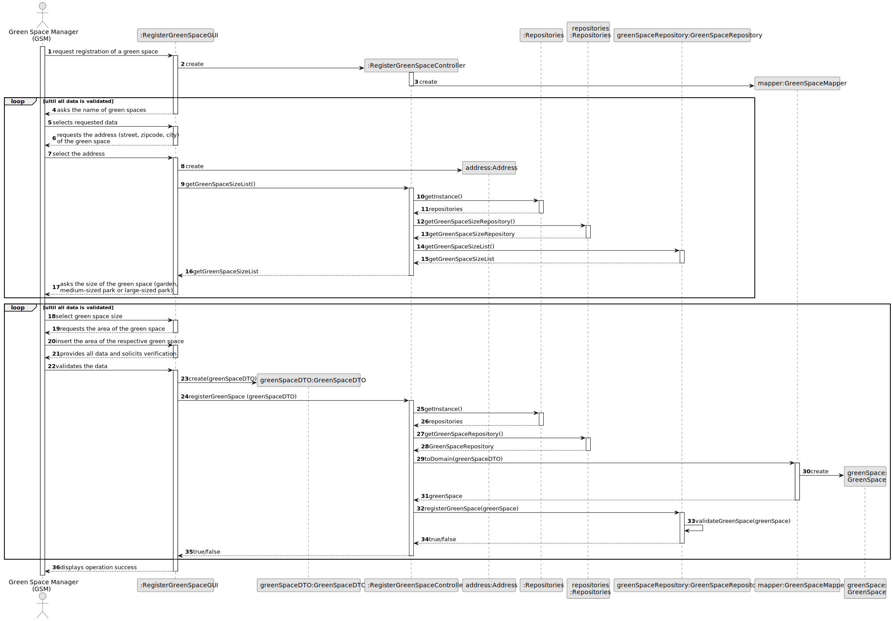
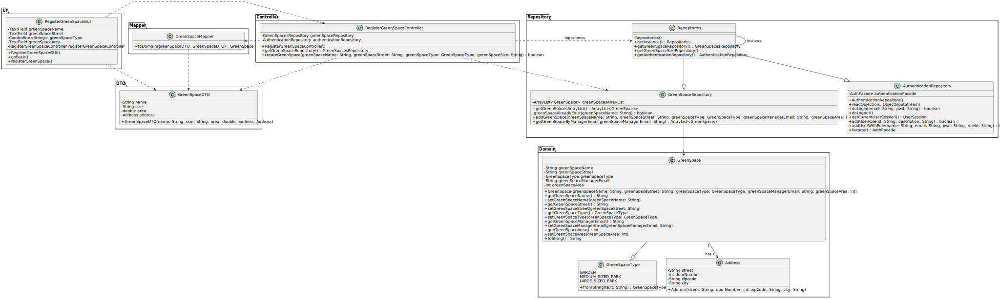

# US20 - Register a green space

## 3. Design - User Story Realization

### 3.1. Rationale

| Interaction ID         | Question: Which class is responsible for...          | Answer                       | Justification (with patterns)                                                                                  |
|:-----------------------|:-----------------------------------------------------|:-----------------------------|:---------------------------------------------------------------------------------------------------------------|
| Step 1  		             | 	... interacting with the actor?                     | RegisterGreenSpaceGUI        | Pure Fabrication: there is no reason to assign this responsibility to any existing class in the Domain Model.  |
| 		                     | 	... coordinating the US?                            | RegisterGreenSpaceController | Controller                                                                                                     |
| 	                      | 	... instantiating a new GreenSpace?                 | GreenSpaceMapper             | Creator (Rule 1): in the DM GreenSpaceMapper register a GreenSpace.                                            |
| Step 2  		             | 	requesting the name of the green space?             | RegisterGreenSpaceGUI        | IE: cf. A&A component documentation.                                                                           |
| Step 3  		             | 	...saving the inputted data temporarily?            | RegisterGreenSpaceGUI        | IE: object created in step 1 has its own data.                                                                 |
| Step 4  		             | 	requesting the address of the green space?          | RegisterGreenSpaceGUI        | Pure Fabrication                                                                                               |
| Step 5  		             | 	... saving the inputted data temporarily?           | RegisterGreenSpaceGUI        | IE: object created in step 1 is classified in one Category.                                                    |
| 		                     | ... instantiating a new Address?		                   | RegisterGreenSpaceGUI        | Creator                                                                                                        |              
| 		                     | 	... ask for greenSpaceSizeList?                     | RegisterGreenSpaceGUI        | IE: owns its data.                                                                                             | 
| 		  		                 | 	... instantiating repositories?                     | RegisterGreenSpaceController | Controller                                                                                                     | 
| 		  		                 | 	... return repositories?                            | Repositories                 | Repositories                                                                                                   | 
| 	  		                  | 	... get greenSpaceSizeRepository?                   | RegisterGreenSpaceController | Controller                                                                                                     | 
| 		                     | 	... return greenSpaceSizeRepository?                | repositories                 | repositories                                                                                                   | 
| 	  		                  | 	... get greenSpaceSizeList?                         | RegisterGreenSpaceController | Controller                                                                                                     | 
| 		                     | 	... return greenSpaceSizeList?                      | GreenSpaceRepository         | GreenSpaceRepository                                                                                           | 
| 		                     | 	... return greenSpaceSizeList?                      | RegisterGreenSpaceController | GreenSpaceRepository                                                                                           | 
| Step 6  		             | 	... show the size of the green space?               | RegisterGreenSpaceGUI        | Pure Fabrication                                                                                               | 
| Step 7  		             | 	... saving the inputted data temporarily?           | RegisterGreenSpaceGUI        | IE: object created in step 1 is classified in one Category.                                                    |
| Step 8  		             | 	... requesting the area of the green space?         | RegisterGreenSpaceGUI        | Pure Fabrication                                                                                               |
| Step 9  		             | 	... receive the area of the respective green space? | RegisterGreenSpaceGUI        | Pure Fabrication                                                                                               |
| Step 10  		            | 	... showing all data and requests confirmation?     | RegisterGreenSpaceGUI        | Pure Fabrication                                                                                               |
| Step 11  		            | 	... receive confirmation of data?                   | RegisterGreenSpaceGUI        | Pure Fabrication                                                                                               |
| Step 12  		            | 	... displaying operation success?                   | RegisterGreenSpaceGUI        | Pure Fabrication                                                                                               |

### Systematization ##

According to the taken rationale, the conceptual classes promoted to software classes are:

* Address
* GreenSpace

Other software classes (i.e. Pure Fabrication) identified:

* RegisterGreenSpaceGUI
* RegisterGreenSpaceController

## 3.2. Sequence Diagram (SD)
### Full Diagram

This diagram shows the full sequence of interactions between the classes involved in the realization of this user story.

## 3.3. Class Diagram (CD)

