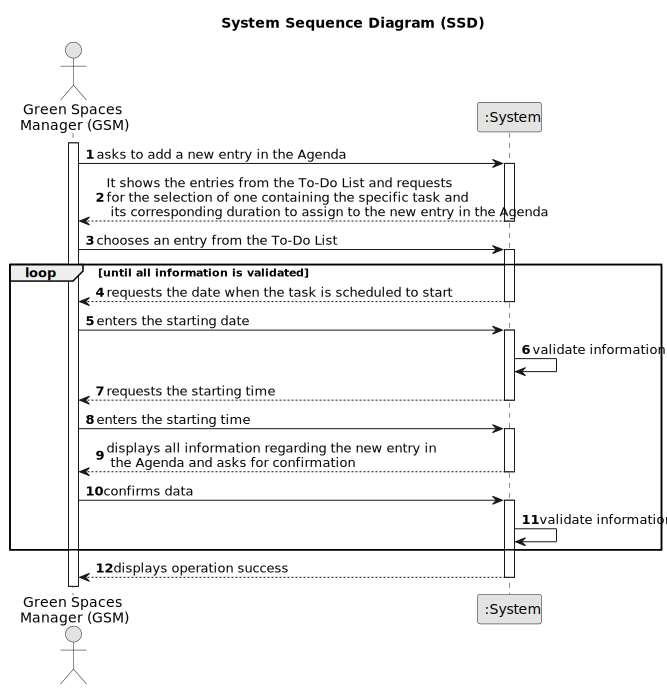

# US022 - Add a new entry to the Agenda

## 1. Requirements Engineering

### 1.1. User Story Description

As a Green Space Manager (GSM), I want to add a new entry in the Agenda.

### 1.2. Customer Specifications and Clarifications

**From the specifications document:**

>	The Agenda consists of entries related to a task (formerly listed in the To-Do List), the team responsible for
executing the task, the vehicles/equipment assigned to it, the anticipated duration, and the task status
(Planned, Postponed, Canceled, Done).

**From the client clarifications:**

> **Question:** If there are multiple GSM in the system, can a GSM create an entry for a Green Space managed by another GSM?
>
> **Answer:** No.

> **Question:** We also know that an Agenda entry has a target date, but is this target date supposed to be inputted upon transferring a task from the to-do list to the agenda, or is it supposed to be inputted upon creating the task in the to-do list?
>
> **Answer:** To-do list entries doesn't have dates!

> **Question:** When a new entry is added to the ToDo list, the default status of that task will be "pending" or no status at all is considered on ToDo list? Similarly, when a new entry is added to the Agenda, the status of that task will be, by default, set to "planned", right?
>
> **Answer:** "Pending" as default for to-do list entries and "Planned" as default for Agenda entries, sounds good.

> **Question:** Can I add an entry that has a time period that already have an existing entry in the Agenda?
>
> **Answer:** Yes, because: there are many parks to manage; different tasks can be executed at same time in the same park.

> **Question:** Regarding the US022, when we are registering an entry to the agenda, are the three inputs (selecting an existing task from the to-do list, starting date, and finishing date) sufficient?
>
> **Answer:** The starting date will be enough because the task already has the predicted duration.

> **Question:** When a To-Do List entry is planned and moves to the Agenda, the status change from "Pending" to "Planned". Should this entry be removed from the To-Do List or just change status to "Planned" as it is on the Agenda?
>
> **Answer:** Changing the status in the To-Do list to Planned seems to be a good approach.

> **Question:** Task duration should be considered in hours or in half days (morning/afternoon)?
>
> **Answer:** Hours should be ok, but keep in mind, that the storage format doesn't need to be same as the input/output format.

> **Question:** Tasks have a status of Planned, Postponed, Canceled or Done. When do they pass to "Planned" status? When they are added to the agenda (before the GSM assigns a team) or when a team is assigned to them?
>
> **Answer:** The use of states and their values is a technical modeling issue, it is not the client's responsibility. Assuming you are using states, a task would become "Planned" as soon as it enters the Agenda.

> **Question:** If he inputs, for example, "2 Days + 2 hours," does that mean 24 + 24 + 2 hours of work for that task, or does each workday have a fixed number of hours, for example, 8h + 8h + 2h?
>
> **Answer:** Working days should be considered; the duration of a working day could be defined as a configuration at bootstrap.

> **Question:** When the task enters in Agenda and the execution date is set, nothing is referenced regarding at what time the task execution starts. In this sense, although we have the start date of the task execution, we don't have the time it starts, so we can't calculate the team's availability accurately.
>
>For example, if we have a team working on a task under the following conditions:
>8h on day 01;
>8h on day 02;
>2h on day 03.
>
>Supposedly, it could still perform some task on day 03 since the team only used 2h of that day. But only with the execution date, it's not possible to determine accurately.
>
> **Answer:** The GSM can insert the date and the starting time for the task in the agenda.

### 1.3. Acceptance Criteria

* **AC1:** The new entry must be linked to a green space overseen by the GSM.
* **AC2:** The new entry must be present in the To-Do list.
* **AC3:** Each GSM is permitted to create entries only for the green spaces they manage.
* **AC4:** When a new entry is added to the agenda, the task should be assigned a default status of "planned."
* **AC5:** When a new entry is registered in the agenda, the system must automatically determine the task's completion date using the starting date specified by the GSM and the expected duration of the task.
* **AC6:** The GSM is required to input not only the starting date but also the starting time for the task in the agenda.
* **AC7:** When transferring an entry from the To-Do List to the Agenda, it should remain on the To-Do List, with only its status updated to "Planned," reflecting its status on the Agenda.
* **AC8:**The system should factor in business days when arranging an entry. The duration of a workday could be specified during initialization.

### 1.4. Found out Dependencies

* There is a dependency on "US021 - Add a new entry to the To-Do List" because it's essential to access the task from the To-Do List along with its duration, enabling their integration into the new entry on the Agenda
* There is a dependency on "US020 - Register a green space and its respective area"  as it's essential to have green spaces registered in the system before linking the agenda entry to a green space managed by the GSM.

### 1.5 Input and Output Data 

**Input Data:**

* Typed data:
  * Starting date;
  * Starting time.

* Selected data:
  * Specific task from the To-Do List to be assigned to the new entry in the Agenda along with its respective duration.

**Output Data:**

* To-Do List entries;
* All Data about the new entry;
* (In)Success of the operation.

### 1.6. System Sequence Diagram (SSD)

