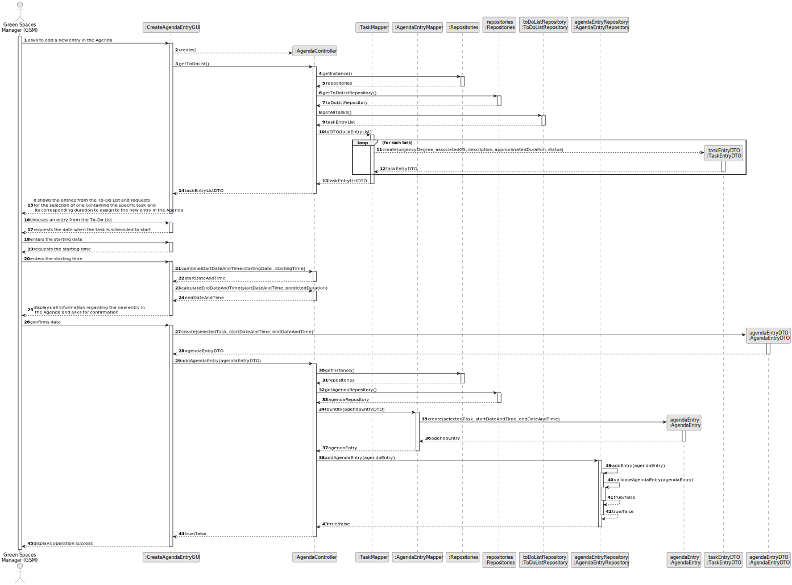
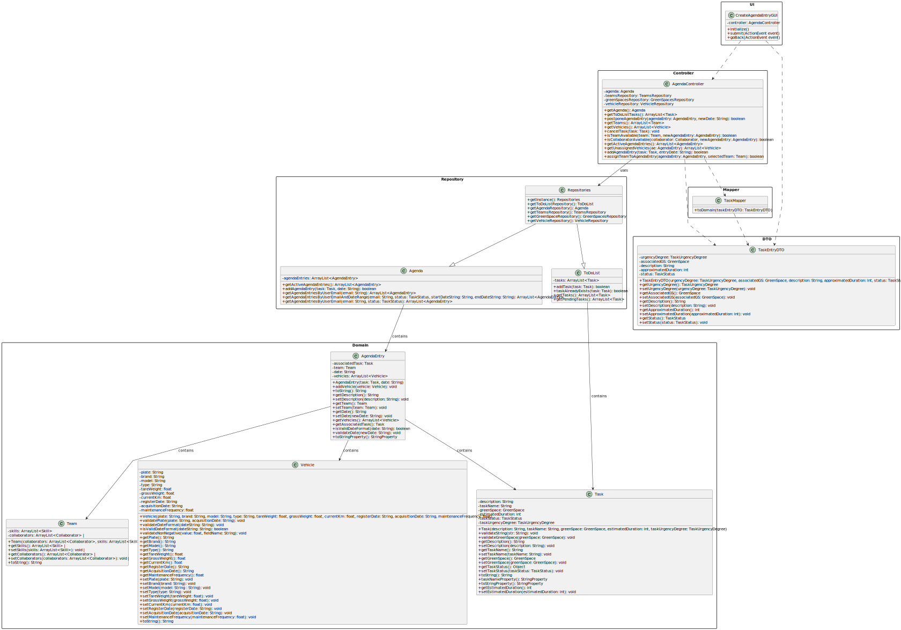

# US022 - Add a new entry to the Agenda

## 3. Design - User Story Realization

### 3.1. Rationale

_**Note that SSD - Alternative One is adopted.**_

| Interaction ID | Question: Which class is responsible for...       | Answer               | Justification (with patterns)                                                                                 |
|:---------------|:--------------------------------------------------|:---------------------|:--------------------------------------------------------------------------------------------------------------|
| Step 1     		  | 	... interacting with the actor?                  | CreateAgendaEntryGUI | Pure Fabrication: there is no reason to assign this responsibility to any existing class in the Domain Model. |
| 			  		        | 	... coordinating the US?                         | AgendaController     | Controller                                                                                                    |
| 		             | 	... interacting with the actor?						            | CreateAgendaEntryGUI | Is responsible for user interactions.                                                                         |
| Step 2         | 	...temporarily saving the inputted data?         | ToDoList             | Is responsible for temporarily keeping inputted data until user confirmation.                                 |
| Step 3  		     | 	... providing the job list?                      | JobRepository        | Is responsible to provide the job list to the UI.                                                             |
|                | 	... displaying the form containing the tasks?    | CreateAgendaEntryGUI | Is responsible for displaying the list of jobs.                                                               |
| Step 4		       | 	.... temporarily keeping the inputted data?      | CreateAgendaEntryGUI | Is responsible for temporarily keeping inputted data until user confirmation.                                 |
| Step 5         | 	... interacting with the actor?						            | CreateAgendaEntryGUI | Is responsible for user interactions.                                                                         |              
| Step 6		       | .... temporarily keeping the inputted data?       | CreateAgendaEntryGUI | Is responsible for temporarily keeping inputted data until user confirmation.                                 |
| Step 7 	 	     | ... displaying the form for the actor to confirm? | CreateAgendaEntryGUI | Knows inputted data until user confirmation                                                                   |
|                | 	... interacting with the actor?                  | CreateAgendaEntryGUI | Is responsible for user interactions.                                                                         |
| Step 8	        | 	... validating the data locally?                 | Agenda               | IE: It is responsible for the validation                                                                      | 
| Step 9         | ... informing operation success? 	                | CreateAgendaEntryGUI | Is responsible for user interactions.                                                                         |

### Systematization ## 

According to the taken rationale, the conceptual classes promoted to software classes are:

* Agenda Entry
* Team
* Vehicle
* Task

Other software classes (i.e. Pure Fabrication) identified:

* CreateAgendaEntryGUI
* RegisterCollaboratorController

## 3.2. Sequence Diagram (SD)

### Full Diagram

This diagram shows the full sequence of interactions between the classes involved in the realization of this user story.

## 3.3. Class Diagram (CD)

