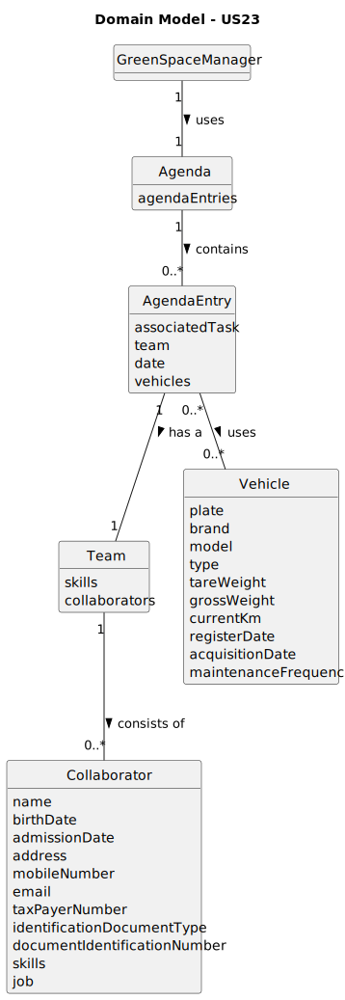

# US23 - Assigns a Team to an Agenda Entry and Sends a Message
## 2. Analysis

### 2.1. Relevant Domain Model Excerpt

### 2.2. Other Remarks

* The name "Human Resources Manager" appearing in the Domain Model above is just an illustrative name in the US03 as it 
represents a "User" as it is shown in the Domain Model in Global Artifacts. 

