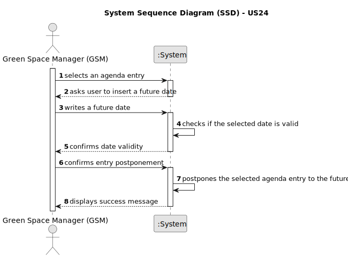

# US024 - Postponing an Entry

## 1. Requirements Engineering

### 1.1. User Story Description
s a GSM, I want to Postpone an entry in the Agenda to a
specific future date.

### 1.2. Customer Specifications and Clarifications 

**From the client clarifications:**
> **Question:** The selected task(s) will be postponed by one interval defined by the user or for the next day?
>
> **Answer:** When postponing a task, the new predicated date for execution should be inserted.

> **Question:** The date you want to postpone in this US24 is the date referring to the "approximate expected duration" field when we registered the task?
>
> **Answer:** No; sometimes, for various reasons (e.g. insufficient staff, faulty equipment or adverse weather conditions) a task has to be postponed to a new date; task duration is not directly related to this.

>
> **Question:** What are the input to postpone an entry? From my perspective the Green Spaces Manager only needs to select the entry and introduce the new date.
>
> **Answer:** Yes, you are correct!

> **Question:** What information will appear on the final list regarding the vehicle,besides the needing for check-up?
>
> **Answer:**  Data that allow to identify the vehicle like Plate, brand and model, as well as, the data that allowed to select/insert te vehicle in the list, number of kms, frequency of checkup and the last checkup.

### 1.3. Acceptance Criteria

* **AC1:** All required fields must be filled in.
* **AC2:** The date must be in the future and after the entry's current date.
* **AC3:** The date and state of the entry must be changed.
* **AC4:** The system must verify and display success of recording.
* 
### 1.4. Found out Dependencies

* There is a dependency on "US22- As a GSM, I want to add a new entry in the Agenda."

### 1.5 Input and Output Data
**Input Data:**

* The entry chosen to postpone and the date to postpone it to.

**Output Data:**

* The success of the operation.

### 1.6. System Sequence Diagram (SSD)

**_Other alternatives might exist._**

#### Alternative One

### 1.7 Other Relevant Remarks

* n/a