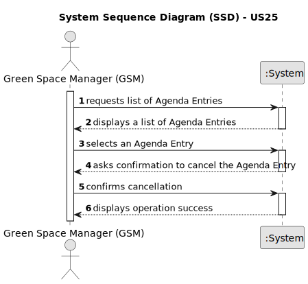

# US25 - Cancel an entry in the Agenda

## 1. Requirements Engineering

### 1.1. User Story Description

As a Green Space Manager (GSM), I want to cancel an entry in the Agenda.

### 1.2. Customer Specifications and Clarifications 

**From the specifications document:**

> A canceled task should not be deleted but rather change its state.

**From the client clarifications:**

> **Question:**  When a task is cancelled, is it possible to put it back on the agenda again later?
>
> **Answer:** Yes.

> **Question:**  When we cancel a task, do we move it again to the To-Do List?
>
> **Answer:** No.

> **Question:**  As a GSM, I want to Cancel an entry in the Agenda. When the GSM wants to cancel a task, this task can only be canceled if its status is PLANNED or POSTPONED, correct?
>
> **Answer:** No, just planned because if there is a Postponed entry then there is also an Planned Entry with the new date.

### 1.3. Acceptance Criteria

* **AC1:** The system should display a list of agenda entries to the GSM.
* **AC2:** The GSM should be able to select an agenda entry from the list.
* **AC3:** The system should ask the GSM for confirmation to cancel the selected agenda entry.
* **AC4:** Upon confirmation, the system should change the state of the agenda entry to "canceled."
* **AC5:** The system should notify the GSM of the successful cancellation.

### 1.4. Found out Dependencies 

* **US22:** Once a task is on the To-Do List, it can be scheduled in the Agenda. To cancel an entry in the Agenda (US25), that entry must first exist in the Agenda, which is handled in US22.
  
### 1.5 Input and Output Data

**Input Data:**

* Typed data:
  * none required

* User actions:
  * Requesting a list of agenda entries
  * Selecting an agenda entry to cancel
  * Confirming the cancellation

**Output Data:**
  * List of agenda entries
  * Confirmation prompt for cancellation
  * Success of the operation

### 1.6. System Sequence Diagram (SSD)

### 1.7 Other Relevant Remarks
* There are no other relevant remarks.