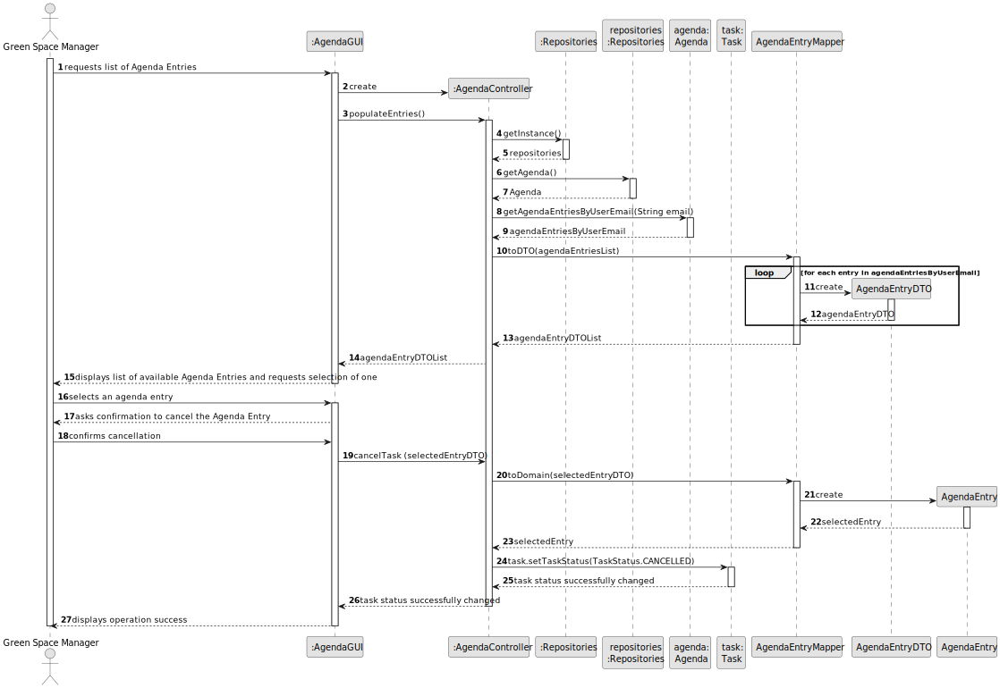
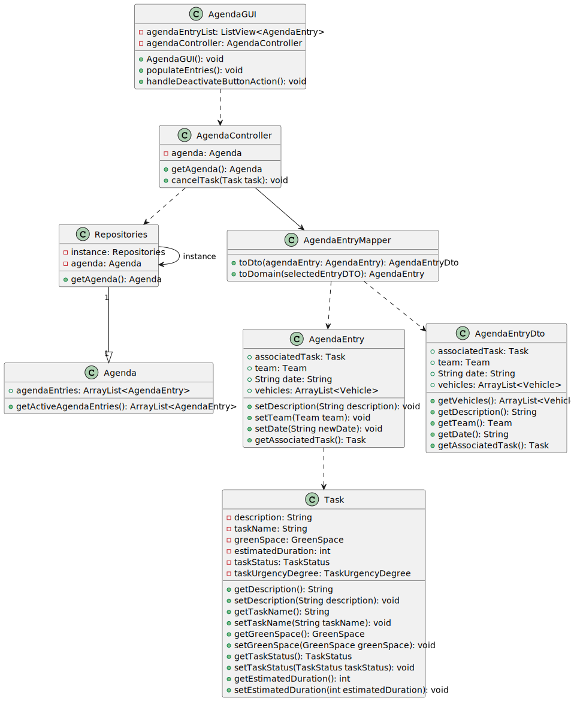

# US25 -  As a GSM, I want to Cancel an entry in the Agenda

## 3. Design - User Story Realization

### 3.1. Rationale 
| Interaction ID | Question: Which class is responsible for...                   | Answer           | Justification (with patterns) |
|:---------------|:--------------------------------------------------------------|:-----------------|:------------------------------|
| Step 1         | ... interacting with the actor?                               | AgendaGUI        | Pure Fabrication              |
|                | ... coordinating the US?                                      | AgendaController | Controller                    |
| Step 2         | ... requesting the data?                                      | AgendaGUI        | Pure Fabrication              |
| Step 3         | ... receiving the data?                                       | AgendaUI         | Pure Fabrication              |
|                | ... getting entry repository?                                 | Repositories     | IE                            |
|                | ... getting all the agenda entries and return them as a list? | Agenda           | IE                            |
|                | ... showing the entries available for selection?              | AgendaGUI        | Pure Fabrication             |
| Step 4         | ... handling the user selecting an entry?                     | AgendaGUI        | Pure Fabrication             |
| Step 5         | ... showing the confirmation info?                            | AgendaGUI        | Pure Fabrication             |
| Step 6         | ... informing of operation success?                           | AgendaGUI        | Pure Fabrication             | 
### Systematization ##

According to the taken rationale, the conceptual classes promoted to software classes are:

* Agenda
* Task

Other software classes (i.e. Pure Fabrication) identified:

* AgendaGUI
* AgendaController
* Repositories
* AgendaEntryMapper
* AgendaEntryDTO

## 3.2. Sequence Diagram (SD)

This diagram shows the full sequence of interactions between the classes involved in the realization of this user story.

## 3.3. Class Diagram (CD)

