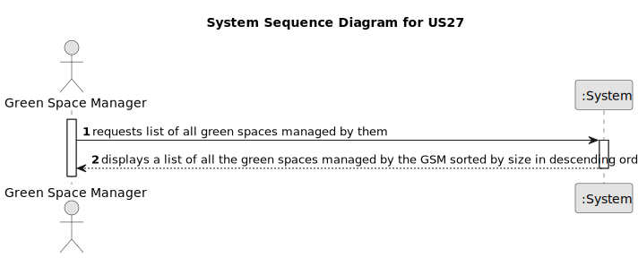

# US27 - List all green spaces managed by the Green Space Manager (GSM)

## 1. Requirements Engineering

### 1.1. User Story Description

As a Green Space Manager (GSM), I need to list all green spaces managed by me.

### 1.2. Customer Specifications and Clarifications

**From the specifications document:**

> The list of green spaces must be sorted by size in descending order (area in hectares should be used). 
> The sorting algorithm to be used by the application must be defined through a configuration file. 
> At least two sorting algorithms should be available.

**From the client clarifications:**

> **Question:** Dear client, in this user story you only want to list the Green Spaces manage by the GSM. Due to this, the GSM should be register in the app previusly, isn't it? Which atributes should it have? A  GSM is a collaborator?
> 
> **Answer:** yes; the GSM (you can have many) should be registered in the app.
GSM is a role that can be played a registered user with the appropriate priviliges;

> **Question:** Which atributes should GSM have? A GSM is a collaborator?
>
> **Answer:** A collaborator is a person (an employee) that have a name, birthdate, a salary, etc, A GSM is a role played by a collaborator. Depending in the size of the company, you can have a collaborator playing multiple roles like GSM, VFM or HRM or different persons playing the same role like GSM.

> **Question:** Dear client, can you explain what do you mean with "At least two sorting algorithms should be available" ? Should both algorithms sort based on size?
>
> **Answer:** The application should be designed (and implemented) to run at least two sorting algorithms. The name of the algorithm to be used to sort the data should be specified in a configuration file. The different sorting algorithms must be implemented on classes. The different implementations should sort by size, in ascending order (cf. AC1 of US27).

### 1.3. Acceptance Criteria

* **AC1:** The list of green spaces must be sorted by size in descending order (area in hectares should be used).
* **AC2:** The sorting algorithm used by the application must be defined through a configuration file.
* **AC3:** At least two sorting algorithms should be available for selection.

### 1.4. Found out Dependencies

* **US20:** The registration of green spaces is essential for listing all green spaces managed by the GSM (US27). Without the registration of green spaces, there would be no data available to list.

### 1.5 Input and Output Data

**Input Data:**

* Typed data:
  * none required

* User actions:
  * GSM requests the list of green spaces they manage.

**Output Data:**

* List of green spaces managed by the GSM, sorted by size in descending order.

### 1.6. System Sequence Diagram (SSD)

### 1.7 Other Relevant Remarks

* The sorting algorithm should be efficient and handle large lists of green spaces.
* The configuration file should be easy to modify to switch between the available sorting algorithms.
* Ensuring that the green spaces are accurately sorted and displayed is crucial for the GSM to manage their tasks effectively.