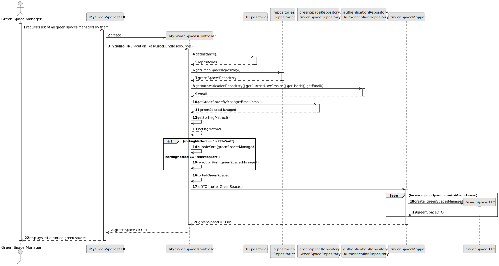

# US27 - List all green spaces managed by the Green Space Manager (GSM)

## 3. Design - User Story Realization

### 3.1. Rationale 
| Interaction ID | Question: Which class is responsible for...   | Answer                   | Justification (with patterns)                                                                 |
|:---------------|:----------------------------------------------|:-------------------------|:----------------------------------------------------------------------------------------------|
| Step 1         | ... interacting with the actor?               | MyGreenSpacesGUI         | Pure Fabrication: There is no need to assign this responsibility to any existing class        |
|                | ... coordinating the US?                      | MyGreenSpacesController  | Controller                                                                                    |
|                | ... having all the repositories?              | Repositories             | IE: has all the different repositories                                                        |
| Step 2         | ... obtaining the current user's email?          | AuthenticationRepository | Pure Fabrication: no existing class in Domain Model can initialize a new Green Space          |
|                | ... retrieving green spaces managed by the user?        | GreenSpaceRepository     | IE: is responsible for retrieving green spaces managed by a specific user                     |
|                | ... sorting the green spaces? | MyGreenSpacesController  | IE: determines the sorting method for green spaces                                            |
|                | ... converting green spaces to DTOs?              | GreenSpaceMapper         | Pure Fabrication: it's a specialized class responsible for mapping GreenSpace objects to DTOs |
|                | ... displaying the sorted green spaces?      | MyGreenSpacesGUI         | IE: is responsible for displaying information to the user                                                                         |

### Systematization ##

According to the taken rationale, the conceptual classes promoted to software classes are:

* GreenSpace

Other software classes (i.e. Pure Fabrication) identified:

* MyGreenSpacesGUI
* MyGreenSpacesController

## 3.2. Sequence Diagram (SD)

This diagram shows the full sequence of interactions between the classes involved in the realization of this user story.

## 3.3. Class Diagram (CD)

