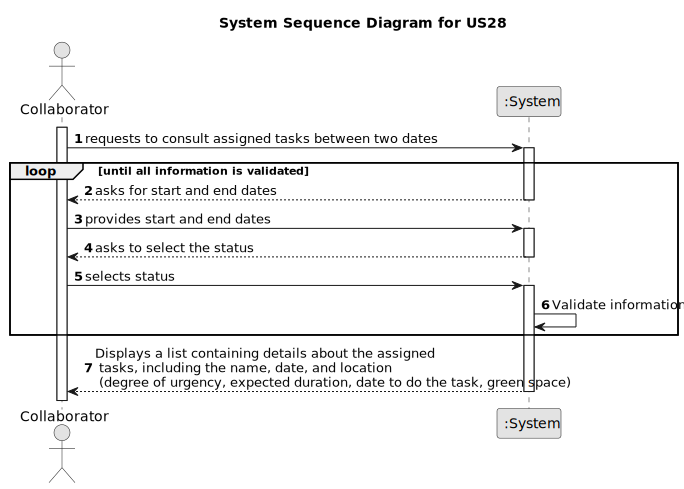

# US028 - Made a list of tasks assigned

## 1. Requirements Engineering

### 1.1. User Story Description

As a Collaborator, I wish to consult the tasks assigned to me between two dates.

### 1.2. Customer Specifications and Clarifications

**From the specifications document:**

> The To-Do List comprises all pending tasks for all parks. The entries in
this list describe the required task, the degree of urgency (High, Medium,
and Low), and the approximate expected duration. The Agenda is made
up of entries that relate to a task (which was previously in the To-Do List),
the team that will carry out the task, the vehicles/equipment assigned to
the task, expected duration, and the status (Planned, Postponed, Canceled,
Done).

**From the client clarifications:**

> **Question:** Could a task belong to different teams and collaborators? I mean, if the status, degree of urgency and expect
duration belong to an entry of the to do list and the task is something generic that can be reuse, or if the
task could belong only to one collaborator, and for another you have to create another one.

> **Answer:** No.
Maybe a distintion should be made between type of task and a task.
Task type is "Prunning trees", a specific task is "Prunning trees" in specific park in a specific date.

> **Question:** Dear client, I didn't end to understand a question answered here. A collaborator could have assigned at the same time different tasks from different teams, isnt it?
Apart, which atributes has a task ( maybe something like: name, frequency, creation_date, lenght, status)? Which id do you want (I think name is not a good idea)? Which status could a task have?

> **Answer:** No, in a specific period (for instance during a week) a collaborator just belongs to team. But if you consider a wider period you may find different teams to which a collaborator belonged.
In this project no distinction will be made between recorrent/occasional tasks; I suppose that the identification is a combination of Name, Date and Local, like Prunning Trees at 20/05/2024 in Parque da Cidade.

> **Question:** I noticed that some details were added to US028. Now the collaborator intends to consult the tasks assigned to him between two dates specified by him.
However, I have a doubt: in US022, when GSM wants to add a new entry to the Agenda, one of the necessary inputs is the starting date of the task itself, as I saw in one of the questions already asked to the client.
Therefore, are the tasks that should be shown to the Collaborator in this US028 those where the starting date is between the two mentioned by the Collaborator? Or, for example, when a task is recorded as complete in US029, the Collaborator would also have to input the task's completion date and then the tasks that begin and end within the date range introduced by the Collaborator in this US028 would be shown?

> **Answer:** I would suggest to consider any tasks which intersept the supplied period (defined by the two dates).

> **Question:** "As a Collaborator, I wish to consult the tasks assigned to me". That means that the collaborator can have more than one task assigned to them.
To ensure that, the same task should be available for more than one team, am I right? The reason for that question is so that if a task is strictly related to only one team, a collaborator will end
up being in two teams simultaneously, which cannot happen.

> **Answer:** A team can have multiple task assigned, hence, if a collaborator belongs to a team.
Besides, a collaborator can move from a team to another, so during, for instance,
a month period a collaborator can belong to multiples teams.

### 1.3. Acceptance Criteria

* **AC1:** The list of green spaces must be sorted by date, starting
  with the first to be performed.
* **AC2:** The Collaborator should be able to filter the results by the
  status of the task.
* **AC3:** The system should validate that the provided start date is not after the end date and vice versa.
* **AC4:** If the provided start and end dates are invalid (e.g., end date is before start date), the system should display an error message to the Collaborator and request them to provide valid dates.
* **AC5:** The system should only display tasks that fall within the provided date range.
* **AC6:**  If no tasks are found within the specified date range and status, the system should display a message indicating that no tasks match the criteria.
* **AC7:** The system should provide options for different status filters (e.g., "Pending," "In Progress," "Completed") to the Collaborator.
* **AC8:** When filtering tasks by status, the system should only display tasks that match the selected status.
* **AC9:** If the Collaborator does not select a status filter, the system should display tasks with all statuses by default.
* **AC10:** Tasks displayed in the list should include details such as the task name, date, location, and status.
* **AC11:** If there are multiple tasks with the same date, they should be sorted alphabetically by task name.
* **AC12:** The system should ensure data security and access control, allowing only authorized users to view and modify task information.

### 1.4. Found out Dependencies

* There is a dependency on "US23" - As a Green Space Manager (GPM), I want to assign a Team to an entry in the Agenda.

### 1.5 Input and Output Data

**Input Data:**

* Typed data:
    * Begin data
    * End data

* Selected data:
    * Status

**Output Data:**

* (In)Success of the operation
* shows a list with information about the tasks assigned \n
  (Name, Date and Local)

### 1.6. System Sequence Diagram (SSD)

