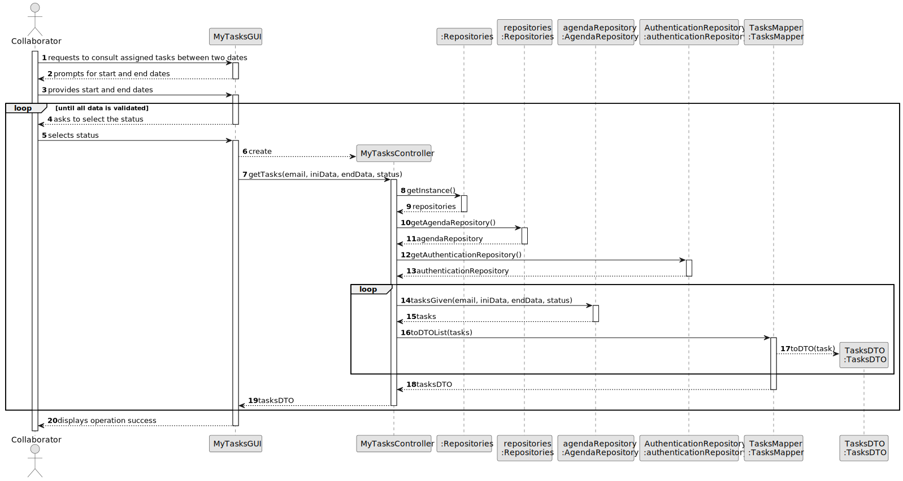
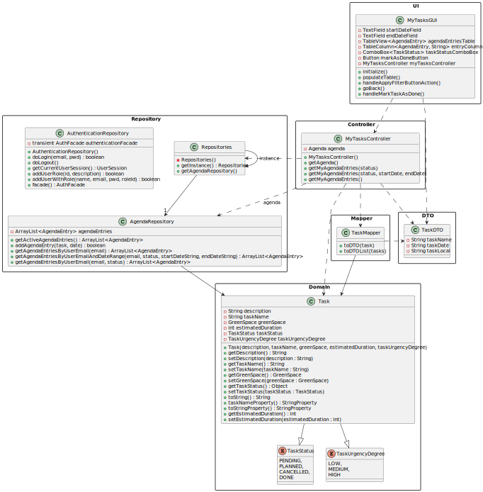

# US028 - Made a list of tasks assigned

## 3. Design - User Story Realization

### 3.1. Rationale

| Interaction ID                                                                                                                                     | Question: Which class is responsible for...                         | Answer                   | Justification (with patterns)                                                                                    |
|:---------------------------------------------------------------------------------------------------------------------------------------------------|:--------------------------------------------------------------------|:-------------------------|:-----------------------------------------------------------------------------------------------------------------|
| Step 1: requests to consult assigned tasks between two dates 		                                                                                    | 	... interacting with the actor?                                    | MyTasksGUI               | Pure Fabrication: there is no reason to assign this responsibility to any existing class in the Domain Model.    |
|                                                                                                                                                    | ... for instantiate the TasksController?                            | MyTasksGUI               | Creator(rule 3): this class uses closely the TasksController.                                                    |
| 			  		                                                                                                                                            | 	... coordinating the US?                                           | MyTasksController        | Controller                                                                                                       |
|                                                                                                                                                    | ... provide the AgendaEntryRepository and AuthenticationRepository? | Repositories             | IE: Have the information about all the repositories                                                              |
|                                                                                                                                                    | ... provide the email of the current user?                          | AuthenticationRepository | IE: Have all the information about the session of the user                                                       |
|                                                                                                                                                    | ... provide the tasks given to a collaborator?                      | Agenda                   | IE: Have all the tasks information                                                                               |
|                                                                                                                                                    | ... convert domain objects to DTOs?                                 | TasksMapper              | Protected Variations: protects the UI and controller from variations in the internal structure of domain objects |
| Step 2: shows a list with information about the tasks assigned (task, degree of urgency, expected duration, date to do the task, green space)   		 | ... shows the list of tasks given to the collaborator? 							      | MyTasksGUI               | IE: responsible for user interaction.                                                                            |

### Systematization ##

According to the taken rationale, the conceptual classes promoted to software classes are:

* Tasks
* Agenda

Other software classes (i.e. Pure Fabrication) identified:

* MyTasksGUI
* MyTasksController

## 3.2. Sequence Diagram (SD)

### Full Diagram

This diagram shows the full sequence of interactions between the classes involved in the realization of this user story.

## 3.3. Class Diagram (CD)

