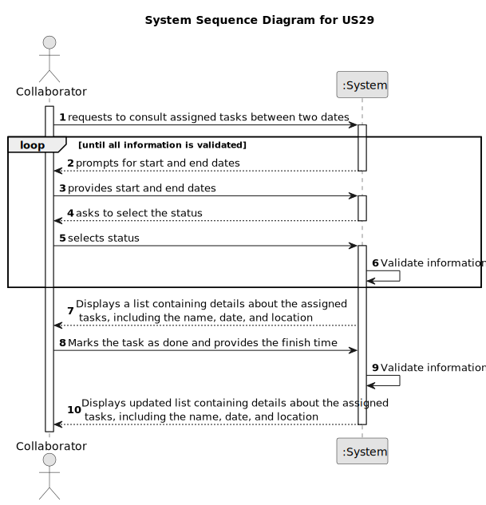

# US29 - Records the completion of a task

## 1. Requirements Engineering

### 1.1. User Story Description

As a Collaborator, I want to record the completion of a task.

### 1.2. Customer Specifications and Clarifications 

**From the specifications document:**

> None.
> 

**From the client clarifications:**

> **Question:**  Can an employee record more than one completed task at a time?
>
> **Answer:** It's a matter of UX/UI, each dev team can decide about it.

> **Question:**  When a collaborator records a task, it should be asked for any observations regarding the completed task?

> **Answer:** Maybe if optional, not mandatory.

> **Question:**  The collaborator can see what type of entrys? Like what status can he filter ? Can he see canceled Entry's?

> **Answer:** The ones assigned to him. He can filter by the different values the status of the status, like planned, executed, canceled ...

> **Question:**  Can a collaborator mark a task as "done" only if it is in the "planned" status?

> **Answer:**  It depends in the status set your team decide to have/use. But if you consider only status refered in the text and in the forum my answer would be, yes, just the "Planned" status can be changed to "Done".

> **Question:**  "As a Collaborator, I want to record the completion of a task."This "record" refers to the act of only changing the status of the task, or do we want to save a list of the completed tasks within each Collaborator?

> **Answer:**  It means to record that a task was completed (changing the status) with the finish time.

> **Question:**  The collaborator should be able to change the status of any task or only tasks assigned to him?
 
> **Answer:** yes.

> **Question:** Does the task associated with the Agenda entry in which this happens remain in the To-do List or can it be removed, unlike what happens in the Agenda? Or even, would this process be different between a completed task and a canceled task?

> **Answer:** Yes. I suppose when a task goes to the Agenda, it leaves the To-Do list but maybe a different flow could be considered.

### 1.3. Acceptance Criteria

* **AC1:** The list of green spaces must be sorted by date, starting
  with the first to be performed.
* **AC2:** The Collaborator should be able to filter the results by the
  status of the task.
* **AC3:** The system should validate that the provided start date is not after the end date and vice versa.
* **AC4:** If the provided start and end dates are invalid (e.g., end date is before start date), the system should display an error message to the Collaborator and request them to provide valid dates.
* **AC5:** The system should only display tasks that fall within the provided date range.
* **AC6:**  If no tasks are found within the specified date range and status, the system should display a message indicating that no tasks match the criteria.
* **AC7:** The system should provide options for different status filters (e.g., "Pending," "In Progress," "Completed") to the Collaborator.
* **AC8:** When filtering tasks by status, the system should only display tasks that match the selected status.
* **AC9:** If the Collaborator does not select a status filter, the system should display tasks with all statuses by default.
* **AC10:** Tasks displayed in the list should include details such as the task name, date, location, and status.
* **AC11:** If there are multiple tasks with the same date, they should be sorted alphabetically by task name.
* **AC12:** The system should ensure data security and access control, allowing only authorized users to view and modify task information.

### 1.4. Found out Dependencies 

**Input Data:**

* Typed data:
  * Begin data
  * End data

* Selected data:
  * Status

**Output Data:**

* (In)Success of the operation
* shows a list with information about the tasks assigned \n
  (Name, Date and Local)

### 1.6. System Sequence Diagram (SSD)

### 1.7 Other Relevant Remarks

* Highlighting the importance of the collaborator registration process, as outlined in User Story US03, it holds a central
position within the organizational structure for human resource management. 
* This process entails gathering vital information, such as the collaborator's name, contact information, assigned job 
position, and key attributes
* To conclude, the system aids in enhancing organizational efficiency and promoting comprehensive personnel management.