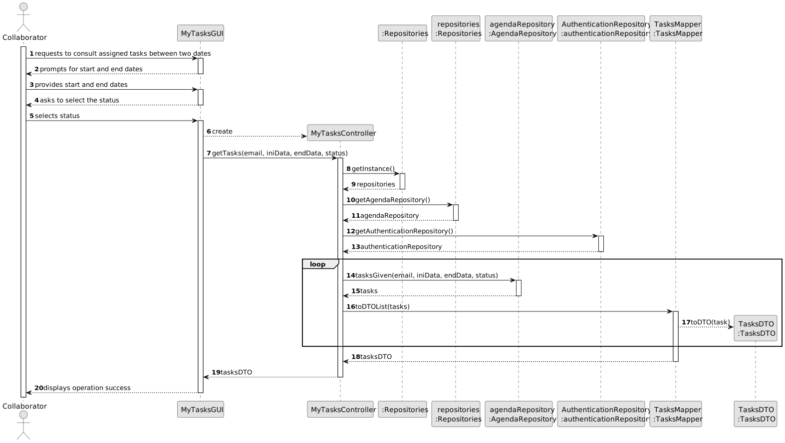

# US29 - As an HRM, I want to register a collaborator with a job and fundamental characteristics

## 3. Design - User Story Realization

### 3.1. Rationale 

| Interaction ID | Question: Which class is responsible for... | Answer            | Justification (with patterns)                                                                                 |
|:---------------|:--------------------------------------------|:------------------|:--------------------------------------------------------------------------------------------------------------|
| Step 1         | ... interacting with the actor?             | MyTasksGUI        | Pure Fabrication: there is no reason to assign this responsibility to any existing class in the Domain Model. |
|                | ... coordinating the US?                    | MyTasksController | Controller                                                                                                    |
|                | ... having all the repositories?            | Repositories      | IE: has all the different repositories.                                                                       |
| Step 2         | ... initiating a new Task?                  | Agenda            | Creator (Rule 1), Pure Fabrication: no existing class in Domain Model can initialize a new Team.              |
| Step 3         | ... validating the input data?              | MyTasksGUI        | IE: is responsible for user interaction.                                                                      |
| Step 4         | ... knowing all the tasks?                  | Agenda            | IE: knows all its collaborators.                                                                              |
| Step 5         | ... displaying the collaborator's tasks?    | MyTasksGUI        | IE: is responsible for user interaction.                                                                      |
|                | ... saving the created tasks?               | Agenda            | IE: owns its data.                                                                                            |
| Step 6         | ... informing operation success?            | MyTasksGUI        | IE: is responsible for user interaction.                                                                      |

### Systematization ##

According to the taken rationale, the conceptual classes promoted to software classes are:

* Collaborator

Other software classes (i.e. Pure Fabrication) identified:

* MyTasksGUI
* MyTasksController

## 3.2. Sequence Diagram (SD)

### Full Diagram

This diagram shows the full sequence of interactions between the classes involved in the realization of this user story.

## 3.3. Class Diagram (CD)

