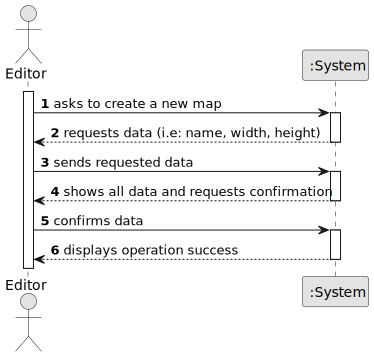

# US001 - As an editor, I want to create a map with a size and a name

## 1. Requirements Engineering

### 1.1. User Story Description

As an editor, I want to create a map with a size and a name

### 1.2. Customer Specifications and Clarifications 

**From the specifications document:**

> The Map Editor allows you to create rectangular maps and place static elements on the map.

**From the client clarifications:**

> **Question:** Em que situação haveria insucesso na criação de um mapa?
Os mapas podem ter tamanho infinito?
Os nomes de scenarios e mapas podem ser iguais?
>
> **Answer:** Desafio: enumere entidades concretas de dimensão infinita ;-)
Sim, são objectos diferentes.

> **Question:**  What are the minimum and maximum dimensions allowed for a map (e.g., width and height in units or pixels)?
Is there a predefined list of sizes, or should users be able to input custom dimensions?
Are there any requirements or restrictions for the map's name (e.g., character limit, allowed/disallowed characters)?
Should map names be unique within the system?
>
> **Answer:** Should be positive integer; Custom dimensions but suggesting predefined sizes could be a good idea. File name like restrictions. yes.

> **Question:** O tamanho do mapa pode ser um número real ou precisa de ser um número inteiro?
>
> **Answer:** The map is a set of cells, similar to a spreadsheet. The coordinates are integers (row and column, or alternatively X and Y)

> **Question:** Are there specific formats required (square, rectangular), or can any dimensions be used? Are there any naming conventions for maps (no special characters, character limit)? Will there be predefined maps, or will all maps be created by editors? Should maps be stored in a specific format?
>
> **Answer:** square is just a particular case of a rectangle ;-) file name; no. tbd

> **Question:** Are there minimum and maximum values ​​for size? Are there standard ratio or max/min ratio for map size?
>
> **Answer:** The number needs to be a positive on; there is no maximum, it's up to the editor to decide.

> **Question:** Considering the map will need to accommodate multiple cities,industries and stations with their respective connections, would it be acceptable to establish a minimum map size like 20x20 or 50x50? A smaller size might not provide enough space for meaningful simulation elements.
> Can we also suggest to the editor the default map size of 100x100 or another one that you indicate to us?
>
> **Answer:** yes, you can define a minimum;
> yes, you can suggest a default size.

> **Question:** Can I consider the following rules as acceptance criteria 3 and 4, respectively? 
> The name must be unique
> Displays the newly created map's details (size, name)
>
> **Answer:** 

> **Question:** Good afternoon. In the new version of us1, a aceptance criteria of a scale which states the size of the cell map in kms has been added. My question is: should this scale be user specified or system retrieved? In the case of the latter, are there any guidelines in place in order to obtain that value? Where should it originate?
>
> **Answer:** User specification.

> **Question:** As an editor, when creating a map, how does he define the size?
> Is there an option for the size do be random?
> Is there a default size in case the editor doesn't specify the dimentions?
> If the editor doesn't define the map's name, does it have a default one?
> After finishing the creation of the map, should we display the map's details or display the rectangle based on the input?
>
> **Answer:**

> **Question:** Caro cliente, como não foi estipulado nenhum critério de aceitação na User Story 1, que critérios de aceitação considera fundamental serem apresentados na Requisição de requisitos?
>
> Dear client, since no acceptance criteria were stipulated in User Story 1, what acceptance criteria do you consider essential to be presented in the requirements request?
>
> **Answer:**

> **Question:** According to the new AC03, should the scale be implemented in java fx in order to show the cale when the map is visualized?
>
> **Answer:**

> **Question:** Para o novo critério da US01, ou seja, a escala do mapa, deve este valor ser algo pré-definido pelo sistema ou deve ser pedido ao utilizador a escala que quer utilizar (p.e.: Insira o valor (em kms) para uma célula).
>
> **Answer:** Já foi respondida essa questão neste forum e na sessões do clientes (algumas vezes).

### 1.3. Acceptance Criteria

* **AC1:** A map cannot have special characters.
* **AC2:** The map width and height needs to be positive
* **AC3:** The map name is unique.
* **AC04**: The maps should have a scale that states the size of cell map in kms.

### 1.4. Found out Dependencies

* There is no dependency found

### 1.5 Input and Output Data

**Input Data:**

* Typed data:
    * Map's name
    * Map's width
    * Map's height

* Selected data:
    * n/a

**Output Data:**

* Map data (for confirmation)
* (In)Success of the operation

### 1.6. System Sequence Diagram (SSD)

### 1.7 Other Relevant Remarks

* The client said that it would be acceptable to restrict the player of a creating a map smaller than a minimum. However, our team decided not to go with that.

* We'll assume that the default scale is kms.
