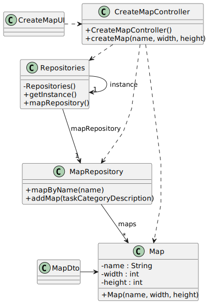

# US006 - Create a map

## 3. Design

### 3.1. Rationale

| Interaction ID                                   | Question: Which class is responsible for...       | Answer              | Justification (with patterns)                                                                                 |
| :----------------------------------------------- | :------------------------------------------------ | :------------------ | :------------------------------------------------------------------------------------------------------------ |
| Step 1: asks to create a new map                 | ... interacting with the actor?                   | CreateMapUI         | Pure Fabrication: there is no reason to assign this responsibility to any existing class in the Domain Model. |
|                                                  | ... coordinating the US?                          | CreateMapController | Controller: acts as an intermediary for all the layers in the US                                              |
| Step 2: requests data                            | ... temporarily storing data?                     | CreateMapUI         | Pure fabrication: there is no reason to assign this responsibility to any existing class in the Domain Model. |
| Step 3: sends requested data | ... basic validation the introduced data?         | CreateMapUI         | Pure fabrication: there is no reason to assign this responsibility to any existing class in the Domain Model. |
| Step 4: shows all data and requests confirmation | ... displaying all information before submission? | CreateMapUI         | Pure fabrication: there is no reason to assign this responsibility to any existing class in the Domain Model. |
|                                                  | ... displaying the confirmation form?             | CreateMapUI         | Pure fabrication: there is no reason to assign this responsibility to any existing class in the Domain Model. |
| Step 5: confirms data                            | ...validating the data?                           | Map                 | IE: owns its data.                                                                                            |
|                                                  | ... storing the map?                              | MapRepository       | IE: knows everything about the maps.                                                                          |
|                                                  | ... checking is map's name exists                 | MapRepository       | IE: knows everything about the maps.                                                                          |
| Step 6: displays operation success               | ...informing operation success?                   | CreateMapUI          | Pure fabrication: there is no reason to assign this responsibility to any existing class in the Domain Model. |

### Systematization ##

According to the taken rationale, the conceptual classes promoted to software classes are: 

* Map

Other software classes (i.e. Pure Fabrication) identified: 

* CreateMapUI
* CreateMapController
* Repositories
* MapRepository
* MapMapper
* MapDto

## 3.2. Sequence Diagram (SD)

### Full Diagram

This diagram shows the full sequence of interactions between the classes involved in the realization of this user story.

## 3.3. Class Diagram (CD)

