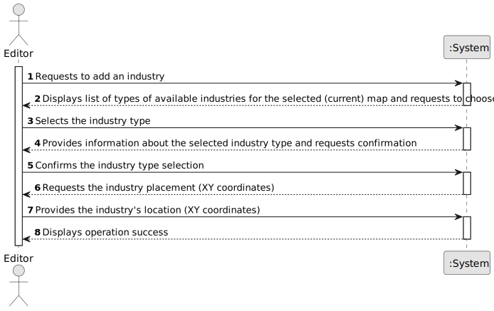

# US02 - As an Editor, I want to add an industry (selected from the available industries) in a position XY of the selected (current) map

## 1. Requirements Engineering

### 1.1. User Story Description

As an Editor, I want to add an industry (selected from the available industries) in a position XY of the selected (current) map

### 1.2. Customer Specifications and Clarifications 

**From the specifications document:**

> The Map Editor allows you to create rectangular maps and place static elements on the map. Elements 
can be cities or industries.

> As for industries, there are three different types:
> Primary sector industries - which generate resources, such as mines (e.g., iron, coal, bauxite, or nitrate mines) 
and farms (vegetables, cereals, wool, coffee, rubber, cattle). The resources generated by these units can, 
if transported by train in the context of the simulator, be consumed/processed by other types of industries;

> Transforming industries - which transform the resources provided by the Primary Sector Industries into new products. 
This industry includes bakeries, textiles, automobiles, and steel mills. For example, a steel mill transforms coal 
and iron ore into steel. The steel produced can then be transported to an automobile factory and used in the 
production of automobiles.

> Mixed industries - Ports potentially have the capacity, depending on what is defined in the scenario, 
to import/export and transform any cargo.

> The Scenario Editor must allow the user to define the restrictions and
conditions for using a given map, namely:
• Time Restrictions - the period in which the simulation will take place;
• Technological Restrictions - for example, which locomotives or industries are available in the scenario;
• Historical Restrictions - historical events that make sense in the scenario and change the operating conditions of 
the simulator. For instance, a war increases the steel demand, and a vaccination campaign or a schooling program 
encourages mail and/or passenger traffic. In this context, the goods that the Ports import and export are also defined.

> It is crucial to highlight that cities and industries only generate or transform cargo if they have a station; 
when the cargo is generated, it is then available to be collected at the station.

> The simulator will enable the manager (or in the playful perspective, the player) to create a railway network 
composed of stations that serve cities and industries, lines connecting those stations, and trains that transport
cargo between stations, according to a route defined by the manager.

> All industrial and population sites within the radius of a station send (supply) and receive (demand) business 
through the station.

> By adding the supply and demand for cargoes from the industry and population in a range, the supply and demand 
for the station are determined. For example, if it is assumed that each coal mine creates an average supply of two 
coal carloads per year, a station with three coal mines in its economic radius generates a supply of about 
six carloads of coal per year.

**From the client clarifications:**

> **Question:** Para o US2, é possível selecionar mais que uma industria ao mesmo tempo para ser colocada no mapa?
> 
> **Answer:** Essa é uma questão de UX/UI mais do que de funcionamento da US propriamente dita, pelo que as equipas 
têm liberdade para decidir.
> 
> **Question:** When adding a new industry to a map, is there any other necessary input aside from position and 
industry type?
> 
> **Answer:** no.
> 
> **Question:** As an editor, when adding a new factory, do I need to check for overbuild?
> 
> **Answer:** yes.
> 
> **Question:** As an editor, are there limits to how many industries/factories can be placed on the map? and do we 
have to considerate if there are industries there are close together? For example, it would be unnecessary for primary 
sector industries to be close to ports, because they have to be transformed in order to be transported.
> 
> **Answer:** no; 
no;
Ports will have different behaviour depending on the settings defined for the scenario!

### 1.3. Acceptance Criteria

* **AC1:** The XY position must be within the map limits.
* **AC2:** The industry type must be selected from a predefined list.
* **AC3:** The industry must be correctly saved on the map. 
* **AC4:** The selected industry type for a given map must respect the restrictions imposed by the given map.

### 1.4. Found out Dependencies

* There is a dependency on "US01 - As an Editor, I want to create a map with a size and a name", as there needs to exist 
a valid map in order to add an industry to.

### 1.5 Input and Output Data

**Input Data:**

* Typed data:
    * Location (XY Coordinates)
    * Industry's name

* Selected data:
    * Map
    * Industry Type

**Output Data:**
    * Map's List
    * Available Industry's List
    * (In)Success message

### 1.6. System Sequence Diagram (SSD)

### 1.7 Other Relevant Remarks

* n/a.