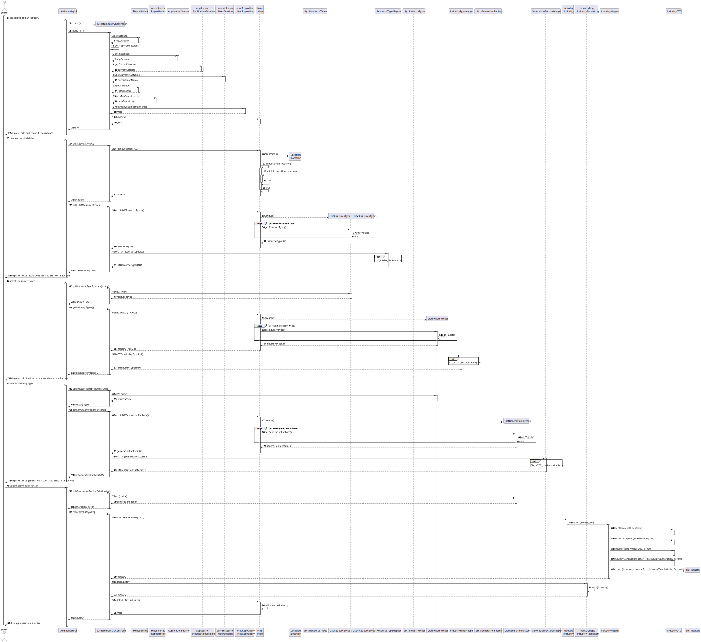
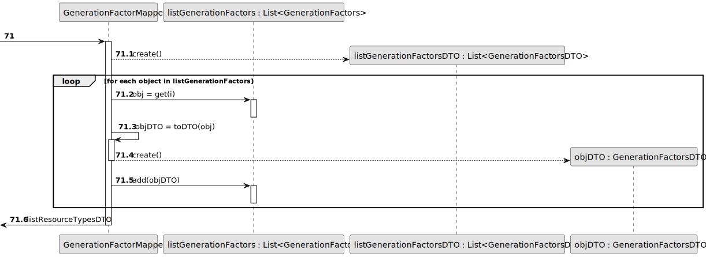
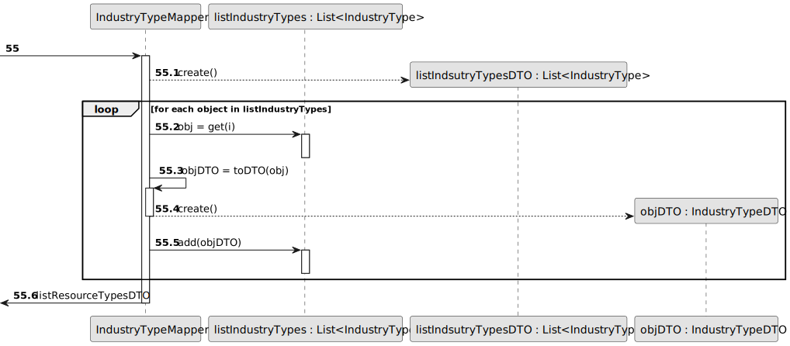
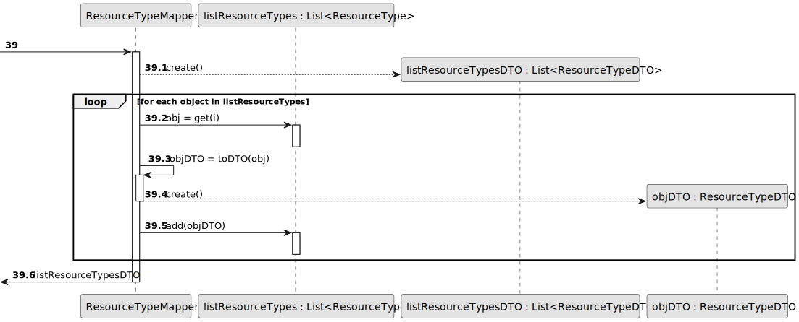
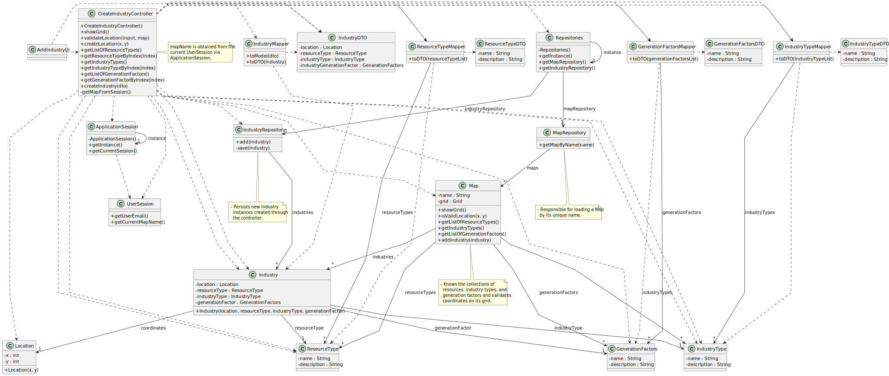

# US002 - As an Editor, I want to add an industry (selected from the available industries) in a position XY of the selected (current) map.

## 3. Design

### 3.1. Rationale

| Interaction ID | Question: Which class is responsible for...                                | Answer                                                                          | Justification (with patterns)                                                                                                            |
|:---------------|:---------------------------------------------------------------------------|:--------------------------------------------------------------------------------|:-----------------------------------------------------------------------------------------------------------------------------------------|
| Step 1         | ... interacting with the actor (Editor)?                                   | AddIndustryUI                                                                   | Pure Fabrication: UI handles all user interactions and presentation.                                                                     |
|                | ... coordinating the use case?                                             | CreateIndustryController                                                        | Controller: orchestrates workflow, handles validations and delegates to domain and infrastructure.                                       |
| Step 2         | ... managing user session and current map name?                            | ApplicationSession / UserSession                                                | Information Expert: provides access to current user session and map context.                                                             |
| Step 3         | ... accessing repositories?                                                | Repositories                                                                    | Singleton: provides centralized access to repositories for maps and industries.                                                          |
| Step 4         | ... retrieving map by name?                                                | MapRepository                                                                   | Repository pattern: loads Map aggregate by unique identifier (map name).                                                                 |
| Step 5         | ... maintaining map state, including grid and collections?                 | Map                                                                             | Information Expert: owns grid, validates coordinates, and manages collections of resource types, industry types, and generation factors. |
| Step 6         | ... validating coordinates input?                                          | Map                                                                             | Information Expert: encapsulates domain validation logic for coordinates.                                                                |
| Step 7         | ... creating coordinates value object?                                     | Coordinates                                                                     | Value Object pattern: encapsulates coordinate data and ensures integrity.                                                                |
| Step 8         | ... providing lists of resource types, industry types, generation factors? | Map                                                                             | Information Expert: aggregates domain lists relevant for industry creation.                                                              |
| Step 9         | ... mapping domain entities to DTOs?                                       | ResourceTypeMapper, IndustryTypeMapper, GenerationFactorsMapper, IndustryMapper | Pure Fabrication: separates domain model from UI/data transfer objects to reduce coupling and preserve SRP.                              |
| Step 10        | ... creating and persisting new Industry?                                  | Industry, IndustryRepository                                                    | Creator: Industry is created from DTO by IndustryMapper; IndustryRepository persists it.                                                 |
| Step 11        | ... adding the newly created Industry to the Map aggregate?                | Map                                                                             | Aggregate Root: manages its child entities and their lifecycle.                                                                          |
| Step 12        | ... informing success and updating UI?                                     | AddIndustryUI                                                                   | Pure Fabrication: responsible for user feedback and displaying results.                                                                  |

### Systematization

Conceptual classes promoted to software classes include:

* Map
* Coordinates
* ResourceType
* IndustryType
* GenerationFactors
* Industry

Supporting infrastructural / pure fabrication classes:

* AddIndustryUI
* CreateIndustryController
* ApplicationSession
* UserSession
* Repositories
* MapRepository
* IndustryRepository
* ResourceTypeMapper
* IndustryTypeMapper
* GenerationFactorsMapper
* IndustryMapper

---

## 3.2. Sequence Diagram (SD)

### Full Diagram

This sequence diagram shows the interaction flow for adding an industry:

### Split Diagrams

The following diagram shows the same sequence of interactions between the classes involved in the realization of this user story, but it is split in partial diagrams to better illustrate the interactions between the classes.

It uses Interaction Occurrence (a.k.a. Interaction Use).

**Get Generation Factors List Partial SD**

**Get Industry Types List Partial SD**

**Get Resource Types List Partial SD**

## 3.3. Class Diagram (CD)

