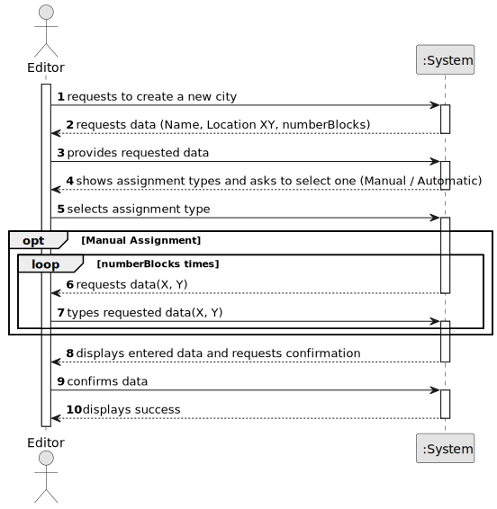

# US003 - Add a city

## 1. Requirements Engineering

### 1.1. User Story Description

As an Editor, I want to add a city in a position XY of the selected map.

### 1.2. Customer Specifications and Clarifications 

**From the specifications document:**

>	A city bears a name, a location (with XY coordinates on the map), and a set
of blocks that represent housing. In the simulator’s context, cities generate
and consume passengers and mail, but they also consume final products (e.g.,
food, textiles, cars).

**From the client clarifications:**

> **Question:** Is it possible for a city to be destroyed by a natural disaster or a war? If so, is it necessary to 
create a mechanism to remove the city from the map and create a new one to transfer the active elements 
from the first one(people, mail, ...)?
>
> **Answer:** A city can be removed in edit mode, but not in simulation mode.

> **Question:** Is there a minimum or maximum number of house blocks that can be assigned?
>
> **Answer:** The number needs to be a positive on; there is no maximum, it's up to the editor to decide.

> **Question:**  De acordo com a User Story 3, senhor cliente, o nome da cidade pode apresentar espaços na sua nomenclatura?
>
> **Answer:** sim pode, "Torres Novas" por exemplo.

> **Question:** De acordo com a User Story 3, o nome da cidade deve ser exclusivo dentro do mesmo mapa?
> 
> **Answer:** Pode ser repetido mas pode tornar-se confuso para os jogadores, o editor deve ser alertado da situação.

> **Question:** Caro cliente, deve ser considerado como critério de aceitação que o mapa deve ser atualizado visualmente
> para mostrar a cidade que foi adicionada previamente ao respetivo mapa e os seus blocos de casas?
> 
> **Answer:** Ainda não existem especificação para interfaces de utilizador.

> **Question:** What is the purpose and meaning of the "City Tag"?
> 
> **Answer:** It's a label that would appear in the map if a GUI is considered.

> **Question:** Does the city have a specific radius for some functionality or is the city creation just figurative?
> 
> **Answer:** No, it's the center, that can be useful if the positions for the House Blocks as randomly generated.

> **Question:** Does that influence passenger statistics or will there be no statistics for a specific city?
> 
> **Answer:** The statistics will about stations and the railroad network not about cities.

### 1.3. Acceptance Criteria

* **AC1:** A city name cannot have special characters or digits.
* **AC2:** The number of blocks must be positive.
* **AC3:** The house blocks can be assigned manually or automatically.

### 1.4. Found out Dependencies

* There is a dependency on US01 - As an Editor, I want to create a map with a size and a name.

### 1.5 Input and Output Data

**Input Data:**

* Typed data:
    * coordinates (X, Y) for city
    * number of blocks (houses)
    * coordinates (X, Y) for blocks (houses) if manual assignment

* Selected data:
  * map
  * type of house assignment

**Output Data:**

* List of available maps
* Confirmation data
* Success of the operation

### 1.6. System Sequence Diagram (SSD)

### 1.7 Other Relevant Remarks

* Nothing yet.