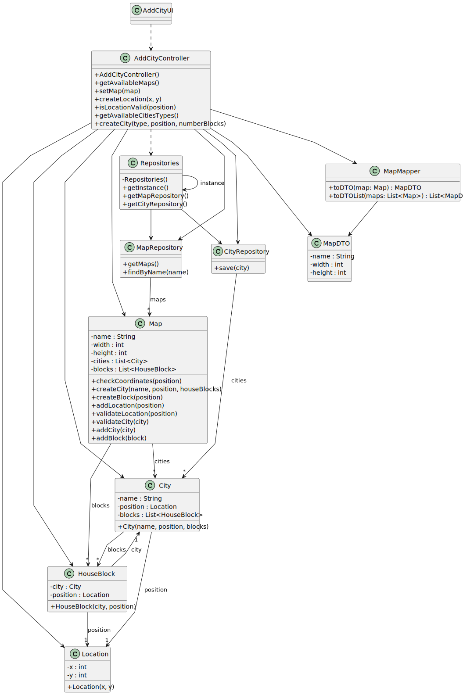

# US003 - As an Editor, I Want to Add a City

## 3. Design

### 3.1. Rationale

| Interaction ID | Responsibility Clarification Question                        | Assigned Class        | Justification (Design Pattern)                                                                     |
|----------------|--------------------------------------------------------------|------------------------|-----------------------------------------------------------------------------------------------------|
| Step 1         | Who interacts with the actor (Editor)?                       | `AddCityUI`            | **Pure Fabrication**: Handles user input/output, separate from domain logic.                       |
|                | Who coordinates the use case?                                | `AddCityController`    | **Controller**: Manages the use case flow and delegates responsibilities.                          |
|                | Who holds data about the current user?                       | `Editor`               | **Information Expert**: Maintains editor’s identity and role.                                      |
| Step 2         | Who provides all existing maps?                              | `MapRepository`        | **Repository**: Handles persistent storage and retrieval of maps.                                  |
| Step 3         | Who temporarily stores the selected map?                     | `AddCityUI`            | **Information Expert**: Holds UI-level data needed throughout interaction.                         |
| Step 4         | Who asks for coordinate input?                               | `AddCityUI`            | **Pure Fabrication**: Interacts with the user to collect input.                                    |
| Step 5         | Who temporarily holds coordinate input?                      | `AddCityUI`            | **Information Expert**: Stores temporary values during user interaction.                           |
| Step 6         | Who validates whether the coordinates are valid?             | `Map`                  | **Information Expert**: Owns business logic to validate positions in its space.                    |
| Step 7         | Who asks for the block assignment type (manual/automatic)?   | `AddCityUI`            | **Pure Fabrication**: Responsible for guiding user choices.                                        |
| Step 8         | Who manages manual house block assignment?                   | `Editor` + `AddCityUI` | **Information Expert** + **UI**: Editor provides data; UI captures it.                             |
| Step 9         | Who handles automatic house block assignment?                | `AddCityController`    | **Information Expert**: Encapsulates automatic logic based on scenario rules.                      |
| Step 10        | Who creates `Position` and `HouseBlock` instances?           | `AddCityController`    | **Creator**: Orchestrates instantiation of domain entities.                                        |
| Step 11        | Who presents the city data for confirmation?                 | `AddCityUI`            | **Pure Fabrication**: UI summarizes data before committing changes.                                |
| Step 12        | Who creates the `City`?                                      | `City`                 | **Creator**: Best placed to validate its own instantiation and rules.                              |
|                | Who saves the newly created city?                            | `Map`                  | **Information Expert**: Aggregates cities and owns their registration.                             |
| Step 13        | Who informs the actor of the result?                         | `AddCityUI`            | **Pure Fabrication**: Displays operation outcome to the user.                                      |

---

### 3.2. Class Promotion

**Conceptual classes promoted to software classes:**

- `Map`
- `City`
- `Position`
- `HouseBlock`

**Additional software classes (for coordination or infrastructure):**

- `AddCityUI`
- `AddCityController`
- `Repositories`
  - `MapRepository`
  - `CityRepository`

---

## 3.2. Sequence Diagram (SD)

### Full Diagram

This diagram shows the full sequence of interactions between the classes involved in the realization of this user story.

## 3.3. Class Diagram (CD)

