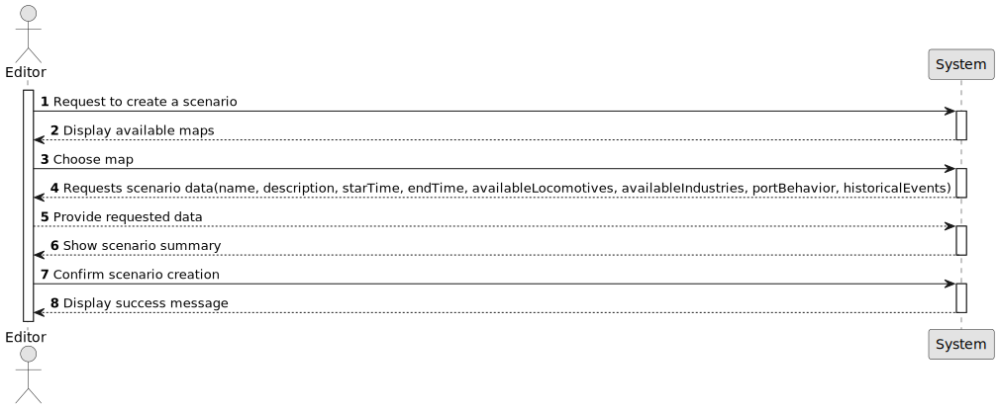

# US04 - Create a Scenario for a Map

## 1. Requirements Engineering

### 1.1. User Story Description

As an Editor, I want to create a scenario for a selected map.

### 1.2. Customer Specifications and Clarifications 

**From the specifications document:**

The Scenario Editor must allow the user to define the restrictions and
conditions for using a given map, namely:
* Time Restrictions - the period in which the simulation will take place;
* Technological Restrictions - for example, which locomotives or industries are available in the scenario;
* Historical Restrictions - historical events that make sense in the scenario and change the operating conditions of the simulator. For instance, a war increases the steel demand, and a vaccination campaign
or a schooling program encourages mail and/or passenger traffic. In
this context, the goods that the Ports import and export are also defined.

**From the client clarification:**

- **Question:** 
Um cenário pode estar contido em vários mapas?
**Answer:**
One scenario uses one map; one map can be used in multiple scenarios

- **Question:**
Para o Editor, seria relevante saber se os cenários ou mapas são criados por ele ou por outro editor?
**Answer:**
Só a titulo informativo, por exemplo, um determinado jogador prefere jogar os cenários criados por um editor específico.

- **Question:**
In the acceptance criterion 3, it talks about "the factors that alter the generation (frequency) of generating industries", what exactly are these factors? Are we talking about the rate at which these industries produce resources? or is it something else?
Also, are we supposed to give the editor the freedom to edit the generation rate of of each generating industry or is it 1 rate for all the generating industries?
**Answer:**
The generation rates of the industries can be defined in a configuration file, it is not expected that there will be any US to edit them.
Each entry must define the industry and the number of cargos generated per unit of time like year or month. (e.g., CoalMine, 4)
A factor allows you to change this rate as a percentage, (e.g., CoalMine, 50%) meaning that the coal mine will now produce 6 cargos per unit of time.

- **Question:**
Are the rates of production and quantity produce from industries decided in the scenario's specifications?
**Answer:**
The rates are predefined values but can be redefined in the scenario.

### 1.3. Acceptance Criteria

- **AC01:** The system must allow the editor to define the behavior of ports, which cargoes they import/export and/or transform.

- **AC02:** The system must allow the editor to define the available locomotion types (steam, diesel, and/or electric).

- **AC03:** The system must allow the editor to (re)defiene the factors that alter the generation (frequency) of generating industries.

- **AC04:** The scenario must be associated with an existing map.

- **AC05:** The system must allow the editor to identify themselves as the creator of the scenario.

- **AC06:** The system must allow the user to define the period in which the simulation will take place.

- **AC07:** The system must allow the editor to define historical events that make sense in the scenario and change the operating conditions of the simulator.

### 1.4. Found out Dependencies

* There is a dependency on US001 - AC04

### 1.5 Input and Output Data

**Input data:**

* Selected data:
    - Map

* Input data:
    - Restrictions:
        - Time
        - Technological
        - Historical
        - Port behavior
        - Industry generation factors

**Output Data:**

* Available maps
* Summary
* Success message

### 1.6. System Sequence Diagram (SSD)

### 1.7 Other Relevant Remarks

n/a