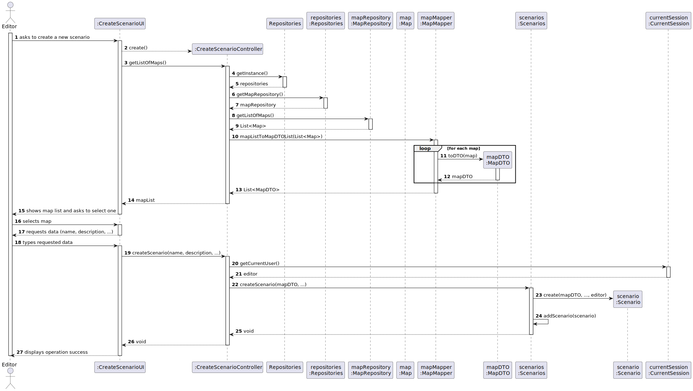
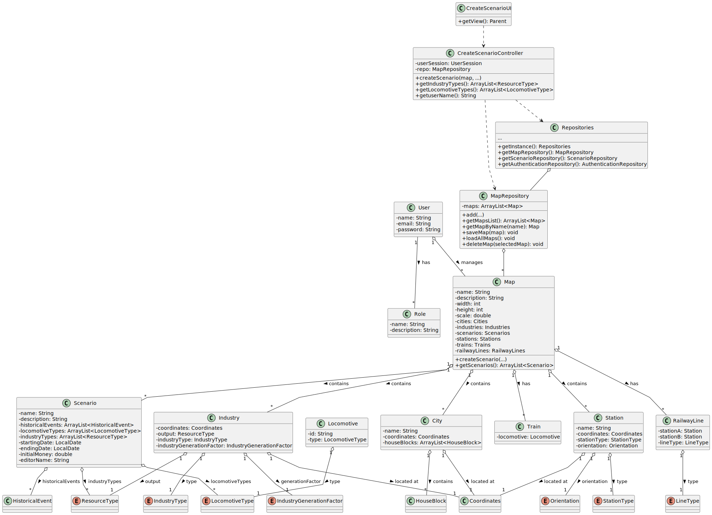

# US004 - As an Editor, I want to create a scenario for a selected map

## 3. Design

### 3.1. Rationale

| Interaction ID | Question: Which class is responsible for...                          | Answer                         | Justification (with patterns)                                                            |
|:---------------|:---------------------------------------------------------------------|:-------------------------------|:-----------------------------------------------------------------------------------------|
| Step 1         | ... interacting with the actor?                                      | CreateScenarioUI               | Pure Fabrication: handles user input and output without containing domain logic.         |
|                | ... coordinating the use case?                                       | CreateScenarioController       | Controller pattern: manages the interaction flow and business coordination.              |
|                | ... knowing the current user (Editor)?                               | ApplicationSession/UserSession | IE: stores context of the currently logged-in user/editor.                               |
| Step 2         | ... retrieving list of maps?                                         | MapRepository                  | High Cohesion: repository focused on Map entity access and retrieval.                    |
| Step 3         | ... receiving data for new scenario from user?                       | CreateScenarioUI               | UI class responsible for collecting scenario creation data from the user.                |
| Step 4         | ... instantiating and validating the new scenario?                   | CreateScenarioController       | Controller encapsulates orchestration and validation before persistence.                 |
| Step 5         | ... retrieving the current editor for scenario association?          | CreateScenarioController       | The controller queries the session to obtain the editor's identity.                      |
| Step 6         | ... persisting the new scenario in the system?                       | ScenarioRepository             | Repository pattern: central access point for managing Scenario entity persistence.       |
| Step 7         | ... informing the user of operation success or failure?              | CreateScenarioUI               | Displays the final result of the operation to the user.                                  |

### Systematization

Based on the rationale, the conceptual classes promoted to software classes are:

* Scenario
* Map

Other software classes (i.e. Pure Fabrication) identified:

* CreateScenarioUI
* CreateScenarioController
* Repositories
* ScenarioRepository
* MapRepository
* ApplicationSession
* UserSession

---

## 3.2. Sequence Diagram (SD)

### Full Diagram

This sequence diagram illustrates the full interaction for the Create Scenario use case, from map retrieval and data input to scenario creation and confirmation.

---

## 3.3. Class Diagram (CD)

This class diagram outlines the software and domain classes involved in the Create Scenario use case, highlighting their methods and relationships.

---
