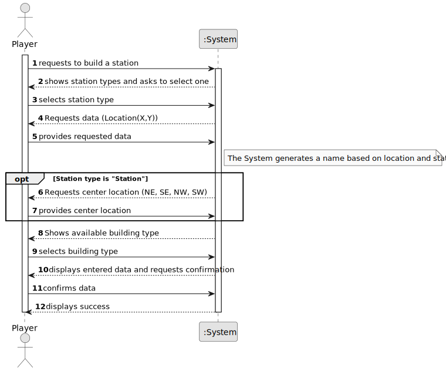

# US005 - Build a station

## 1. Requirements Engineering

### 1.1. User Story Description

As a Player, I want to build a station.

### 1.2. Customer Specifications and Clarifications 

**From the specifications document:**

>	There are three types of stations: Depots (50k, 3x3 radius), Stations (100k, 4x4 radius), 
and Terminals (200k, 5x5 radius). Their cost and economic radius distinguish the stations. 

> When built, a station consists of just one building, which can be upgraded
with other buildings that can increase the station’s performance, improve
train operation, facilitate train manoeuvrers, and increase the lifespan of
cargo stored at the station.

**From the client clarifications:**

> **Question:** What is the input data for the user story 5? Is there any input besides the type of the station?
>
> **Answer:** Position; Station type (Terminal, Station or Depot) and, in the case of the station, the center must be 
> filled in. If the proposed is not accepted an alternative one must be entered.

> **Question:** Is the budget the only concern to build a station, or does the player also needs to have other 
> specific resources, like steel, etc.? Are resources included on the budget, or the budget represent only the player's monetary value?
>
> **Answer:** just the budget in a generic currency.

### 1.3. Acceptance Criteria

* **AC1:** Overbuilding is not possible.

### 1.4. Found out Dependencies

* There is a dependency on US01 - As an Editor, I want to create a map with a size and a name.

### 1.5 Input and Output Data

**Input Data:**

* Typed data:
    * location if station type is a station
    * building name
	
* Selected data:
    * station type
    * building type
    * center location (when station type is station)

**Output Data:**

* StationType list
* BuildingType list
* Confirmation data
* (In)Success of the operation

### 1.6. System Sequence Diagram (SSD)

### 1.7 Other Relevant Remarks

* The sucess of the operation depends on the budget in the end if no errors on the app occur.