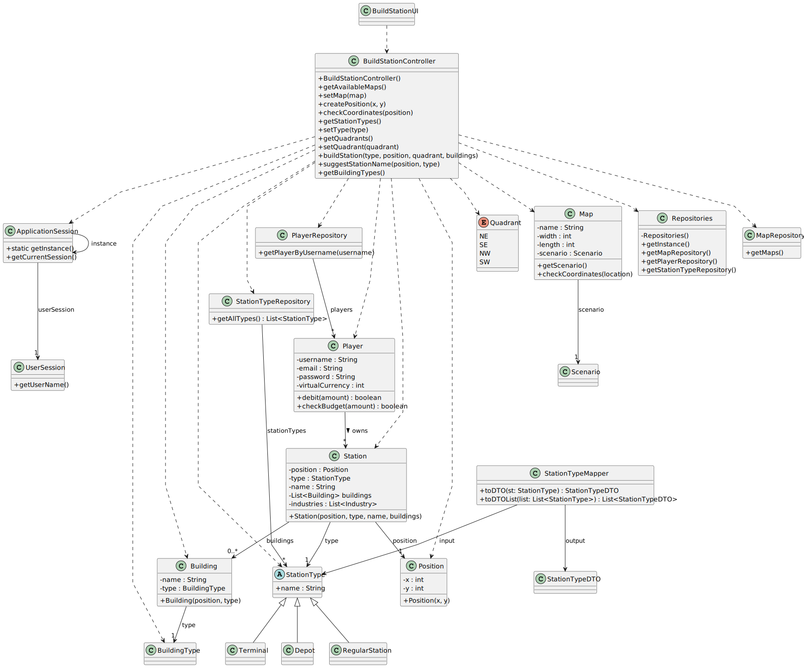

# US005 - Build Station

## 3. Design

### 3.1. Rationale

| Interaction ID | Question: Which class is responsible for...                                 | Answer                  | Justification (with patterns)                                        |
|----------------|-----------------------------------------------------------------------------|-------------------------|----------------------------------------------------------------------|
| Step 1         | ... interacting with the actor?                                             | BuildStationUI          | Pure Fabrication: interface responsible for user interaction.        |
|                | ... coordinating the use case?                                              | BuildStationController  | Controller: orchestrates the flow and delegates responsibilities.    |
| Step 2         | ... accessing the current session state?                                    | ApplicationSession      | Singleton: represents the active application session.                |
| Step 3         | ... retrieving the current map name from the user's session?                | UserSession             | Expert: contains data about the current user.                        |
| Step 4         | ... accessing the map repository?                                           | Repositories            | Singleton + IE: central access point for repositories.               |
| Step 5         | ... retrieving the map by its name?                                         | MapRepository           | IE: responsible for providing maps.                                  |
| Step 6         | ... retrieving the current scenario from the map?                           | Map                     | IE: knows the associated scenario.                                   |
| Step 7         | ... retrieving the available station types?                                 | Scenario                | Expert: knows the available station types.                           |
| Step 8         | ... creating StationType objects?                                           | Scenario / StationTypes | Creator + Expert: responsible for instantiating station types.       |
| Step 9         | ... mapping StationType entities to DTOs?                                   | StationTypeMapper       | Pure Fabrication: converts objects to Data Transfer Objects (DTOs).  |
| Step 10        | ... requesting coordinates and orientation (if applicable)?                 | ViewStationDetailsUI    | IE: decides what data to request based on station type.              |
| Step 11        | ... validating and creating positions with or without orientation?          | Position                | Expert: validates and represents positions on the map.               |
| Step 12        | ... validating if a position or station is valid in the context of the map? | Map                     | IE: knows the space and positioning rules.                           |
| Step 13        | ... generating the station name based on the position?                      | Map                     | Expert: logic for naming stations based on position.                 |
| Step 14        | ... creating the actual station?                                            | Station                 | Creator: represents the station entity.                              |
| Step 15        | ... adding and validating the station on the map?                           | Map                     | IE: maintains and validates the set of existing stations.            |
| Step 16        | ... presenting the result of the operation to the user?                     | BuildStationUI          | Pure Fabrication: communicates messages and results to the user.     |
| Step 17        | ... retrieving the acquisition price of a station type?                     | StationType             | Expert: knows its own price.                                         |
| Step 18        | ... retrieving the current player from the session?                         | UserSession             | Expert: holds the reference to the logged-in player.                 |
| Step 19        | ... validating and debiting the player’s currency to buy the station?       | Player                  | Expert: knows its own balance and handles currency validation/debit. |

### Systematization

According to the rationale above, the following conceptual classes were promoted to software classes:

#### Domain Entities:
- `Station`
- `StationType`
- `Position`
- `Map`
- `Scenario`
- `Industry`
- `Building`
- `CardinalPoints`

#### Infrastructure / Support:
- `Repositories` (Singleton)
- `MapRepository`
- `StationRepository`
- `StationTypeRepository`

#### Interface / Application:
- `BuildStationUI`
- `BuildStationController`
- `StationTypeMapper`
- `ApplicationSession`
- `UserSession`
---

## 3.2. Sequence Diagram (SD)

### Full Diagram

This diagram shows the full sequence of interactions involved in the Buy Locomotive use case, including data retrieval, validation, and purchase confirmation.

---

## 3.3. Class Diagram (CD)

This class diagram shows the key classes involved in the Buy Locomotive use case, their attributes, methods, and relationships.

---