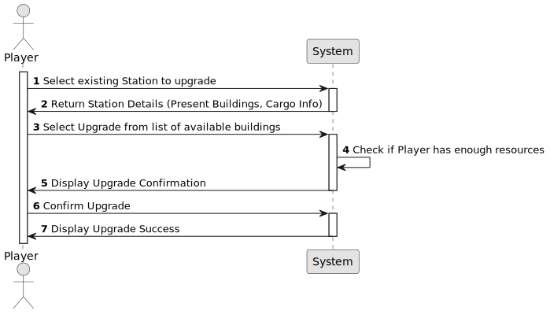

# US06 - Upgrade a Station

## 1. Requirements Engineering

### 1.1. User Story Description

- As a Player, I want to upgrade a selected station with a building. Each type of station improvement has a date from which it is
available. Some pieces of equipment are mutually exclusive (e.g., small and grand hotel) and some equipment/buildings replace others (the telegraph was initially used to facilitate the operation of trains at stations, and was later replaced by the telephone, so after the telephone advent, the telegraph is no more available).

### 1.2. Customer Specifications and Clarifications 

**From the specifications document:**

When built, a station consists of just one building, which can be upgraded with other buildings that can increase the station’s performance, improve train operation, facilitate train manoeuvrers, and increase the lifespan of cargo stored at the station. Some of the buildings that can be used to upgrade stations are: telegraph (later telephone), caf´e (small or large), customs, post office, hotel (small or large), silo, liquid storage.

When viewing a station, in addition to the buildings present, the cargo
that is ready for collection and the cargo that needs to be delivered (as in
the example) should also be displayed.

Each type of station improvement has a date from which it is available. Some equipments are mutually exclusive (e.g.,small and grand hotel)and some equipments/buildings replace others (the telegraph was initially used to facilitate the operation of trains at stations, and was later replaced by the telephone, so after the advent of telephone, telegraph is no more available).

**From the client clarification:**

- **Question:** No enunciado, é dado o exemplo do small hotel e large hotel como equipamentos mutuamente exclusivos. Isso significa que todos os upgrades do mesmo tipo são sempre mutuamente exclusivos? Ou, por exemplo, é possível ter mais de uma unidade de liquid storage na mesma estação?
Além disso, gostaria de confirmar se é possível ter múltiplos buildings de tipos diferentes na mesma estação. Por exemplo, podemos ter um small café, um large hotel e um post office simultaneamente?
Caso seja permitido, existe um limite máximo para a quantidade de buildings em cada estação?
 Se esse limite existir, ele varia conforme o tipo de estação (Depot, Station ou Terminal)?
Todas as combinações de edifícios são permitidas? Por exemplo, o Player tem liberdade de escolher ter na mesma estação os upgrades: customs + silo + telegraph.
**Answer:** Existem edícifios mutamente exlusivos como restaurante pequeno e restaurante grande.
Existem edificios que quando passam a existir, deixa de ser possivel construir o anterior, por exemplo, o telegrafo foi substituido pelo telefone. As estações que tenham telegrafo continuam com o telegrafo a funcionar até que seja construido um telefone que substitua o telegrafo. A partir do momento que existe telefone já não é possivel construir um telegrafo.
Não podem existir multiplos edificios iguais (por exemplo, não posso ter 3 silos de cereais)
As combinações, desde que respeitando as restrições anteriomente referidas, são todas possíveis.

- **Question:**
Is there a limit on the number of buildings a station can be upgraded with?
Does the upgrade from telegraph to telephone occur automatically once a certain year is reached?
**Answer:**
No;
There are no automatic updates; When a new building is available, the player can buy it and then the previous building is replaced.

- **Question:**
Can you please define the Station Upgrades in a list, and state in it what are they affecting in the Station's attributes specifically?
**Answer:**
Please refer to game to check the available buidings and it's attributes.

**Question to the answer:**
Good morning Professor, would it be possible for you to provide this information? I have searched and discussed it with several colleagues who also looked for it, but we couldn't find this information anywhere, even within the Railroad Tycoon II wiki.
**Answwer:**
For this proof of concept, teams do not need to implement all types of industry, all possible station upgrades or all locomotives.
With regard to station upgrades, there are many examples in Figure 4 of the PI Assignment text. The impact of the new buildings does not need to be considered in this sprint.

- **Question:**
Based on another question of this forum, we are supposed to get the information of the possible upgrades of a building from the actual Railroad Tycoon 2 upgrades list. From this list I can see that the effects that the buildings have on a station require functionalities that were not mentioned on this project. For example this building : 

Warehouse: Available from 1830, costs $25,000. Reduces pickup delay penalties for goods, cotton, and wool by 50%.

We were never told that there would be pickup delay penalties for goods. The list goes on.
My question is: are we supposed to implement all of the effects on this list, or not? 
**Answer:**
No need to implement the effects of the station upgrades in this sprint.

### 1.3. Acceptance Criteria

- **AC01:** The station to be upgraded must already exist in the system.

- **AC02:** When viewing the station, it should be displayed the buildings present, the cargo ready for collection and the cargo that needs to be delivered.

- **AC03:** The player must have sufficient resources to perform the upgrade.

- **AC04:** The upgrade must be selected from a list of available buildings.

- **AC05:** Each building has a specific availability date (it cannot be built before its introduction year).

- **AC06:** Some buildings are mutually exclusive (e.g., small vs. large hotel).

- **AC07:** The station must have enough space to accommodate the new building.

- **AC08:** There cannot be multiple identical buildings (for example, I cannot have 3 grain silos)

### 1.4. Found out Dependencies

* There is a dependency on US05 - AC01

* There is a dependecy on US04 - AC05

### 1.5 Input and Output Data

**Input data:**

* Selected data:
    * Station to be upgraded
    * Building to construct

**Output Data:**

* List of stations
* Station summary
* List of available buildings
* Success/failure message

### 1.6. System Sequence Diagram (SSD)

### 1.7 Other Relevant Remarks

n/a