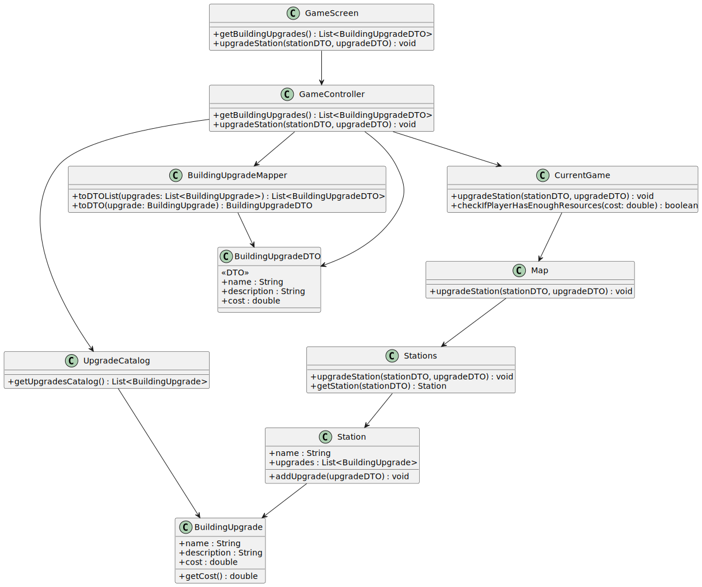

# US006 - As a Player, I want to upgrade a selected station with a building

## 3. Design

### 3.1. Rationale

| Interaction ID | Question: Which class is responsible for...                    | Answer                    | Justification (with patterns)                                                                            |
|----------------|----------------------------------------------------------------|---------------------------|----------------------------------------------------------------------------------------------------------|
| Step 1         | ... interacting with the actor?                                | UpgradeStationUI          | **Pure Fabrication:** UI logic is separated from domain, handles user input/output.                      |
| Step 2         | ... coordinating the use case?                                 | UpgradeStationController  | **Controller:** coordinates the overall upgrade process and delegates calls.                             |
| Step 3         | ... knowing all available scenarios to show?                   | ScenarioRepository        | **Information Expert:** owns and manages the collection of Scenario objects.                             |
| Step 4         | ... holding the selected scenario temporarily?                 | UpgradeStationUI          | **Information Expert:** UI stores temporary user selections for interaction flow.                        |
| Step 5         | ... requesting station data for selected scenario?             | UpgradeStationController  | **Controller:** responsible for delegating retrieval of station data.                                    |
| Step 6         | ... knowing all available stations?                            | StationRepository         | **Information Expert:** provides access to Station entities for the scenario.                            |
| Step 7         | ... holding the selected station temporarily?                  | UpgradeStationUI          | **Information Expert:** stores temporary station selection during UI interaction.                        |
| Step 8         | ... requesting available building types?                       | UpgradeStationController  | **Controller:** coordinates building type retrieval for the upgrade.                                     |
| Step 9         | ... knowing all available building types?                      | BuildingRepository        | **Information Expert:** holds and returns building type data.                                            |
| Step 10        | ... holding the selected building type temporarily?            | UpgradeStationUI          | **Information Expert:** UI stores temporary selection before execution.                                  |
| Step 11        | ... checking player credentials and resources?                 | UserSession, Player       | **Information Expert:** UserSession manages player identity, Player manages resources and affordability. |
| Step 12        | ... creating a new building instance of selected type?         | Building                  | **Information Expert:** responsible for building creation and instantiation.                             |
| Step 13        | ... adding the building to the station?                        | Station                   | **Information Expert:** owns and manages the collection of buildings.                                    |
| Step 14        | ... informing operation success to the user?                   | UpgradeStationUI          | **Pure Fabrication:** UI presents the outcome and feedback to the user.                                  |

---

### Systematization ##

According to the rationale above, the conceptual classes promoted to software classes are:

* Scenario
* Station
* BuildingType
* StationType

Other software classes (i.e., **Pure Fabrication**) identified are:

* UpgradeStationUI
* UpgradeStationController
* Repositories
* ScenarioRepository
* BuildingRepository
* StationRepository

## 3.2. Sequence Diagram (SD)

### Full Diagram

This diagram shows the full sequence of interactions between the classes involved in the realization of this user story.

## 3.3. Class Diagram (CD)

