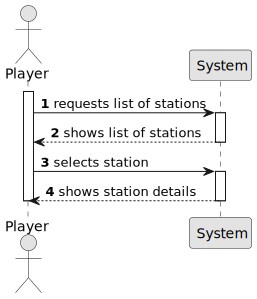

# US07- List all Stations and select one

## 1. Requirements Engineering

### 1.1. User Story Description

- As a Player, I want to list all the stations to select one to see its
details, including the existing building and the demand/supply cargoes.

### 1.2. Customer Specifications and Clarifications 

**From the specifications document:**

When built, a station consists of just one building, which can be upgraded with other buildings that can increase the station’s performance, improve train operation, facilitate train manoeuvrers, and increase the lifespan of cargo stored at the station. Some of the buildings that can be used to upgrade stations are: telegraph (later telephone), caf´e (small or large), customs, post office, hotel (small or large), silo, liquid storage.

When viewing a station, in addition to the buildings present, the cargo
that is ready for collection and the cargo that needs to be delivered (as in
the example) should also be displayed.

**From the client clarification:**

* Question: 
When the user selects an existing station, does it automatically show all the associated info to that station or the user selects the station then has to select the required option ? eg: 'show details'.

* Answer: That's a matter of UX/UI, each team can decide what works best.

* Question: 
1) Should the list be sorted in any particular way? (e.g., by name, by cargo volume, etc.)?

2) Will the player be able to apply filters to the list? If so, which ones would be useful? (e.g., only active ones, by type, by region…)?

3) What information should be visible directly in the list? Just the station name, or also other details like type, location, and operational status (active/inactive), etc.?

4) Besides the existing buildings and demand/supply cargo, are there any other details that should be shown when viewing a station's information? For example, location, capacity, or operational status?

* Answer:
1) tbd
2) tbd
3) name and a summary of available cargos to be collected and the ones that are demanded
4) available cargos to be collected and the ones that are demanded

### 1.3. Acceptance Criteria

* The station list must display all registered stations, including:  
   - Station name.  
   - A summary of available cargo for collection and demanded cargo.

* The list must allow the player to select a station to view its full details.

* When a station is selected, the system must display:  
   - All buildings present at the station.  
   - The list of cargo ready for collection.  
   - The list of demanded cargo.

### 1.4. Found out Dependencies

* US05 - As a Player, I want to build station.

### 1.5 Input and Output Data

**Input data:**

  * Typed data
  
  * Selected data
      * Station

**Output Data:**

* List of stations
* Selected station details

### 1.6. System Sequence Diagram (SSD)

### 1.7 Other Relevant Remarks

n/a