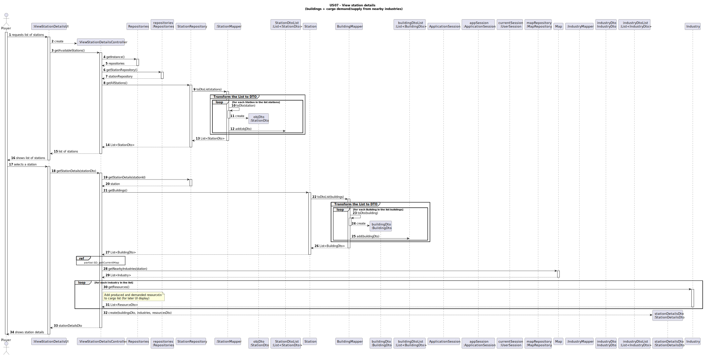
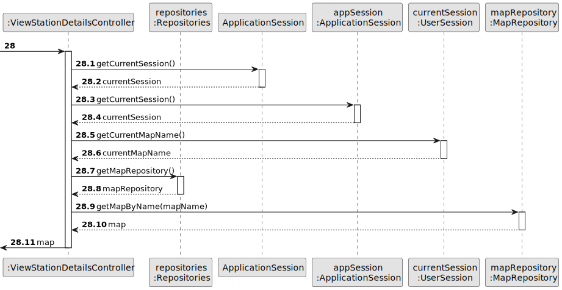
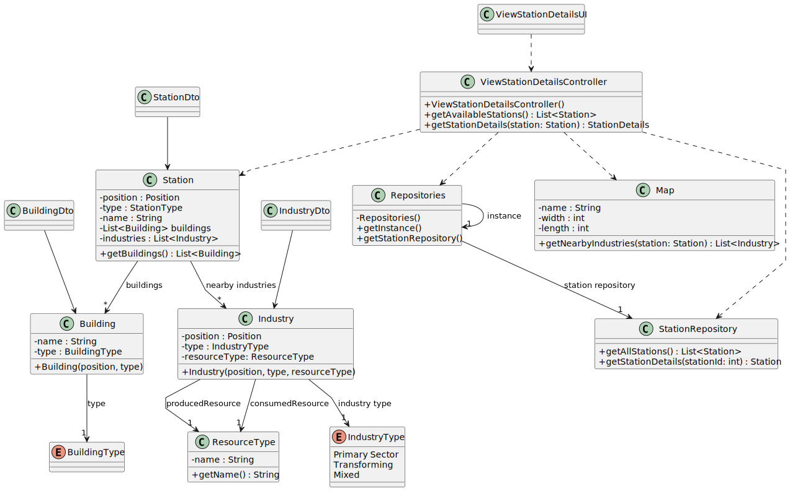

# US007 - View Station Details

## 3. Design

### 3.1. Rationale

| Interaction ID | Question: Which class is responsible for...                           | Answer                       | Justification (with patterns)                                                         |
|:---------------|:----------------------------------------------------------------------|:-----------------------------|:--------------------------------------------------------------------------------------|
| Step 1: requests list of stations         | ... interacting with the actor?                                       | ViewStationDetailsUI         | *Pure Fabrication*: interface responsável pela interação com o utilizador.            |
|                | ... coordinating the user story?                                      | ViewStationDetailsController | *Controller*: coordena o fluxo da história de utilizador.                             |
| Step 2: shows list of stations         | ... requesting the list of available stations?                        | ViewStationDetailsController | *Information Expert*: acede ao repositório para obter dados.                          |
|                | ... storing all existing stations?                                    | StationRepository            | *Information Expert*: repositório com conhecimento sobre todas as estações.           |
| Step 3: selects station         | ... displaying available stations?                                    | ViewStationDetailsUI         | *Information Expert*: responsável por mostrar dados ao utilizador.                    |
|                | ... identifying nearby industries and their resources?                | Map, Industry                | *Information Expert*: `Map` conhece a geografia, `Industry` conhece os seus recursos. |
| Step 4: shows station details         | ... keeping the selected station information temporarily?             | ViewStationDetailsUI         | *Information Expert*: armazena temporariamente a seleção do utilizador.               |

---

### Systematization

According to the rationale above, the following conceptual classes were promoted to software classes:

According to the taken rationale, the conceptual classes promoted to software classes are: 

- **Station**
- **Building**
- **Industry**
- **ResourceType** 
- **Map**  

Other software classes (i.e. Pure Fabrication) identified: 

- **ViewStationDetailsUI**
- **ViewStationDetailsController**
- **Repositories**
- **StationRepository**
- **StationDetailsDto**
- **StationMapper**
- **StationDto**  
- **BuildingMapper**
- **BuildingDto**
- **IndustryMapper**
- **IndustryDto**

---

## 3.2. Sequence Diagram (SD)

### Full Diagram

Este diagrama mostra a sequência completa de interações entre o ator (Jogador) e os componentes de software ao visualizar os detalhes de uma estação.

---
---

## 3.3. Class Diagram (CD)

Este diagrama mostra as principais classes envolvidas nesta user story e as suas relações.

