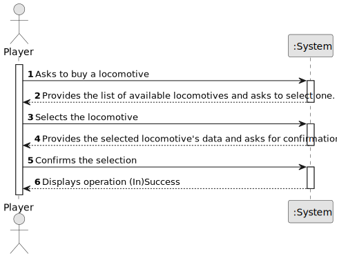

# US09 - As a player, I want to buy a locomotive.

## 1. Requirements Engineering

### 1.1. User Story Description

As a player, I want to buy a locomotive.

### 1.2. Customer Specifications and Clarifications 

**From the specifications document:**

> In the figure 1, it is possible to see, next to the city of Madrid, the existence of a steel mill, a nitrate plant, 
and a wool production farm. The Scenario Editor must allow the user to define the restrictions and conditions for using
a given map, namely:
  • Time Restrictions - the period in which the simulation will take place;
  • Technological Restrictions - for example, which locomotives or industries are available in the scenario;
  • Historical Restrictions - historical events that make sense in the scenario and change the operating conditions of 
the simulator. For instance, a war increases the steel demand, and a vaccination campaign or a schooling program 
encourages mail and/or passenger traffic. In this context, the goods that the Ports import and export are also defined.

> Trains are composed of locomotives and carriages. The locomotives provide traction to the composition (train) and 
can be of different types, namely, run by steam, diesel, and electricity. Note that electric locomotives require
electrified lines. The locomotives are characterized by several technical aspects, such as power, acceleration, top 
speed, start year of operation, fuel cost and maintenance per year, and acquisition price. The carriages are
distinguished by the type of cargo they can transport (e.g., passengers, mail, coal, iron ore, steel, cars) and, 
in the context of the simulator, they have no acquisition cost.

> In the simulator, the player/user acquires trains within the available budget and can put the train into 
service on a specific route. A route is a list of stations where the train passes, along which it loads (carriages) 
cargo at each station. 

**From the client clarifications:**

> **Question:** Question: How is the availability of locomotives determined?
> 
> **Answer:** Each locomotive model has a one-year entry into service period, after which it becomes available for purchase.
> 
> **Question:** Monetary data is expressed in any particular currency?
> 
> **Answer:** An abstract one.
> 
> **Question:** What happens if the player does not have enough budget to buy a locomotive?
> 
> **Answer:** He can't buy! Bonds and loans will not be considered right now.
> 
> **Question:** Is there a limit to the number of locomotives a player can buy?
> 
> **Answer:** No limit.
> 
> **Question:** Why is the current date required when buying a locomotive? My interpertation for this -> The current 
date is used to validate whether the selected locomotive is available in the current scenario. For example, electric 
locomotives may only be available after a certain year defined in the scenario, like RailRoad Tycoon (game).
> 
> **Answer:** Already answered in the first point.
> 
> **Question:** Is there a limit to how many trains a player can own, like a inventory that can get full?
> 
> **Answer:** there is no physical limit, just the available memory.
> 
> **Question:** Can a player buy the same train multiple times?
> 
> **Answer:** the same type of locomitve, yes; but these locomotives will have unique identification (like a plate 
or a serial number)
> 
> **Question:** Verifiquei que na US em referencia existe uma dependencia referente a uma lista de locomotivas 
disponíveis para o cenário e data atual. No entanto, não encontrei nenhuma User Story específica que trate da construção 
ou exibição dessa lista. Essa funcionalidade de listagem será detalhada em uma US futura?
> 
> **Answer:** The locomotives that will be presented in the selection list are restricted to the current date and any 
restrictions that may have been defined in the scenario. The presentation of the list of locomotives is part of US09.

### 1.3. Acceptance Criteria

* **AC1:** The player should choose the locomotive from a list of available locomotives for the scenario as well as 
a current date.
* **AC2:** The locomotive must be correctly registered in the system.
* **AC3:** The player must have sufficient funds in order to buy a locomotive.
* **AC4:** The locomotive must have unique identification.
* **AC5:** In order for a locomotive to be available for purchase, it must first respect the one-year entry into service 
period, after which it becomes available for purchase.

### 1.4. Found out Dependencies

* There is a dependency on "US01 - As an Editor, I want to create with a size and a name.", as there needs to be a map.
* There is a dependency on "US04 - As an Editor, i want to create a scenario for the selected map.", as there needs to be
a scenario in order to know the locomotive specifications. (i.e. Definition of the available locomotion types (steam, diesel, and/or
electric).
* There is a dependency on "US05 - As a Player, I want to build station (can be a depot, a station or a terminal) with 
a location in the current map. The system should propose a name for the station based on the closest city and the station
(e.g., Porto Terminal, Ovar Station or Silvalde Depot). In case of Depot and Terminal, the center is the geometric one, 
in the case of station, the centre should be defined by the Player (NE,SE,NW,SW).", as for locomotives to exist there needs
to exist stations for them to operate on.
* There is a dependency on "US08 - As a Player, I want to build a railway line between two stations.", as there needs to 
exist railways for the locomotives.

### 1.5 Input and Output Data

**Input Data:**

* Selected data:
    * Locomotive

**Output Data:**

* List of available locomotives
* (In)Success of the operation

### 1.6. System Sequence Diagram (SSD)

**_Other alternatives might exist._**

### 1.7 Other Relevant Remarks

* n/a.