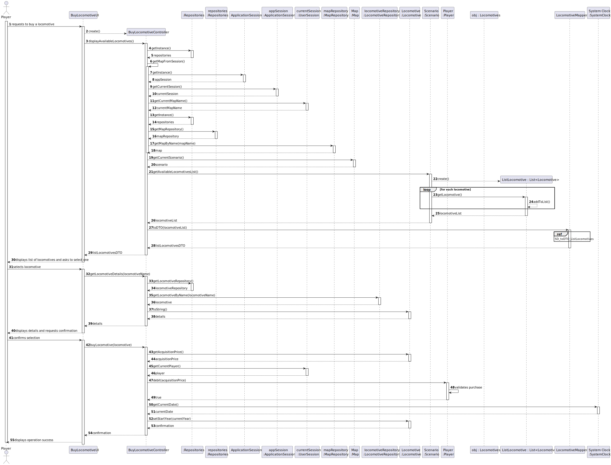
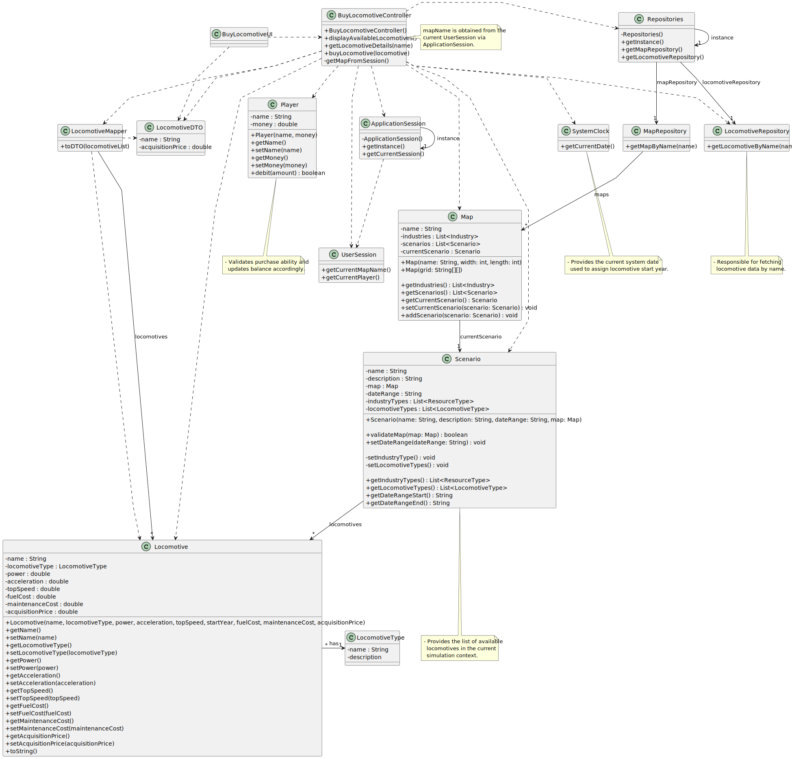

# US009 - As a player, I want to buy Locomotive

## 3. Design

### 3.1. Rationale

| Interaction ID | Question: Which class is responsible for...                  | Answer                           | Justification (with patterns)                                                                      |
|:---------------|:-------------------------------------------------------------|:---------------------------------|:---------------------------------------------------------------------------------------------------|
| Step 1         | ... interacting with the actor (Player)?                     | BuyLocomotiveUI                  | Pure Fabrication: UI manages user interactions and displays data.                                  |
|                | ... coordinating the use case?                               | BuyLocomotiveController          | Controller: orchestrates the workflow and delegates to domain and infrastructure classes.          |
|                | ... knowing the current user session?                        | ApplicationSession / UserSession | Information Expert: they encapsulate session state like current player and current map name.       |
| Step 2         | ... providing access to repositories?                        | Repositories                     | Singleton pattern: central access point for repositories, ensuring low coupling and high cohesion. |
| Step 3         | ... fetching the map by name?                                | MapRepository                    | Repository pattern: encapsulates data access for maps.                                             |
| Step 4         | ... managing map state and current scenario?                 | Map                              | Information Expert: owns scenarios and manages current scenario.                                   |
| Step 5         | ... providing available locomotives for the current context? | Scenario                         | Information Expert: knows locomotive availability constrained by scenario rules and date ranges.   |
| Step 6         | ... converting domain locomotives to data transfer objects?  | LocomotiveMapper                 | Pure Fabrication: separates UI concerns from domain by mapping Locomotive to LocomotiveDTO.        |
| Step 7         | ... fetching locomotive details by name?                     | LocomotiveRepository             | Repository pattern: encapsulates data access for locomotives.                                      |
| Step 8         | ... representing locomotive details?                         | Locomotive                       | Information Expert: encapsulates locomotive attributes and toString() for display.                 |
| Step 9         | ... validating and processing player’s purchase payment?     | Player                           | Information Expert: contains logic to debit money and validate funds.                              |
| Step 10        | ... providing current date for simulation?                   | SystemClock                      | Singleton utility class: provides current simulation date for time-sensitive updates.              |
| Step 11        | ... setting acquisition/start year on locomotive?            | Locomotive                       | Information Expert: modifies its state with the start year.                                        |
| Step 12        | ... informing UI about operation success or failure?         | BuyLocomotiveUI                  | Pure Fabrication: responsible for user feedback and interaction.                                   |

### Systematization

The conceptual classes promoted to software classes include:

* Player
* Map
* Scenario
* Locomotive
* LocomotiveType

Other software classes (Pure Fabrication or infrastructural) identified:

* BuyLocomotiveUI
* BuyLocomotiveController
* ApplicationSession
* UserSession
* Repositories
* MapRepository
* LocomotiveRepository
* LocomotiveMapper
* SystemClock

---

## 3.2. Sequence Diagram (SD)

### Full Diagram

This diagram shows the full sequence of interactions between the classes involved in the realization of the Buy Locomotive use case.

### Split Diagrams

The following partial diagrams highlight specific interaction groups in the sequence:

**Fetching Available Locomotives**

## 3.3. Class Diagram (CD)

