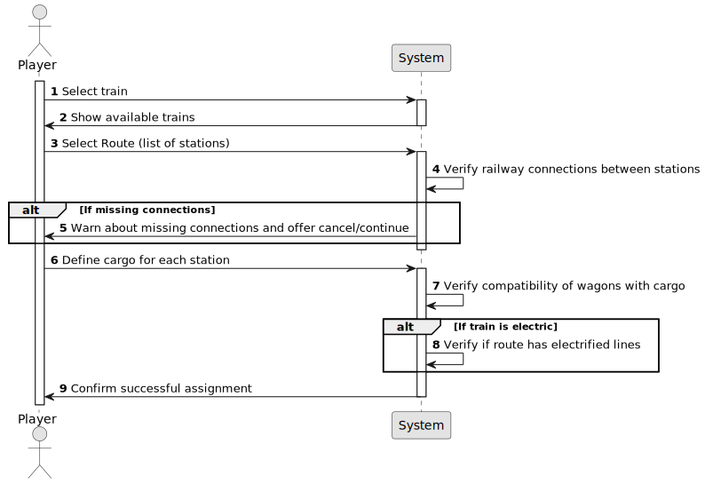

# US10 - Assign a train to a route

## 1. Requirements Engineering

### 1.1. User Story Description

- - As a Player, I want to assign a selected train to a route. A
route is a list of Points-of-Route, each Point-of-Route is defined by: a
station, a list of cargoes to be picked up.

### 1.2. Customer Specifications and Clarifications 

**From the specifications document:**

In the simulator, the player/user acquires trains within the available budget and can put the train into service on a specific route. A route is a list of stations the train passes by, along which it loads (carriages) cargo at each station.

Trains are composed of locomotives and carriages. The locomotives provide traction to the composition (train) and can be of different types, namely, run by steam, diesel, and electricity. Note that electric locomotives require electrified lines. The locomotives are characterized by several technical aspects, such as power, acceleration, top speed, start year of operation, fuel cost and maintenance per year, and acquisition price. The carriages are distinguished by the type of cargo they can transport (e.g., passengers, mail, coal, iron ore, steel, cars) and, in the context of the simulator, they have no acquisition cost.

Railway Lines allow the connection of two stations. In the context of this project, it is not intended to make a detailed graphical edition of the route, but only a topological representation of the connection between two stations. A line has a certain length, can be single or double, and can be electrified (or not).

**From the client clarification:**

- **Question:** 
Can multiple cargo types be assigned to the same train? Does a route have a limit of stations that can be assigned?
**Answer:** 
yes;
no;

- **Question:** 
A route is a list of stations where the train passes. If there is many stations but no railway lines, are we able to create a route? 
**Answer:**
If there is no path between any pair of consective points of the route, the player should be warned, then the player can opt between cancel/proceed.

- **Question:**
Sempre que um train chega a uma station, é suposto descarregar completamente a carga mesmo que a station não necessite de parte dela? Por exemplo, um train chega com 3 mail, 3 iron, 3 food, e a station só pede 3 food, o resto é descartado?
**Answer:**
Sim, essa é a simplfificação que vamos adoptar.

- **Question:**
Good afternoon client, here are some questions my team has regarding the US10:
1. Does a train collect all the cargo available in a station or just the cargo required for other stations in its route?
2. When the route of a train is changed in the middle of its previous route, does it finish the route it was currently in or does it immediately start to follow the new one?
    2.1. If the train had cargo obtained from the previous route, what happens to it?

Thank you in advance for your time
**Answer:**
1. it collects the defined in the route if available in the station otherwise it departs with the carriages empty.
2. there is no US for changing routes

- **Question:**
Should the route already be defined, with the player choosing from a list of valid routes (a route being a list of stations to pass through), or should the player select the stations one by one after picking the train to assign?
**Answer:**
Each train has an associated route, and a route is a list of pairs (station - carriages to be loaded). There is no need to manage routes independently of trains.

- **Question:**
Question: Can a player assign a train to a route without selecting valid stations?
Question: What happens if the train does not have the required carriages to pick up the cargo?
Question: How are the cargoes to be picked up determined?
**Answer?**
Just a few more questions:
Question: How are valid stations determined for a route?
Question: What happens if the selected train cannot carry the specified cargo?
Question: Can a train be assigned to multiple routes simultaneously?

### 1.3. Acceptance Criteria

- **AC01:** The player can only assign to a route a train he possesses.

- **AC02:** The assigned route must have valid connections between stations.

- **AC03:** Each Point-of-Route must have a sation and a list of cargos to be picked up.

- **AC04:** The train must have carriages for the cargo types defined in the route.

- **AC05:** The train can only pick up the cargo types defined in the route, and only if they are available in the station (if not, the train goes on with empty carriages).

- **AC06:** There is no limit to the number of stations in a route.

- **AC07:** A train can only be assign to one route at a time.

- **AC08:** A train must unload all cargo when arriving at a station.

- **AC09:** If the locomotive is eletric, the system must check if the route has electrified railway lines.

### 1.4. Found out Dependencies

* There is a dependecy in US05 - AC02, AC03

* There is a dependency in US08 - AC02

* There is a dependecy in US09 - AC01

* Existing routes.

### 1.5 Input and Output Data

**Input data:**

* Selected train (locomotive and carriages).

* Defined route (list of stations).

* Cargo to be loaded at each station.

**Output Data:**

* Confirmation message if the train is successfully assigned to the route.

* Warning message if the route has missing railway connections.

* Error message if the train is incompatible with the selected route or cargo.

### 1.6. System Sequence Diagram (SSD)

### 1.7 Other Relevant Remarks

n/a