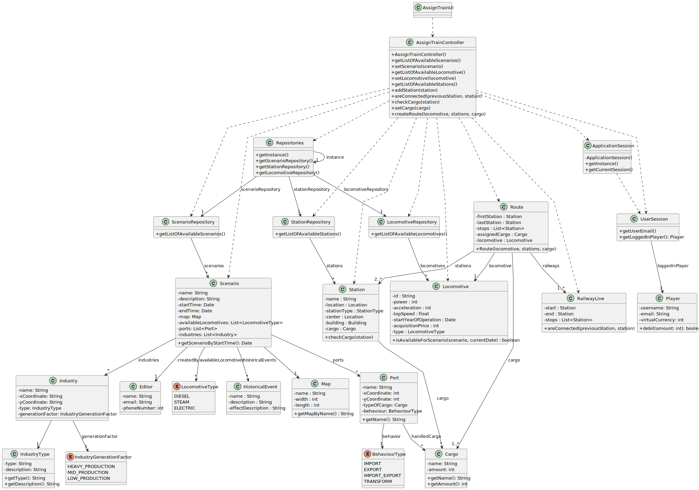

# US010 -  As a Player, I want to assign a selected train to a route with valid stations and the respective list of cargoes to be picked up in each station.

## 3. Design

### 3.1. Rationale

| Interaction ID | Question: Which class is responsible for...                        | Answer                    | Justification (with patterns)                                                                                       |
|:---------------|:-------------------------------------------------------------------|:--------------------------|:--------------------------------------------------------------------------------------------------------------------|
| Step 1         | ... interacting with the actor?                                    | AssignTrainUI             | Pure Fabrication: UI layer handles all interactions with the player.                                                |
|                | ... coordinating the US?                                           | AssignTrainController     | Controller: responsible for mediating between the UI and the domain.                                                |
|                | ... knowing the user using the system?                             | UserSession               | IE: session-scoped data about current user.                                                                         |
|                |                                                                    | ApplicationSession        | IE: gives access to current UserSession.                                                                            |
|                |                                                                    | Player                    | IE: owns resource data (used for validation, eligibility, etc.).                                                    |
| Step 2         | ... knowing all available scenarios to show?                       | Repositories              | IE: central hub to access all repositories.                                                                         |
|                |                                                                    | ScenarioRepository        | HC + LC: delegates scenario-specific logic.                                                                         |
| Step 3         | ... saving the selected scenario?                                  | AssignTrainController     | HC: central controller maintains the current state of selection.                                                    |
| Step 4         | ... knowing all available locomotives to show?                     | LocomotiveRepository      | HC + LC: specialized repository for this domain concept.                                                            |
| Step 5         | ... saving the selected locomotive?                                | AssignTrainController     | HC: maintains context of selection.                                                                                 |
| Step 6         | ... knowing all available stations to show?                        | StationRepository         | HC + LC: domain-specific retrieval.                                                                                 |
| Step 7         | ... verifying station connections and cargo capability?            | AssignTrainController     | IE: responsible for validation logic.                                                                               |
| Step 8         | ... keeping the selected stations and cargo?                       | AssignTrainController     | HC: controller aggregates selected data before command execution.                                                   |
| Step 9         | ... creating a new route?                                          | Route                     | Creator (Rule 1): a route is a domain object created from its constituent parts.                                    |
|                | ... validating data integrity (domain validation)?                 | Route                     | IE: owns its data.                                                                                                  |
|                | ... saving the route?                                              | AssignTrainController     | IE: handles coordination of the action, though persistent saving could be delegated elsewhere if needed.            |
| Step 10        | ... informing player of success?                                   | AssignTrainUI             | IE: UI responsibility to provide feedback to the user.                                                              |

### Systematization

According to the rationale, the conceptual classes promoted to software classes are:

* Player
* Route
* Locomotive
* Station
* Scenario
* Cargo

Other software classes (i.e. Pure Fabrication) identified:

* AssignTrainUI
* AssignTrainController
* Repositories
* ScenarioRepository
* StationRepository
* LocomotiveRepository
* ApplicationSession
* UserSession

## 3.2. Sequence Diagram (SD)

### Full Diagram

This diagram shows the full sequence of interactions between the classes involved in the realization of this user story.

## 3.3. Class Diagram (CD)

