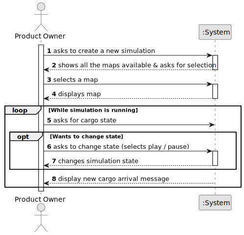

# US012 - As a Product Owner, I want to create a simulator that generates cargo at current stations automatically

## 1. Requirements Engineering

### 1.1. User Story Description

As a Product Owner, I want to create a simulator that generates cargo at current stations automatically.

### 1.2. Customer Specifications and Clarifications 

**From the specifications document:**

> **Question:** Should the simulator run in real-time or in set intervals? Can users manually adjust cargo generation rates? Should generated cargo be influenced by train schedules?
>
> **Answer:** Not in real-time. Maybe not the player but generation should be configurable (maybe in a config file). There are no train schedules!

> **Question:** A simulação é corrida mapa a mapa ou para todos os mapas existentes? Exemplo: Escolhe correr isoladamente a simulação no mapa da cidade de Lisboa mas não corre no mapa de Paris. Ou teria que correr necessariamente em todos os mapas? Se for mapa a mapa, como é que isso se processa? Corre no mapa em que o Product Owner está? O Product Owner seleciona em que mapas quer correr a simulação?  Quando o Product Owner pausa esta pausa é local para um cenário específico ou para todos os cenários? esta pausa é para um mapa ou para todos?
>
> **Answer:** No contexto da simulation o jogador escolhe um cenário para jogar, associado ao cenário existe obrigatoriamente um mapa. A execução do simulador para uma cenário é designada de simulação.

> **Question:** -There is a limit to cargo storage? - How should cargo generation be done? At fixed time intervals or based on specific events (train arrival)?
>
> **Answer:** 1) 24 2) accordingly to the frequency defined for the industry and house blocks by the station (the distribution along the year can be fixed or random)

> **Question:** should cargo generation dynamically update as the railway network expands or changes? Will the user have customization options for cargo generation rules, or will it be fully automated? How should cargo stockpiling be managed at stations to prevent excessive accumulation?
>
> **Answer:** 1) yes; the generation is done for the industries and house blocks served by the stations present in the network. 2) just in the edition of the scenario; 3) a maximum number can be considered per cargo type (e.g. 30)

### 1.3. Acceptance Criteria

* **AC1:** The simulator must consider active cities and industries.
* **AC2:** There must be an option to start/pause the simulator.
* **AC3:** Cargo is only generated if the city and industries have stations.
* **AC4:** Generation should be configurable with a config file.

### 1.4. Found out Dependencies

* There is a dependency on:
    * US001
    * US002
    * US003
    * US005 
    * US008

### 1.5 Input and Output Data

**Input Data:**

* Typed data:
    * n/a

* Selected data:
    * Map
    * Change state (play or pause)

**Output Data:**

* New cargo arrival message

### 1.6. System Sequence Diagram (SSD)

### 1.7 Other Relevant Remarks

* n/a.